

# Podium Guide

Last updated: January 18, 2018  
Copyright © Zynewave  
[zynewave.com](http://zynewave.com/)

This guide is provided "as is" without any warranty of any kind. Zynewave and its contributors assume no responsibility or liability for any errors or inaccuracies that may appear in the guide.

* * *

**Table Of Contents**

[Guide Conventions](#h.dxo2kq8ga4i4)

[1\. Getting Started](#h.lxmdoih5n1pq)
* [1.1\. Create New Project](#h.ph9t12u0t64o)
* [1.2\. The Arrangement Editor](#h.xynm5souj4ss)
* [1.3\. Setting Up Tracks](#h.e7ugjan9alz7)
* [1.4\. Recording](#h.yw6htqsx2adj)
* [1.5\. Mixing](#h.mwukd1bujuck)
* [1.6\. Automating Parameters](#h.cwna8jlljvev)
* [1.7\. Exporting To Sound File](#h.ce0hloupnl26)

[2\. Projects](#h.fb79ltc4xeka)
* [2.1\. Project Properties](#h.xffdaoes0cx5)
* [2.2\. Project Files](#h.6g9b3a8yn3o3)
* [2.3\. Project Templates](#h.nl1e4hlr7itc)
* [2.4\. Project Window](#h.ecn3whwsh0zp)
  * [2.4.1\. Project Menu](#h.w9v56wfognyf)
  * [2.4.2\. Setup Menu](#h.8wrwkuc3rez6)
  * [2.4.3\. Window Menu](#h.t6rwx1x6nqh8)
  * [2.4.4\. Help Menu](#h.9gyjmbuc4mnp)
  * [2.4.5\. Folder Pages](#h.x6u4l5gzyqlf)
  * [2.4.6\. Drag & Drop](#h.ertw9e2bg6po)
  * [2.4.7\. Stickie Notes](#h.sw3kpqp70bmy)
* [2.5\. Project Start Page](#h.nh00mrrfg2lb)
  * [2.5.1\. Project Info Panel](#h.hu9x6fvw9fxq)
  * [2.5.2\. Recent Projects Panel](#h.sfvp9z7i1kca)
  * [2.5.3\. Contents Panel](#h.t956j3doiewg)
  * [2.5.4\. Contents Menu](#h.z0but054sdt8)
  * [2.5.5\. Contents List Menu](#h.u4rvzjewfhpw)
  * [2.5.6\. Devices Panel](#h.o2zqto9a3fve)
  * [2.5.7\. Devices Menu](#h.oqn84uet7605)
  * [2.5.8\. Devices List Menu](#h.cw69svhcyu5g)
  * [2.5.9\. Import Hardware Definition](#h.8vm3n3kqt8rz)
* [2.6\. Browser Window](#h.vhjlegffv0pi)
  * [2.6.1\. Browser Toolbar](#h.nkh0use1tq4z)
  * [2.6.2\. Browser Options Menu](#h.v2toa3r7qxur)
  * [2.6.3\. Project Browser](#h.t3w9h9he3ll1)
  * [2.6.4\. Project Browser Menu](#h.pua3bydoyyle)
  * [2.6.5\. Project List Menu](#h.u4n24i3mtte1)
  * [2.6.6\. File Browser](#h.th7pbwn9o3s3)
  * [2.6.7\. File Browser Menu](#h.komwx4n5too3)
  * [2.6.8\. File List Menu](#h.f28y7h2ot5bk)

[3\. Devices](#h.ah1wa2i5n4kq)
* [3.1\. Hardware Devices](#h.6vl0wl4j7c4f)
* [3.2\. Plugins](#h.w6q7r1eym9i9)
* [3.3\. Multitimbral & Multiple IO Plugins](#h.slv47ir7smq4)
* [3.4\. ReWire Devices](#h.surt7xvd3nhp)
* [3.5\. Device Mappings](#h.7om17gfgqaaq)
  * [3.5.1\. Device Mapping Properties](#h.j4z9omiwgl2h)
* [3.6\. Device Definitions](#h.fhmhc980qria)
  * [3.6.1\. Device Definition Properties](#h.cot18bzb6exh)
  * [3.6.2\. Creating Library Files](#h.6g527zjp2y5u)
* [3.7\. Presets](#h.tnibgkjol3wp)
  * [3.7.1\. Program Preset Properties](#h.t85e4udmodga)
  * [3.7.2\. Library Preset Properties](#h.ur67zxtr2o1y)
* [3.8\. Parameters](#h.9iroo5tnlh4t)
  * [3.8.1\. Parameter Properties](#h.4j3ny3pda0o6)
  * [3.8.2\. System Exclusive Messages](#h.xhlb8rchewpi)

[4\. Editors](#h.5pg8xs61t8mk)
* [4.1\. Timeline](#h.gxruzkdtcf9e)
* [4.2\. Selection](#h.d11ttqy97j07)
* [4.3\. Clipboard](#h.1wk57lken0cn)
* [4.4\. Edit History](#h.9angtgx8xrjc)
* [4.5\. Toolbars](#h.n1yjqhv5ag39)
  * [4.5.1\. Edit Toolbar](#h.2rx96mnx37t8)
  * [4.5.2\. Track Toolbar](#h.9kkz1o9swvee)
  * [4.5.3\. Editor Profile Toolbar](#h.mobw1psefvgm)
  * [4.5.4\. Transport Toolbar](#h.ggw7r1b4ed0b)
* [4.6\. Editor Menus](#h.6gpkzstqzav2)
  * [4.6.1\. File Menu](#h.lje072d0va6d)
  * [4.6.2\. Track Menu](#h.1fwio3lvq5lr)
  * [4.6.3\. Edit Menu](#h.44nlc4xedbmx)
  * [4.6.4\. View Menu](#h.nq3103tkz4a2)
  * [4.6.5\. Grid & Snap Menu](#h.2uqlo93h56m2)
  * [4.6.6. Marker Menu](#h.marker-menu)
  * [4.6.7. Tempo Menu](#h.tempo-menu)
* [4.7\. Sliding & Zooming](#h.rgl78d56lg3y)
  * [4.7.1\. Navigator](#h.rd01gy2jtmx8)
  * [4.7.2\. Zoom Snapshots](#h.nh1ve9ia0sne)
  * [4.7.3\. Scrollbars](#h.juwsul19zfgv)
  * [4.7.4\. Slide/Zoom Tools](#h.d07vkgqcamui)
  * [4.7.5\. Slide/Zoom Key Shortcuts](#h.m9kb55rrb57p)
* [4.8\. Arrangement](#h.gb6j5hy74mvq)
  * [4.8.1\. Arrangement Properties](#h.212noywlu970)
  * [4.8.2\. Arrangement Editor](#h.hs5e8kq143r6)
  * [4.8.3\. Markers](#h.y3nf6rilothh)
  * [4.8.4\. Time Signature, Tempo & Scale](#h.ris45gum8jbp)
  * [4.8.5\. Track Tags](#h.bxehbr2enpil)
* [4.9\. Sound](#h.dt6ocnu9e8au)
  * [4.9.1\. Sound Properties](#h.hblcw073f3ni)
  * [4.9.2\. Sound Editor](#h.67h2qj7ry5ak)
  * [4.9.3\. Export to Sound File](#h.x8rpqqjwfbap)
* [4.10\. Note Sequence](#h.ttvmxags9otu)
  * [4.10.1\. Note Editor](#h.xevwwe2fm84z)
  * [4.10.2\. Piano Roll & Drum Map](#h.b6naf5d868iv)
  * [4.10.3\. Editing Note Events](#h.xiq6mdi8ojqu)
  * [4.10.4\. Note Event Hotspots](#h.f7ocdnh33z8e)
  * [4.10.5\. Velocity Region](#h.kv5aveylk6bh)
  * [4.10.6\. Note Map](#h.h44cbpj6vlh0)
* [4.11\. Curve Sequence](#h.o6oomworp3q7)
  * [4.11.1\. Curve Editor](#h.moreeomh3ysx)
  * [4.11.2\. Splines](#h.r1rhwttpt3et)
* [4.12\. Edit Actions](#h.4k5471ekz9n7)
  * [4.12.1\. Adjust Timing](#h.qovq4wjozk25)
  * [4.12.2\. Adjust Sound Events](#h.gfpvt9ii967n)
  * [4.12.3\. Adjust Transposition](#h.ku5ld0bfqem3)
  * [4.12.4\. Adjust Velocities](#h.yjut5wkoxxvq)
  * [4.12.5\. Adjust Points](#h.bju7cjsbk6fl)
  * [4.12.6\. Beat Slice](#h.3xcgio17v8vk)

[5\. Tracks](#h.f7vfc7unqcre)
* [5.1\. Track Hierarchy](#h.1wd9uwxo7xq8)
* [5.2\. Track Controls](#h.ck0yjadhw9an)
* [5.3\. Track Properties](#h.b66m8i5vbhr5)
* [5.4\. Track Templates](#h.6k5bq12jjm1p)
* [5.5\. Track Inspector](#h.oo4cat2m3073)
  * [5.5.1\. Color Picker](#h.nw620gb1l8is)
  * [5.5.2\. Rack](#h.klsav4v2qf6e)
  * [5.5.3\. Track Panel](#h.hraquu6dnyd7)
  * [5.5.4\. Device Panel](#h.ykjf851o0f0u)
  * [5.5.5\. Preset Panel](#h.x9w2eek2tp9q)
  * [5.5.6\. Parameter Panel](#h.ed57aa1rrutb)
  * [5.5.7\. Input Panel](#h.rc02xbdh79xq)
* [5.6\. Using Presets](#h.rixdsd9nehz8)
  * [5.6.1\. Creating Plugin Library Presets](#h.dbrga9fzr03t)
  * [5.6.2\. Creating SysEx Library Presets](#h.bthu4mnvw3wx)

[6\. Arranging](#h.qt5ulkqbu40u)
* [6.1\. Sequence Events](#h.34kk2p15hnva)
  * [6.1.1\. Gain, Fade-In/Out & Crossfades](#h.2kpr3xmzaq3z)
  * [6.1.2\. Time-Stretching](#h.x3b5zab9zq57)
  * [6.1.3\. Sound Event Properties](#h.e2mz3q5m2r4d)
* [6.2\. Parameter Automation](#h.l9u0rfngkzfi)
  * [6.2.1\. Mixer Faders](#h.287a5939fjj0)
  * [6.2.2\. Recording Automation](#h.bplgul9eo1n5)
  * [6.2.3\. Editing Automation](#h.5jj7ob89x0e4)
  * [6.2.4\. Parameter Event Automation](#h.rfoi2y6r1g62)
* [6.3\. Mixing](#h.o0h1hbsjctg7)
  * [6.3.1\. Mixer Options Menu](#h.ycco4d54p68d)
  * [6.3.2\. Fader & Meter Grid](#h.mxizbzi64utf)
  * [6.3.3\. Embedded Plugin Editors](#h.j34mrh5o2p9c)
  * [6.3.4\. Busses](#h.ecu67864j4uj)
  * [6.3.5\. Levels](#h.1n111qpl80r7)
* [6.4\. Recording](#h.b9qmqnhznbh2)
  * [6.4.1\. Punch Mode](#h.wne9g8ykgvz9)
  * [6.4.2\. Multi-Take Recording and Compositing](#h.pepa41hpbyoq)
  * [6.4.3\. Recording MIDI Parameters](#h.b65lpqjg806v)

[7\. Setup](#h.wamtojlyepaz)
* [7.1\. Setup Files](#h.33zotw9tcdoe)
* [7.2\. Audio/MIDI](#h.4r7kvywic1ed)
  * [7.2.1\. Audio](#h.bh1v8j6t8rb5)
  * [7.2.2\. MIDI](#h.2wxiksyqub1v)
  * [7.2.3\. Control Surfaces](#h.nho91qi3vwg2)
  * [7.2.4\. Report](#h.f3ahtipmzxu6)
* [7.3\. Preferences](#h.4g9tau50c64r)
  * [7.3.1\. Projects](#h.57glu1kj2699)
  * [7.3.2\. Engine](#h.1813mv5uygi9)
  * [7.3.3\. Play/Record](#h.p5syr6xd4yah)
  * [7.3.4\. Metronome](#h.c2qttg8o8l3p)
  * [7.3.5\. Plugins](#h.jk8a4utp7iam)
  * [7.3.6\. Editors](#h.d1owoscymz0a)
  * [7.3.7\. Appearance](#h.8medhcu04ssb)
  * [7.3.8\. About 64-Bit Mixing](#h.s1hl3oww1kf8)
* [7.4\. Colors](#h.ab5qqsep725r)
  * [7.4.1\. Surface and text colors](#h.mktt9mtuei8o)
  * [7.4.2\. Indicator and highlight colors](#h.vgslfaxp1f5u)
  * [7.4.3\. Track colors](#h.90y4jvv97gaf)
  * [7.4.4\. Color Setups](#h.1gt43dqksage)
* [7.5\. Favorite Folders](#h.152t5znf16p1)
* [7.6\. Editor Profiles](#h.w97na76gog9d)
  * [7.6.1\. Space Region](#h.f32wpq2870uu)
  * [7.6.2\. Toolbar Region](#h.umbdr8m3adat)
  * [7.6.3\. Timeline Ruler Region](#h.lrpy52geqmcy)
  * [7.6.4\. Navigator Region](#h.4iow7sng3v4x)
  * [7.6.5\. Scrollbar Region](#h.k5e19pvx6jvo)
  * [7.6.6\. Format Region](#h.9kcdjfp7a5ec)
  * [7.6.7\. Tracks Region](#h.pd5qj0yekcu5)
  * [7.6.8\. Embedded Editor Region](#h.mdvns0r07l68)
  * [7.6.9\. Mixer Region](#h.mijj7hankzjl)
  * [7.6.10\. Notes Region](#h.x0xe88b886ef)
  * [7.6.11\. Velocity Region](#h.xqx8mnc5pylh)
  * [7.6.12\. Curve Region](#h.am0y4vuznfg6)
  * [7.6.13\. Channels Region](#h.l1lepbkj9pzh)
  * [7.6.14\. Event List Region](#h.nzd4w7ep59na)
* [7.7\. Windows](#h.yyun8msvbakz)
  * [7.7.1\. Screens](#h.3euf8w8es7fq)

[8\. Control Surfaces](#h.f42hnp3xai8z)
* [8.1\. Configuration](#h.fter9lm2cyoe)
* [8.2\. Mixer Integration](#h.bnikgmrteg8s)
* [8.3\. Mackie Control](#h.31u1unyje8m1)
  * [8.3.1\. Help Mode](#h.y218kuxhbpwl)
  * [8.3.2\. Keyboard Simulation](#h.a78x2ag6w1ue)
  * [8.3.3\. Arrangement Selection Mode](#h.manp5eln75g9)
  * [8.3.4\. Mixer Mode](#h.tgcncxrhnizm)

[9\. zPlugins](#h.y7cgsi32l1fo)
* [9.1\. zPEQ](#h.hyn5swkuhepf)
* [9.2\. zPitch](#h.on0mzwagi2kd)
* [9.3\. zReverb](#h.i208i5i93nk0)

[Appendix A: Podium Key Shortcuts](#h.f2dqjs66e5t9)

[Appendix B: Text Translations](#h.appendix-b)

* * *

## Guide Conventions

These are some of the conventions and formatting used to keep the guide layout consistent.

**Highlighting:**

*   GUI elements are written in bold, with capitalization as in the GUI. The element type is written in lowercase and not bold. Example: **View** menu.
*   UI elements that are not named in the GUI use lowercase and not bold. Example: track inspector, mixer region.
*   Links within the guide are lowercase, unless they refer to a named GUI element.
*   _Note:_ is written at the start of a paragraph to emphasize important information.
*   _Tip:_ is written at the start of a paragraph to offer shortcuts or other time-saving hints.
*   Double quotes are used for file paths.
*   Single quotes are used for concepts.

**Spelling/choice of words:**

*   American English.
*   Chapter and section headings are prefixed with serial numbers. Numbering of sections within chapters or parent sections appends another serial number separated by a period. Example: 2.4.7.
*   "Chapter" refers to all sections within the chapter.
*   “Section" refers to a specific numbered section within a chapter.
*   "For example" and "that is" are used instead of e.g. and i.e.
*   plugin (not plug-in).
*   child track (not subtrack).
*   subfolder (not sub folder).

**Navigation:**

*   "Click" is used with buttons in the GUI, and "press" with keys on the keyboard.
*   Mouse actions: double-click, right-click, Ctrl+click, Shift+click, Alt+click, Ctrl+drag, Shift+drag, Alt+drag.

**Screenshots:**

*   Screenshots of the Podium UI uses the “Paper” Podium color setup.
*   Screenshots of dialog boxes uses the default Windows 7 Aero theme.

* * *

## 1\. Getting Started

This tutorial will take you through the basic steps of setting up a new project, creating an arrangement, using instrument and effect plugins, recording audio and MIDI inputs, automating parameters, and exporting the final result as a sound file.

The quickest way to learn about features in the Podium UI, is to read the popup help that appears when you move the mouse cursor over a control. If you want more detailed information, you can click the **Help** button in dialog windows or position the mouse cursor over any UI element and press Shift+F1 to open the corresponding Podium guide section in a web browser.

The first time you start Podium you should see the project start page with the **Create New Project** panel. If this is not the first time you have used Podium, then you may want to use the **Restore Default Setup** command in the **Setup** menu to revert the setup back to its default state. You may also need to use the **New Project** command in the **Project** menu in case you have an older project loaded.

A project can contain multiple arrangements and sounds along with a collection of device objects that define your audio/MIDI hardware and software plugins. Everything in the project is saved in a single .pod file, except for sounds which are saved as references to separate sound files. When you record sounds in an arrangement the sound files are by default saved in subfolders within the project folder.

The **Create New Project** panel allows you to quickly create a project from scratch. Once you become more experienced with Podium you can create customized [project templates](#h.nl1e4hlr7itc) and use these as starting point for your new projects. You can also use project templates to switch between different plugin setups in your existing projects.

### 1.1\. Create New Project

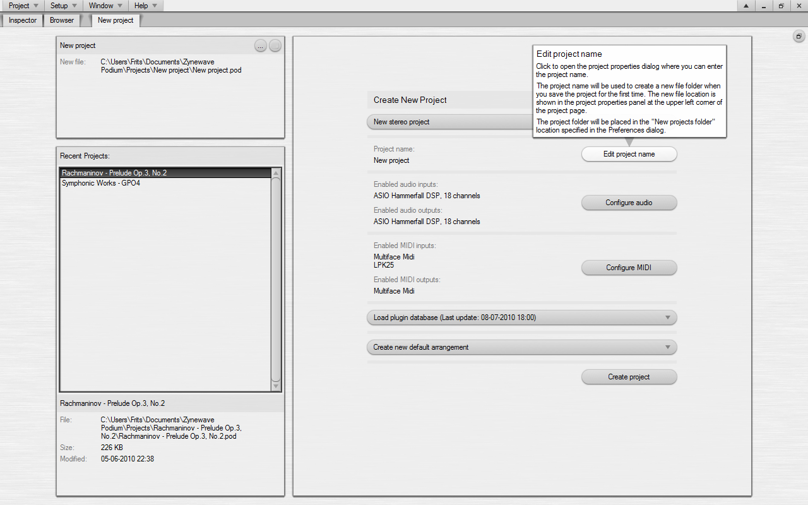

*   **Project option**: This selector defaults to **New stereo project**. You can change it to include surround, or select from a list of project templates you have previously saved. If you select a template, then the plugin and arrangement options on this page are removed, since the configuration of these are already contained in the project template.
*   **Edit project name**: Click this button to open the **[Project Properties](#h.xffdaoes0cx5)** dialog. Type a name for your new project. When you later save your project, Podium will use this project name as the project file folder name. The location where new project folders are created can be specified with the **New projects folder** setting on the **[Projects](#h.57glu1kj2699)** preferences tab. In the Podium default setup this folder location is "Documents\Zynewave Podium\Projects". Click OK to close the dialog.
*   **Configure audio** & **Configure MIDI**: Click either of these buttons to open the audio or MIDI page in the **[Audio/MIDI](#h.4r7kvywic1ed)** dialog. You will need to configure the audio and MIDI interfaces that you want to use with Podium. On the **MIDI** page you should click the checkbox next to all the interfaces you want to use. On the audio page it is highly recommended that you select an ASIO audio driver to get the best low-latency performance. If you don't have an ASIO driver installed on your PC system, you can try to install the ASIO4ALL driver, which is available as a free download from [www.asio4all.com](http://www.asio4all.com). Click OK to close the dialog.
*   **Plugin option**: This selector allows you to specify whether you want to use VST plugins in your project. The first time you run Podium, the selector will default to **Build and load plugin database**. When you create the project, Podium will build a database of all the plugins it finds. In the following projects you create, the selector will default to **Load plugin database**, to avoid repeating the time consuming plugin scanning. If you have installed new plugins since you last built the database, you can select to rebuild or update the database. Selecting the update option will only scan for new plugin files and new plugins are added to the end of the plugin list in the database.
*   **Configure plugin folders**: The Podium installation includes a few Zynewave VST effect plugins. You may have additional VST plugins installed on your PC system. If Podium hasn't automatically detected all your VST plugin folders, then click this button to open the **[Preferences](#h.jk8a4utp7iam)** dialog. Here you can browse for the folders where you have installed your VST plugins. You only need to specify the main plugin folder. Podium will automatically scan any subfolders.
*   **Arrangement option**: This selector allows you to skip or customize the arrangement creation, in case you for example are building a project that you want to save as a project template. For this tutorial, select the **Create a new arrangement** option.
*   **Create project**: Click this button to create the project based on all the settings you have made on this page. The interface and plugin configurations are stored in the Podium [setup file](#h.33zotw9tcdoe). If you later on change your interface or plugin configurations you can easily update these in your existing projects using the **Devices** panel on the project start page.

If you selected to build or update the plugin database, Podium will now show the **Updating Plugin Database** progress dialog and start to scan for VST plugins. This can take several minutes depending on how many plugins you have installed.

When Podium scans a plugin it will load the plugin to examine its capabilities. This means that the plugin can cause Podium to crash. Should this happen, then the next time you start Podium you will see a dialog that informs you that the crashing plugin has been put on the quarantine list. Plugin scanning will skip plugins that are on the quarantine list. You may need to repeat the project creation a few times until the plugin scanning finishes without encountering further crashing plugins.

As the final step, the arrangement is created and the arrangement editor is opened on a new page in the project window. The next chapter in this tutorial will describe the arrangement editor.

If you prefer to have one file for each arrangement you work on, you can choose to create a new project each time you start on a new arrangement. However you have the option to create multiple arrangements in a single project using the [contents panel](#h.t956j3doiewg) on the project start page.

### 1.2\. The Arrangement Editor

The default layout of the arrangement editor shows from top to bottom: Edit toolbar, navigator, timeline ruler, marker region, tempo/time signature region, track toolbar, tracks region, editor profile toolbar and transport toolbar.

The layout and edit options of an editor are defined by an editor profile. The Podium default setup includes a set of profiles that are designed for different purposes such as editing and mixing. You can quickly switch between these by clicking the buttons in the editor profile toolbar. The [editor profiles](#h.w97na76gog9d) chapter has more information on how you can customize the editor profiles.

The navigator will show a miniature of all the events that are placed on the timeline. The navigator will be useful for keeping an overview of the entire timeline, and it will allow you to quickly zoom in on the areas you want to work on.

The arrangement is created with only a master track. There are several ways that you can add new tracks:

*   Left-click or right-click the **+** button in the track toolbar.
*   Double-click or right-click the empty area below the last track header.
*   Drag an input or device object from the inspector or from other track headers, and drop the object on the empty area below the last track header.
*   Click the **Track** menu button or right-click the background of a track header to access the **Insert New Track** command.

You can use the track menu to manage your tracks, but in many situations it will be easier to use the [track inspector](#h.oo4cat2m3073). Click the **Inspector** tab at the top left corner to open the track inspector. The inspector will show the properties of the highlighted focus track.

### 1.3\. Setting Up Tracks

Let's start by setting up a track for audio recording: Click the **+** button in the track toolbar to create a new track. Name the track and click OK to close the dialog. Click the inspector **[Input](#h.rc02xbdh79xq)** panel header, or press F5, to open the list of available inputs. Open the "Audio Inputs" folder and double-click on an input to assign it to the track. You can also drag an input from the list onto the track header.

When an audio input is assigned to a track, it is "live", meaning that what is received on the input will be routed through the track and eventually out to the master output. You can disable the input by clicking the **X** bypass button located next to the input on the track.

Next, let's set up a track for playing an instrument plugin: Create the track and then click the inspector **[Device](#h.ykjf851o0f0u)** panel header, or press F2, to open the list of available devices. This list shows all the VST plugins that were found when the project was created. If you had any VST instrument plugins installed, double click on one to assign it to the track, or drag it from the list onto the track header.

By default the arrangement is configured to auto-assign the first available MIDI input to the focus track. So if you have a MIDI keyboard connected, you should now be able to play the instrument plugin. Alternatively you can assign a MIDI input similar to how you assigned an audio input.

Click the plugin selector on the track header to open/close the plugin editor. Click the inspector **[Preset](#h.x9w2eek2tp9q)** panel header, or press F3, to show the list of presets that are available in the plugin. Double-click a preset to change to that preset in the plugin.

The inspector device list can also be used when you want to add effect plugins to tracks. Either double-click an effect plugin to add it to the focus track effect chain, or drag the effect to any of the track headers.

### 1.4\. Recording

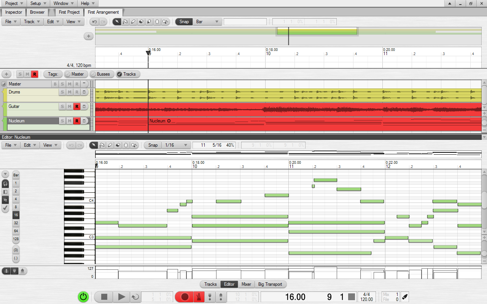

The arrangement defaults to a time signature of 4/4 and a tempo of 120 BPM. To adjust this, double-click the [tempo event](#h.ris45gum8jbp) in the tempo region or double-click the tempo indicator in the transport toolbar.

The tracks you want to record should have audio or MIDI inputs assigned, as explained in the previous section. Click the **R** button on the tracks to arm them for recording. Click the record button on the transport toolbar to enable recording mode. The record armed tracks will be highlighted with red color, to indicate the areas that will be recorded. Click the metronome button if you want an audible click synced to the tempo and time signature of the arrangement. Click the play button on the transport toolbar to start the recording.

You can limit the time range that is recorded by using punch in/out. To do so, click the punch in/out buttons on the transport toolbar, and then drag the handles of the red bar that has appeared in the timeline ruler.

Once you are done with recording a track, deselect the track **R** button to avoid erasing the recorded events the next time you start recording. If you want to record new tracks from the same input, just drag the input onto another track or onto the blank area below the last track. When done recording, either remove the input with the track menu or bypass the input by clicking the **X** button next to the input.

The sequences and sounds that you have recorded on the tracks can be edited in separate editors. Click the **Editor** button on the editor profile toolbar. This profile has an embedded editor that will automatically show the currently selected track event. You can resize the editor by dragging its title bar. Alternatively you can also double-click a track event to open a separate editor window.

### 1.5\. Mixing

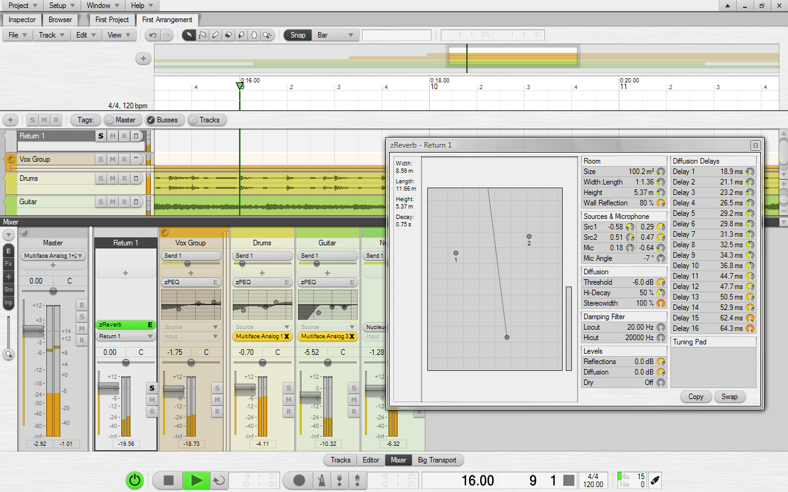

Click the **Mixer** button in the editor profile toolbar. The mixer can be useful for precision level metering and quick access to various track controls. The horizontal track lanes in the tracks region are mirrored as vertical strips in the mixer.

Let's add effects to our audio tracks using the selectors on the mixer strips: Click the **+** button on a strip to open a menu with available devices. Select the [zPEQ](#h.hyn5swkuhepf) effect from the Zynewave Effects submenu. You should now see an embedded EQ editor in the mixer strip. Read the popup help for this editor to see how you can edit the EQ curve.

After inserting an effect, you'll notice that the new effect appears below the **+** button. This brings us to an important principle in Podium: The signal flow follows the visual layout of the track hierarchy. Audio starts at the bottom of the track hierarchy and flows up through the effect chain on the track, continuing up through effect chains on group tracks and the master track, until it arrives at the master output at the top of the master track.

Next, let's add a mixer bus. A bus allows you to extract audio from one or more tracks using a bus send, and then inject the mixed bus output to one or more tracks using a bus return.

Click the **+** button on a track and select Send 1 from the Busses submenu. Click Yes in the message box that appears, asking if you want to create a matching bus return track. Notice that the new bus send is added above the **+** button. This is because bus sends are typically applied as the last step in the effect chain. Insert the [zReverb](#h.i208i5i93nk0) effect on the Return 1 track, and then turn up the Send 1 sliders to send audio to the reverb.

The bus send sliders will control the level of the signal that is sent to the busses. The gain fader on the track will control the level of the signal going out of the track. Adjusting the send level will not affect the gain level. Adjusting the gain level will by default affect the send level, but this can be changed in the **Fader** submenu of the **Track** menu.

### 1.6\. Automating Parameters

If you have recorded a note sequence with your MIDI keyboard, you may already have recorded MIDI parameter tracks for pitch bend, aftertouch or modulation. You can also record parameter tracks for adjustments you make to controls in the plugin editor during recording. To enable this, the track with the plugin must be record armed.

To manually create parameter tracks: Click the inspector **[Param](#h.ed57aa1rrutb)** panel header, or press F4, to show the list of parameters that can be automated for the focus track. If a device is assigned to the track you will see **Mixer** and **Device** buttons. Mixer parameters include **Level**, **Pan** and **Send**. These control the Podium mixer. The list of device parameters will depend on the device that is assigned on the track. This can be both MIDI parameters and VST parameters. Double-click a parameter to create a parameter track. Double-click on the parameter track timeline to add a curve sequence event.

[Curve sequences](#h.o6oomworp3q7) can be edited both with the [curve editor](#h.moreeomh3ysx) and with the mixer. The mixer strip for a parameter track has a slider that shows the value of the curve sequence at the play cursor position. Dragging the slider while playback is stopped will create a sharp curve change. Dragging during playback will create a smooth curve change.

### 1.7\. Exporting To Sound File

At some point you may want to export the audio output of your arrangement to a sound file. To do this you use the bounce feature.

Select the master track and press the **B** key shortcut or select the **Render** command in the **Bounce** submenu of the **Track** menu. A dialog will appear showing the progress. Once the render is done, a highlighted **B** button appears on the master track and the waveform of the bounced audio is drawn as an overlay on the master track. This indicates that the track is now set to play the bounced audio, and subsequently all child tracks are muted. Clicking the **B** button again will deactivate the bounced audio and reenable all the child tracks.

This method of bouncing does not only apply to the master track. You can bounce enable any group or individual audio track. If you keep adding tracks with instrument and effect plugins you may eventually run out of CPU resources during playback. The CPU indicator in the transport toolbar will indicate how much of the available CPU power is being used. When the CPU usage overloads you will hear drop-outs in the sound. You can bounce a track to free up the CPU resources used by the plugins on that track.

The bounced audio will be rendered to the end of the arrangement, which is the point on the timeline where the last event is placed. In some cases you may want to extend the bounced audio, for example to capture the decay of a reverb effect. In that case you can extend the arrangement by placing a [marker](#h.y3nf6rilothh) at the point on the timeline where you want the bounced audio to stop. Double click on the marker timeline region (above the tempo region) to place a marker. Then redo the bounce render.

When you finally are happy with the master track bounce, select the **[Export to Sound File](#h.x8rpqqjwfbap)** command in the **File** menu. This will show a dialog where you can specify the bit resolution of the exported file. Some external tools such as mp3 encoders may only support sound files saved with 16-bit resolution. Click the **Export** button to show the save file dialog.

* * *

## 2\. Projects

A project consists of different types of objects that are organized in a hierarchic folder structure similar to a file system. At the top of the hierarchy is the project object itself and this is where you initially start out in the Podium project window.

The objects in a project can be grouped into two categories:

*   Arrangements, sounds, note sequences and curve sequences are objects that have a timeline. A project can contain any number of these objects, so you can choose to work with a collection of arrangements within a single project.
*   Device mappings, device definitions, presets and parameters are objects that define your audio and MIDI interfaces, mixer busses, external devices and software plugins. You use these device objects to interact with the devices in the arrangement editor.

In addition to these objects, you also have the folder object. When a project is created using the **Create New Project** page, the device objects are grouped into a set of default folders. You can create additional folders, to for example sort your plugins into categories. Plugin folders will be presented as submenus when you open plugin selector menus in the editors.

Any type of object can act as a folder. For example, any sounds and sequences you create while working in an arrangement editor will be inserted in the project as child objects of the arrangement object.

The [project start page](#h.nh00mrrfg2lb) presents an overview of the objects in the project. The start page menus can be used to manage the project contents and device setup. The objects can also be browsed and edited directly using the [project browser](#h.t3w9h9he3ll1). Use caution and keep a backup of your project if you intend to edit the objects directly. Messing with the device objects can cause the devices not to respond as expected in arrangements.

### 2.1\. Project Properties

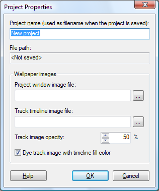

The **Project Properties** dialog is opened by selecting **Project Properties** in the **Project** menu or by clicking the **...** button in the project info panel on the project start page.

*   **Project name**: As long as the project is not yet saved to file, you can change the project name in this edit field. Once the project is saved, the project name will automatically be set to the saved filename. Renaming the project file will thus change the project name. The project name is shown on the project page tab at the top of the project window.
*   **File path**: If the project has been saved, this field shows the full file path of the project file.
*   **Project window image file**: If an image file is specified, it will be painted as wallpaper on the project page. If the image is smaller than the page, it will be tiled to fill the entire page. Use the **...** button to open a file dialog for selecting an image file. You can also drag & drop image files from Windows Explorer onto the Podium project window to set the wallpaper image.
*   **Track timeline image file**: If an image file is specified, it will be painted as wallpaper on the tracks timeline area in arrangement editors.
*   **Track image opacity**: A value lower than 100% will draw the image blended with the timeline fill color of the current color setup.
*   **Dye track image with timeline fill color**: This option combined with the opacity setting can help tone down the image and make it blend in with your current Podium color setup.

The specified image files are stored as file references in the project file. If the image files are located in the folder or a subfolder of where the project file is saved, the image file references are stored with a file path relative to the project folder. This ensures that the image files still can be loaded with the project if you later on move or rename the project folder.

### 2.2\. Project Files

A project is saved to a single file with the filename extension .pod. Each sound object in the project is saved to a separate sound file. The project file only stores the file path to the sound file.

Use the **Project** menu to open and save projects. You work on one project at a time in Podium, so opening a project will close the currently loaded project. The **Save Project** command will only save the project file and not any sound files. Use the **Save All Changes** command to save both the project file and any modified sounds. To save a single sound, use the **File** menu in the sound editor.

When you create a new project, the project file will not be created until you save the project for the first time. Podium will create a project folder with the same name as the project. This project folder is created in the **New projects folder** as specified in **Preferences**. The project file will be saved inside the project folder. Any sounds you have created in the project will be saved in the project folder as well. The sound files will be saved in subfolders according to their folder placement in the project. For example, sounds recorded in an arrangement will be saved in a subfolder with the same name as the arrangement.

The project info panel on the start page shows the full file path for the project. The info panel below the contents panel shows the full file path of the sound object that is currently selected in the list.

### 2.3\. Project Templates

Project templates can be used for two purposes:

*   You can select a project template in the **Project option** selector menu on the **Create New Project** page. Selecting a template will hide the options for plugins and arrangements, as they are already configured in the template. As an example, you could have templates for studio recording, live recording, mastering, rock, orchestral, etc.
*   You can change the plugin setup in an existing project with the **Load Plugin Setup from Template** submenu of the **Devices** menu on the project start page. As an example, you could have templates where the plugins are sorted by plugin developer or by plugin category.

When you have created a project that you want to use as a project template, you save the template with the **Save Project as Template** command in the **Project Templates** submenu of the **Project** menu. This will open the **New Project Template** dialog where you can enter a name for the template.

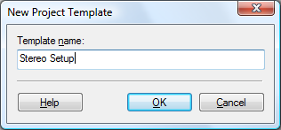

The project template file is saved in the **Project template library folder** as specified in **Preferences**. If a template file already exists with the name you entered, Podium will ask you if you want to overwrite it.

You can organize your template files by using the **Explore Templates Folder** command. This will open a Windows Explorer. Here you can rename or delete template files, or organize the files into subfolders. Template subfolders are shown as submenus when you open a menu that lists the project templates. Use the **Update Templates List** command after you have made changes to the files in the templates folder.

### 2.4\. Project Window

The main Podium application window is a project window. Additional project windows can be opened with the **New Project Window** command in the **Window** menu. Having multiple project windows open allows you to for example view different parts of your project at the same time or view the same arrangement with different profiles and zoom settings.

If you select the **Link Project Windows** option in the **Window** menu then page navigation in any project window will be synced in all open project windows. Navigating for example into an arrangement in one window will automatically open the arrangement in the other windows as well. Each project window remembers the last used editor profile, so one window can be set to show a tracks profile and the other a mixer profile.

At the top of the window are page tabs showing where you are in the project. The first page is always the project object. When you enter into an object it will be added as a new page to the project window.

The window contains embedded track inspector and browser pages. Using the embedded pages can often be more convenient than opening separate inspector and browser windows. The inspector can be opened/closed by clicking the **Inspector** page tab, or by pressing the F1 to F5 shortcut keys. The browser can be opened by clicking the **Browser** page tab, or by pressing the F6 shortcut key. Opening one of the pages will automatically close the other page. When one of the pages is open, the help panel will appear below the page, provided that the **Enable Help Panel** option in the **Help** menu is selected. The pages can be resized by dragging the space between the pages.

The project page can be toggled between start page mode and folder page mode with the button at the top right corner of the page. See the [project start page](#h.nh00mrrfg2lb) chapter for more information.

If you maximize a project window, the standard Windows border is removed and the project window is shown full-screen. When maximized, the menu bar will include the auto-hide, minimize, restore and close buttons. When the auto-hide option is selected the menu bar will disappear when the mouse cursor is moved away from the menu bar. The menu bar can be shown again by moving the mouse cursor to the top of the screen and holding it there for half a second.

#### 2.4.1\. Project Menu

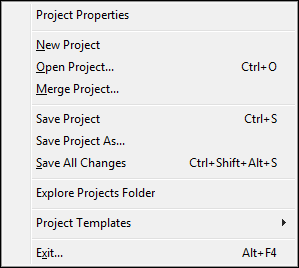

*   **Project Properties**: Opens the **[Project Properties](#h.xffdaoes0cx5)** dialog.
*   **New Project**: Creates a new empty project. If your current project contains unsaved changes, you will be prompted if you want to save the changes. The [project start page](#h.nh00mrrfg2lb) is shown after the empty project is created.
*   **Open Project...**: Opens a file dialog for loading a project file. If your current project contains unsaved changes, you will be prompted if you want to save the changes.
*   **Merge Project...**: Opens a file dialog for selecting a project to be merged into the currently loaded project. The merge project file is not modified. Arrangements imported from the merge project are modified to use matching devices found in the current project. Device objects in the merge project are imported as well, if matching devices are not already found in the current project.
*   **Save Project**: Saves the project, but does not save any edited sounds. Saving sound files can take a long time, so use this command if you only want to save your project changes.
*   **Save Project As...**: Opens a file dialog for saving the project to another filename. The project will be renamed to the new filename, and following project save commands will save to the new filename. Use this command if you want to keep backup copies of older revisions of your project.
*   **Save All Changes**: Saves the project and any edited sound files.
*   **Explore Projects Folder**: Opens a file explorer for the projects folder.
*   **Project Templates**: Submenu for managing project templates. See the [project templates](#h.nl1e4hlr7itc) section for more information.
*   **Save Project as Template...**: Opens the **New Project Template** dialog where you can enter a name for the template.
*   **Explore Templates Folder**: Opens a file explorer for the project templates folder.
*   **Update Templates List**: Use this if you have reorganized your template files while Podium is running. The list is automatically updated when you start Podium.
*   **Exit...**: Exits the Podium application. If the project or sounds have unsaved changes you will be prompted if you want to save before exiting.

#### 2.4.2\. Setup Menu

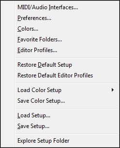

*   **Audio/MIDI...**: Opens the **[Audio/MIDI](#h.4r7kvywic1ed)** dialog.
*   **Preferences...**: Opens the **[Preferences](#h.4g9tau50c64r)** dialog where you configure global application options.
*   **Colors...**: Opens the **[Colors](#h.ab5qqsep725r)** dialog where you configure all the color settings that are saved to color setup files.
*   **Favorite Folders...**: Opens the **[Favorite Folders](#h.152t5znf16p1)** dialog where you configure the folders that will appear as favorite shortcuts in the Podium browsers.
*   **Editor Profiles...**: Opens the **[Editor Profiles](#h.w97na76gog9d)** dialog where you configure all the different types of editor profiles.
*   **Restore Default Setup**: Deletes the current setup and replaces it with the default setup.
*   **Restore Default Editor Profiles**: Replaces the current editor profiles with the editor profiles from the default setup.
*   **Load Color Setup**: Submenu with shortcuts to all the color setup files.
*   **Save Color Setup...**: Opens a file dialog where you can save a [color setup file](#h.1gt43dqksage). The files you save will appear in the **Load Color Setup** submenu.
*   **Load Setup...**: Opens a file dialog where you can load a setup file you previously saved. Alternatively you can also drag and drop setup files on the Podium window.
*   **Save Setup...**: Opens a file dialog where you can save a backup of the current setup.
*   **Explore Setup Folder**: Opens a file explorer for the setup folder.

#### 2.4.3\. Window Menu

*   **New Project Window**: Opens a new [project window](#h.ecn3whwsh0zp).
*   **Link Project Windows**: Links page navigation between all open project windows.
*   **New Inspector Window**: Opens a new [track inspector](#h.oo4cat2m3073) window.
*   **New Browser Window**: Opens a new [browser window](#h.vhjlegffv0pi).
*   **Windows...**: Opens the **[Windows](#h.yyun8msvbakz)** dialog where you can manage all created windows and their assignment to different virtual screens.
*   **Screen 1, 2, 3, 4**: Switch between different virtual [screens](#h.3euf8w8es7fq).

#### 2.4.4\. Help Menu

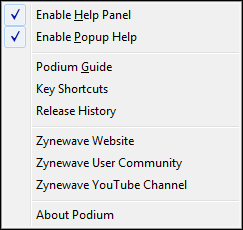

*   **Enable Help Panel**: The help panel is shown below the embedded **Inspector** or **Browser** page, if either one of them is open. When the help panel is open, it will show the help text that normally would appear as popup help.
*   **Enable Popup Help**: A popup box with context help will appear next to the UI element currently under the mouse cursor. Popup help will only appear if the help panel is closed. You can press Shift+F1 to open the corresponding section in the Podium guide.
*   **Podium Guide**: Opens the Podium guide document that was installed together with the Podium application.
*   **Key Shortcuts**: Opens the key shortcuts page in the Podium guide document.
*   **Release History**: Opens the Podium release history document.
*   **Zynewave Website**, **Zynewave User Community**: Opens the Zynewave website in a web browser.
*   **Zynewave YouTube Channel**: Opens the Zynewave video tutorial channel on the YouTube website.
*   **About Podium**: Shows a dialog with Podium version information.

_Note:_ Help is also shown for individual menu items while a menu is open. The empty space at the top of the project window will show a more detailed description of the currently highlighted menu item.

#### 2.4.5\. Folder Pages

Folder pages present child objects in a style that is similar to the tiles view mode in Windows Explorer. Each object is represented by a draggable tile that shows the object icon, name and further details. An object that contains child objects will show the number of child objects on a second text line. Preset and parameter objects will show configuration details on a third text line.

The [key shortcuts](#h.f2dqjs66e5t9) and mouse actions you use to navigate and select objects are the same as those used in the standard Windows file explorer.

When you double-click an object or press the enter key for the focus object, the action will depend on the object type. If the object is an arrangement, sound or sequence, the object will be opened on a dedicated editor page. If the object is a folder it will be opened on a folder page. All other objects will open the object properties dialog. If you want to specifically open a folder page or a properties dialog, you can use the object right-click menu or the Ctrl+Enter and Alt+Enter shortcuts.

By default the objects are snapped to a grid. If you want to freely move the objects on the page, select the **Layout Mode** option in the **Edit** menu. The **Layout Mode** option is a property of the current page object, so it can be set individually for each object in the project. Typically you would only use **Layout Mode** on the main project page to lay out your arrangements in a more presentable style.

When **Layout Mode** is selected, the folder page **Edit** menu includes some commands that can help with aligning objects in columns and rows. The commands are available if multiple objects are selected. The **Align X Position** and **Align Y Position** commands will align the selected objects to the current focus object. The **Align X Spacing** and **Align Y Spacing** commands will space out the objects evenly, starting with the leftmost or topmost of the selected objects.

#### 2.4.6\. Drag & Drop

Objects can be dragged from any list or button that shows the object with its icon. You can use drag and drop to reorder objects in the project, or you can drag and drop objects in an arrangement editor to assign them to tracks or create events on the timeline. When you are drag-reordering objects in a list, you can hold down the Ctrl key to drop the object as a child of the object under the cursor. You can also drop an object onto the page tabs at the top of the project window, to drop the object as a child of the object on that page.

When you are dragging an object, a small translucent image will be attached to the mouse cursor showing the object icon and name. If you are dragging a multiple object selection, the folder icon is shown and the text tells you how many objects you are dragging.

If you drag the object over an area that does not accept the object, the mouse cursor turns into a 'no go' cursor. If you drag over an area that can accept the object, a translucent mask is drawn to highlight what will be affected by the drop.

As with any mouse drag operation in Podium you can abort the drag operation by right-clicking while still holding the left button.

If you want to reorganize objects in the project, it is recommended that you move objects with drag and drop instead of using the cut and paste edit menu commands. When cutting objects to the clipboard they are removed from the project and thus any links to the objects in arrangements are reset. Moving objects with drag and drop will not break any links between the objects.

#### 2.4.7\. Stickie Notes

Stickie notes can be attached to objects in the project as well as tracks in arrangements. The project start page shows stickie note buttons in the object info panels. The track inspector shows a stickie note button for the focus track. Stickie notes can also be shown in project browser lists. A stickie note button will have a dimmed image when the note is empty, and a bright yellow image when the note contains text. Hovering the mouse over the button will temporarily pop up the stickie note.

To edit a stickie note for an object, open the stickie note window by clicking the stickie note button or by using the the **Stickie Note** command in the object right-click menu. Pressing Alt+N opens the stickie note window for the current focus object.

To remove a stickie note, just delete all the text (including spaces and linefeeds) in the stickie note window. The quickest way to do this is to press Ctrl+A to select all the text, and then press the delete key.

If you enable the **Pop up project stickie note after loading project** option on the **[Projects](#h.57glu1kj2699)** preferences tab, then the project stickie note on the project start page will automatically pop up and stay open every time a project is loaded. To make the stickie note go away just move the mouse cursor over the stickie note button.

### 2.5\. Project Start Page

The project page is the home page in a project window. The button at the top right corner of the page will switch the project page view between start page mode or folder page mode.

The project start page presents an organized view of the project contents and devices. Most users will find the start page sufficient for all project management tasks. You may however prefer the layout of the folder pages once you have created your project with the start page.

When you start on a new project, the project start page shows the **Create New Project** panel. This panel is described in detail in the [getting started](#h.ph9t12u0t64o) chapter. When a project is loaded, the project start page shows the **Contents** and **Devices** panels.

#### 2.5.1\. Project Info Panel

The info panel at the upper left corner shows information for the currently loaded project. The panel has buttons for opening the **Project Properties** dialog and the project stickie note window.

If the project is saved, the full file path is shown. If the project has not been saved yet, the **New file** line shows the folder and filename that will be used when you save the project for the first time. If you change the project name in the **Project Properties** dialog before saving, then the new folder and filename will be updated accordingly. If a folder already exists with the project name, then "_01" (or a higher number) is appended to the folder name. Once the project is saved, the project name is the same as the project filename. You can change the project name by renaming the project file.

#### 2.5.2\. Recent Projects Panel

Below the project info panel is the **Recent Projects** panel. This shows a list of previously loaded project files sorted with the most recently opened project at the top. The info panel at the bottom shows file information for the currently selected project in the list.

Double-click a project in the list or press the Enter key to load the selected project. If your current project is not saved, Podium will ask if you want to save the changes before loading the new project. Once a project is loaded it will move to the top of the recent project list. You can remove a project from the list using the **Remove Project** right-click menu command or by pressing the Delete key.

#### 2.5.3\. Contents Panel

The contents list shows all arrangements and sounds in the project. New content can be created or imported using the **Contents** menu and the list right-click menu.

If after loading a project you see a sound that has a red icon in the list, it indicates a "broken" sound, meaning that the linked sound file could not be loaded. This can happen if you have moved the sound file or have renamed file folders. To relink broken sounds to their sound files you can select one or more broken sounds in the list, right-click the selection and use the **Search for Missing Files...** command. Podium will search for the missing files in the folder you specify. Note that this method will not work if you have renamed the sound files. In that case you should select **Properties** for the broken sound, and use the **Relink file...** button in the **Sound Properties** dialog.

#### 2.5.4\. Contents Menu

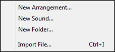

*   **New Arrangement...**: Opens the **New Arrangement Properties** dialog. After the arrangement is created it is opened in an arrangement editor page.
*   **New Sound...**: Opens the **Sound Properties** dialog. After the sound is created it is opened in a sound editor page. Creating new sounds is only necessary if you want to record directly in the sound editor. Recording audio in the arrangement editor will automatically create new sounds. If you want to edit an existing sound file, you should use the **Import File...** command, or drag the sound file onto the project page or onto a track in an arrangement editor.
*   **New Folder...**: Opens the **Folder Properties** dialog. The new empty folder is inserted at the bottom of the list. If your project contains a large number of arrangements or sounds, you may find it useful to organize them into folders.
*   **Import File...**: Various types of media files can be imported to create either arrangement or sound objects. Importing a sound file (.wav or .aif) will create a sound object that links to the sound file. Importing a MIDI file (.mid) will create an arrangement. The tracks in the arrangement will be set up with the first available instrument in the devices list that matches the MIDI channel numbers specified in the MIDI file. Note that you can also import MIDI files by dragging and dropping them onto tracks, but in that case only the first note or curve sequence in the MIDI file will be imported onto the track.

#### 2.5.5\. Contents List Menu

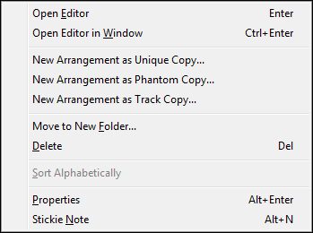

*   **Search for Missing Files...**: Opens a **Browse For Folder** dialog. Podium will relink the broken sounds if it finds matching filenames in the specified folder. Use this command if you have moved your sound files to another folder. The command only appears in the menu if the selection includes any broken sounds.
*   **Open Editor**: Opens an editor page for the selected object. Shortcut key is Enter. The editor page can also be opened by double-clicking the object.
*   **Open Editor in Window**: Opens an editor for the object in a separate window. Shortcut key is Ctrl+Enter.
*   **New Arrangement as Unique Copy...**: Creates a copy of the arrangement including unique copies of all sounds and sequences used in the arrangement.
*   **New Arrangement as Phantom Copy...**:  Creates a copy of the arrangement without copying sounds and sequences. Timeline events are still linked to the sounds and sequences used by the original arrangement. Useful if you want to create alternative mixes of an already completed song.
*   **New Arrangement as Track Copy...**: Creates a copy of the arrangement without any timeline events. Useful for starting a new arrangement with a default track layout.
*   **Move to New Folder...**: Opens the **Folder Properties** dialog. All selected objects are moved into the new folder. The new folder is inserted in the list at the position of the first selected object.
*   **Delete**: Shows a message box, asking for confirmation to delete all selected objects.
*   **Sort Alphabetically**: Sorts a multiple selection alphabetically. If the selected objects span multiple folders, then objects within each folder are sorted separately.
*   **Properties**, **Stickie Note**: Opens the properties dialog or the stickie note window for the selected object.

#### 2.5.6\. Devices Panel

The devices list shows all device mapping objects in the project. This includes I/O, busses, ReWire and VST plugins. The list can be maintained with the commands in the **Devices** menu and the list right-click menu.

When a project is created, the device list is by default grouped into folders according to device type. If audio and MIDI interfaces were enabled, there will be folders for **Audio Inputs**, **Audio Outputs**, **MIDI Inputs**, **MIDI Outputs** and **Busses**. If the ReWire option in **Preferences** was enabled, the **ReWire** folder will contain all the installed ReWire device applications that Podium detected. If the VST plugin option was enabled, the plugins will be organized in folders matching the disk folders of the installed plugins. You can customize the folder organization in the project without having to change the plugin installation folders.

If after loading a project you see a plugin device mapping that has a red icon in the list, it indicates a "broken" plugin, meaning that the linked plugin file could not be loaded. This can happen if you have made changes to your plugin installations. Use the **Search for Missing Plugins** command in the **Devices** menu, to let Podium search for and relink all the broken plugins it can find in the VST plugin scan folders as configured in **Preferences**. To search for plugins in a specific folder you can select one or more broken plugins in the list, right-click the selection and use the **Search for Missing Plugins...** command.

#### 2.5.7\. Devices Menu

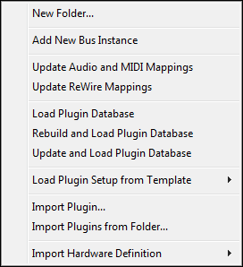

*   **Select All Missing Plugins**: Selects all broken plugins in the list. If you no longer have the plugins available you can choose to delete the mappings by right-clicking the selection and use **Delete**. The command only appears in the menu if the selection includes any broken plugins.
*   **Search for Missing Plugins**: Searches for and relinks all the broken plugins that can be found in the VST plugin scan folders as configured in **Preferences**. The command only appears in the menu if the selection includes any broken plugins.
*   **New Folder...**: Opens the **Folder Properties** dialog. The new empty folder is inserted at the bottom of the list.
*   **Add New Bus Instance**: Creates send/return mappings for a new bus instance.
*   **Update Audio and MIDI Mappings**: If you have changed the **Audio/MIDI** configuration since the project was created, then you can use this command to update all the audio and MIDI device mappings in the project. Note that when you change the configuration in the **[Audio/MIDI](#h.4r7kvywic1ed)** dialog, Podium will ask you if you want to update the mappings in the currently loaded project.
*   **Update ReWire Mappings**: Creates device mappings for all available ReWire devices not already imported in the project. For more information about ReWire, see the [ReWire devices](#h.surt7xvd3nhp) section. The command only appears in the menu if the ReWire option is enabled in **Preferences**.
*   **Load Plugin Database**: Replaces the plugin setup in the loaded project with the latest plugin database. Use this command to update an older project with your latest plugin installations. This command is quick since it does not scan for plugins. If you have changed your plugin installations since the database was last updated, then you should use the rebuild or update commands instead.
*   **Rebuild and Load Plugin Database**: Rebuilds the plugin database and then replaces the plugin setup in the loaded project.
*   **Update and Load Plugin Database**: Updates the plugin database and then replaces the plugin setup in the loaded project. The command will only search for new plugin files. Any new detected plugins are added to the end of the plugin list in the database.
*   **Load Plugin Setup from Template**: This submenu appears if you have saved project templates. Selecting a project template from the submenu will replace the plugin setup in the loaded project with the plugin setup from the project template. If arrangements in the loaded project uses plugins mappings that are not present in the selected template, then these plugin mappings are preserved and merged with the plugin setup from the template.
*   **Import Plugin...**: Opens a file dialog where you can select one or more VST plugin files. The selected plugins will be imported and added to the end of the devices list. In comparison to the plugin database commands, plugin import allows you to set up a smaller set of plugins in your project.
*   **Import Plugins from Folder...**: Opens a **Browse For Folder** dialog. Podium will scan for and import detected plugins in the specified folder and any subfolders. Plugins that are already imported are skipped.
*   **Import Hardware Definition**: This submenu appears if Podium has found any hardware definition files. See the [Import Hardware Definition](#h.8vm3n3kqt8rz) section for more information.

#### 2.5.8\. Devices List Menu

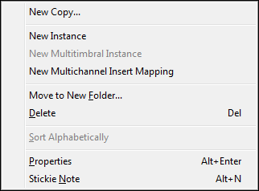

*   **Search for Missing Plugins...**: Opens a **Browse For Folder** dialog. Podium will relink the broken plugins if it finds matching filenames in the specified folder. The command only appears in the menu if the selection includes any broken plugins.
*   **New Copy...**: Opens the **Device Mapping Properties** dialog for creating a copy of the selected mapping.
*   **New Instance**: Creates a new instance of the selected global device. The new instance will have copies of all the mappings belonging to the original instance, only the copied mappings will use the next available instance number. You can access the command by right-clicking on either a device mapping or a folder containing device mappings for a global instance.
*   **New Multitimbral Instance**: Creates a new global instance of the selected instrument insert mapping. The new global instance will have 16 MIDI channel mappings in addition to the audio output mapping. Some VST instrument plugins cannot be detected as being multitimbral capable when they are scanned. For those plugins Podium will only create a single instrument insert mapping. If you know a plugin instrument is multitimbral capable, you can use this command to get mappings for the individual MIDI channels.
*   **New Multichannel Insert Mapping**: Creates a new multichannel insert mapping that combines the input and output channels used by all mappings of the selected global device. Some VST plugins cannot be detected as being multichannel capable when they are scanned. For those plugins Podium will create separate stereo mappings for the number of supported input and output channels. If you know a plugin is multichannel capable, you can use this command to create a single multichannel insert mapping. Afterwards you can adjust the channel settings in the properties of the new insert mapping. See also [multitimbral & multiple io plugins](#h.slv47ir7smq4).
*   **Move to New Folder...**: Opens the **Folder Properties** dialog. All selected objects are moved into the new folder. The new folder is inserted in the list at the position of the first selected object.
*   **Delete**: Shows a message box, asking for confirmation to delete all selected objects.
*   **Sort Alphabetically**: Sorts a multiple selection alphabetically. If the selected objects span multiple folders, then objects within each folder are sorted separately.
*   **Properties**, **Stickie Note**: Opens the properties dialog or the stickie note window for the selected object.

#### 2.5.9\. Import Hardware Definition

The **Devices** menu contains an **Import Hardware Definition** submenu which lists all the files that are found in the **Hardware definition library folder** as specified in **Preferences**. The default location of this folder is "Documents\Zynewave Podium\Library\Hardware Definitions". Podium will search this folder during startup.

Device definition files contain a set of device objects that have been customized for a particular device. This includes mappings, presets and parameters. If you chose to build the default folders the first time you ran Podium, there will be a set of generic device definition files in the hardware definitions folder.

The available definition files in the Podium library are limited, but Podium also supports Cubase patch script files (the version that uses the .txt extension). If you copy your patch script files to the hardware folder then these will show up in the **Import Hardware Definition** submenu the next time you start Podium.

If you select a hardware definition from the submenu, Podium will display the **Import Hardware Definition** dialog. Here you specify how your device is connected to your MIDI and audio interfaces. If you have more than one MIDI input or more than one MIDI output interface enabled, you should select the interface that the device is connected to. Otherwise leave it at the **\<Use default setting from file\>** setting. You should also leave it at the default setting if you are importing a device that uses virtual MIDI ports such as the Yamaha SW1000XG. Finally select the first channel in the audio interface connections. This will typically be the first channel in a stereo pair. If you don't have either input or output connected to your audio interface, then leave the setting at **\<Not connected\>**. Clicking **OK** will import the device definition and adjust the imported mappings to your interface selections.

### 2.6\. Browser Window

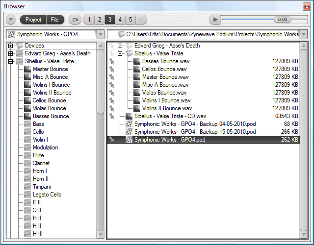

Browser windows can be opened with the **New Browser Window** command in the **Window** menu. Several browser windows can be open at the same time. Each [project window](#h.ecn3whwsh0zp) also has an embedded browser page that can be opened/closed by clicking the **Browser** page tab, or by pressing the F6 shortcut key.

The browser can show a project browser and/or a file browser. The project browser (on the left) shows the objects in the currently loaded project. The file browser (on the right) shows the contents of a disk folder that you specify. The file browser can be used to get an overview of the files that are used by the current project, and it can be used to import files into your project by for example dragging sound and MIDI files onto the track timeline in arrangement editors.

The project and file browsers can be resized by dragging the space between the two lists. Pressing the Tab key will switch key focus between the two lists.

#### 2.6.1\. Browser Toolbar

The toolbar at the top of the browser page contains various controls for configuring the browser. Some of the toolbar controls can be shown/hidden using the browser options menu.

*   **Browser options menu**: Opens the options menu.
*   **Project browser** & **File browser**: Shows/hides the project browser and the file browser. Both browsers can be shown at the same time. If only one browser is shown, and you click the button to hide it, the other browser will automatically be shown.
*   **Refresh file list**: Refreshes the file browser list.
*   **Add to favorites**: Adds the current address bar folder in the file browser to the favorite folders list, provided that the folder is not already in the favorite folders list.
*   **Auto-audition**: When this mode is enabled, audition is automatically started for the selected sound or MIDI file in the file browser list. Audition is restarted when you select another file in the list, either by cursor key navigation or by clicking in the list.
*   **Audition gain slider**: Sets the gain of auditioned sounds. Ctrl+click the slider to reset it to 0 dB. Shift+click+drag to fine adjust the gain value.

If you have added favorite folders, you will see numbered buttons to the left of the **Add to favorites** button. A maximum of nine numbered buttons are shown. These buttons are shortcuts to the first nine favorite folders. If you have more favorites, you can access them all in the file browser menu.

Clicking a favorite button will go to that favorite folder. Clicking again will return to the previous folder. Right-clicking a favorite number button will show a menu with the following commands:

*   **Insert New Favorite**: Inserts the current address bar folder as a new favorite before the selected favorite.
*   **Overwrite Favorite**: Overwrites the selected favorite with the current address bar folder. This can also be done by Ctrl+clicking the button.
*   **Delete Favorite**: Deletes the favorite folder. This can also be done by Alt+clicking the button.
*   **Move Left**, **Move Right**: Moves the favorite to the left or right in the list of favorites.

_Note:_ All the browser options, including the audition gain value, are local settings for each browser window. The favorite folders list however is globally shared among all browsers.

#### 2.6.2\. Browser Options Menu

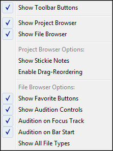

The menu is opened by clicking the menu button in the browser toolbar.

*   **Show Toolbar Buttons**: Shows/hides the **Project** and **File** toolbar buttons. These buttons are shortcuts to the **Show Project Browser** and **Show File Browser** menu options.
*   **Show Project Browser**: Shows/hides the project browser.
*   **Show File Browser**: Shows/hides the file browser.
*   **Show Stickie Notes**: Enable this option to show yellow stickie note icons next to the objects that have a stickie note attached. Clicking a stickie note icon will open the stickie note window. Stickie notes can be created for any object by using the **Stickie Note** right-click menu command.
*   **Enable Drag-Reordering**: When this option is enabled, you can drag objects around in the project browser list. Hold the Ctrl key to drop objects as child objects of the object under the mouse cursor.
*   **Show Favorite Buttons**: Shows the **Add to favorites** button and numbered buttons for jumping to a favorite folder in the file browser.
*   **Show Audition Controls**: Shows the **Auto-audition** button and the audition gain slider.
*   **Audition on Focus Track**: If an arrangement is currently powered on, enabling this option will audition sound files on the focus track in the arrangement. This means the sound is auditioned with any effect processing that is set up on the focus track. If the option is disabled, then the sound is auditioned directly on the master track. If an arrangement is not currently powered on, then any auditioned sounds are sent directly to the audio interface. MIDI files will always be auditioned on the focus track, since they require an instrument device to play back the notes in the MIDI file.
*   **Audition on Bar Start**: If an arrangement is currently playing, then enabling this option will delay the start of an auditioned sound or MIDI file so that it plays in sync on the next bar line. MIDI files will play back at the current arrangement tempo.
*   **Show All File Types**: When disabled, only media file types recognized by Podium will be shown in the file browser list.

#### 2.6.3\. Project Browser

The address bar at the top of the project browser shows the object whose folder contents is shown as a tree view in the list below. The project object is initially set in the address bar. You can drag an object onto the address bar or use the commands in the project browser menu and project list menu to set a new object in the address bar.

To the left of each object is shown an icon that identifies the object type. An asterisk symbol is drawn on project and sound icons if the object has been modified and not yet saved to file.

Object lists are also available in the [track inspector](#h.oo4cat2m3073). The inspector lists are used for easy selection of device mappings, presets and parameters and they show only the objects that are available for the focus track.

#### 2.6.4\. Project Browser Menu

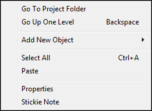

The menu can be opened by right-clicking the address bar or by clicking the menu button at the right edge of the address bar.

*   **Go To Project Folder**: Sets the project object in the address bar.
*   **Go Up One Level**: Sets the parent object in the address bar.
*   **Add New Object**: Shows a submenu where you select which type of object to create. The object is added as child object of the address bar object.
*   **Select All**: Selects all objects shown in the list.
*   **Paste**: Pastes any clipboard objects as child objects of the address bar object. The objects are pasted at the end of the child list.
*   **Properties**: Opens the properties dialog for the address bar object.
*   **Stickie Note**: Opens the stickie note window for the address bar object.

#### 2.6.5\. Project List Menu

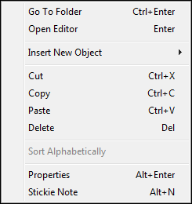

The menu can be opened by right-clicking on an object in the list.

*   **Go To Folder**: Sets the selected object in the address bar.
*   **Open Editor**: Appears in the menu if the selected object is an arrangement, sequence or sound object.
*   **Insert New Object**: Shows a submenu where you select which type of object to create. The object is inserted before the selected object and under the same parent object as the selected object. If you want to add a new child object to an object which does not yet have any child objects, use the **Go To Folder** command on the desired parent object and then use the **Add New Object** submenu in the project browser menu.
*   **Cut** & **Copy**: Cuts or copies all selected objects to the clipboard.
*   **Paste**: Pastes any objects on the clipboard into the object list before the selected object.
*   **Delete**: Deletes all selected objects. A confirmation dialog will appear.
*   **Sort Alphabetically**: Sorts a multiple selection alphabetically. If the selected objects span multiple folders, then objects within each folder are sorted separately.
*   **Properties**: Opens the properties dialog for the selected object.
*   **Stickie Note**: Opens the stickie note window for the selected object.

#### 2.6.6\. File Browser

The address bar at the top of the file browser shows the folder whose contents is shown as a tree view in the list below. Moving the mouse cursor over the address bar will highlight the individual parent folders in the folder path. Clicking a parent folder will set that folder in the address bar.

A folder select dialog can be opened by double-clicking on the blank area to the right of the folder name (to avoid going to a parent folder as described above), or by selecting the **Browse for Folder...** command in the file browser menu. You can also use the **Go To Folder** right-click menu command on a folder in the list.

When a folder is set in the address bar, any subfolders will initially be shown as collapsed in the file list. Searching all subfolders can be time-consuming so Podium only searches a folder when you open it in the list for the first time. The icon for a folder is shown dimmed to indicate that the folder has not yet been searched.

Navigation in the file list uses the same key shortcuts as all other tree lists in Podium. Use arrow, page up/down, home/end keys to navigate the list. Use -/+ or arrow left/right keys to collapse/expand a folder.

By default only file types that can be imported into the project are shown in the list. Icons similar to the ones used in the project browser are shown next to the files. A folder in the list may appear to be empty but can in fact contain hidden files. Enable the **Show All File Types** option in the browser options menu to show all files in the list.

If you double-click, press Enter or use the **Audition** right-click menu command on a sound or MIDI file, Podium will play the file while showing a progress bar. You can drag the sound or MIDI file directly onto the tracks in an arrangement editor, which will import the file as a sound or sequence object under the arrangement object. Alternatively you can use the **Import into Project** right-click menu command to import into the folder currently shown in the project browser address bar.

MIDI file audition is only available if an arrangement is currently powered on. The MIDI file will be played on the focus track, so you will only hear the notes if you have an instrument assigned on that track. Only the first available note sequence in the MIDI file will be auditioned. If the MIDI file contains multiple tracks, you can import it as a new arrangement using the **Import File...** command in the **Contents** menu on the project start page.

Files that are linked to the project are marked with pin icons at the left side of the file list. Pins will be placed next to the project file, sound files, and any image files specified in the **Project Properties** dialog. If a folder contains linked files, a dimmed pin icon is shown next to the folder. If there are linked files outside of the address bar folder, a dimmed pin icon will be shown in the address bar.

#### 2.6.7\. File Browser Menu

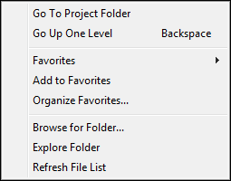

The menu can be opened by right-clicking the address bar or by clicking the menu button at the right edge of the address bar.

*   **Go To Project Folder**: Sets the project folder for the currently loaded project in the address bar.
*   **Go Up One Level**: Sets the parent folder in the address bar.
*   **Favorites**: Shows a submenu listing all configured favorite folders. Selecting a favorite will set that folder in the address bar.
*   **Add to Favorites**: Adds the current address bar folder to the favorite folder list.
*   **Organize Favorites...**: Opens the **[Favorite Folders](#h.152t5znf16p1)** setup dialog. In this dialog you can reorder the favorites and delete favorites you no longer need.
*   **Browse for Folder...**: Opens the **Browse For Folder** dialog where you can select a new address bar folder.
*   **Explore Folder**: Opens a Windows Explorer for the address bar folder.
*   **Refresh File List**: Refreshes the file browser list. Use this if you have changed the folder contents with a Windows Explorer.

#### 2.6.8\. File List Menu

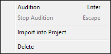

The menu can be opened by right-clicking on a file or folder in the list.

*   **Audition**: Starts audition of the selected sound or MIDI file. Audition behavior can be configured in the [browser options menu](#h.v2toa3r7qxur).
*   **Stop Audition**: Stops the current audition.
*   **Go To Folder**: Sets the selected folder as the address bar folder.
*   **Open Project**: Closes the current project and opens the selected project. If the project contains unsaved changes, you will be prompted if you want to save the changes.
*   **Import into Project**: Imports the selected sound or MIDI file into the project. MIDI files will be imported as arrangements. You can also drag MIDI files onto tracks of an existing arrangement, in which case only the first sequence in the MIDI file will be imported and placed on the track.
*   **Delete**: Performs a standard Windows file delete on all selected files and folders in the list. A confirmation dialog will appear. All deleted files will be moved to the Windows recycle bin. Be careful with deleting folders. Unless the **Show All File Types** option is enabled, folders that appear to be empty in the file browser may in fact contain non-media files.

* * *

## 3\. Devices

When working with devices in Podium, you use the same types of objects, whether you want to access simple MIDI and audio inputs, audio monitoring outputs, software plugins, mixer busses, ReWire devices, or external hardware devices connected via MIDI and audio interfaces.

Podium uses [Device Mappings](#h.7om17gfgqaaq), [Device Definitions](#h.fhmhc980qria), [Presets](#h.tnibgkjol3wp) and [Parameters](#h.9iroo5tnlh4t) to encapsulate the configuration of devices. The purpose of these device objects is both to hide the technical aspects of the different types of devices and to offer a uniform way of working with the devices in the arrangement editor.

Device mappings are the main handle to a device. A device may have multiple mappings associated if the device supports multiple MIDI or audio channel configurations. Each device mapping links to a device definition object that contains preset and parameter objects configured for that particular device. Preset objects are used to recall and store settings for a device. Parameter objects are used for automating single parameters in a device.

When you want to use a device in an arrangement you assign the device mapping to a track. Once assigned, you have access to the list of presets and parameters that are available for the device. You can then assign a preset to the track and create child tracks for parameter automation.

The project start page can be used to configure your devices, so normally you don't have to deal with the internal workings of the device objects.

### 3.1\. Hardware Devices

External hardware devices can be fully integrated into the Podium engine. If you hook up both the MIDI and audio connections of a device to your PC interfaces then you can control and route the audio through the device on a single track in an arrangement. You use the same approach whether you are working with hardware devices or with software plugins. This makes it possible to route hardware and plugins interchangeably in effect chains. Podium also supports full MIDI and audio latency compensation with hardware devices as well as with plugins.

To configure a hardware synth or effects unit, you import a device definition file from the project start page. A device definition file contains device objects that have been customized for a particular device. When you select a hardware definition on the project start page, a dialog pops up where you select the MIDI interfaces and the audio interface channels that your device is connected to. These settings will then be used by Podium to configure the imported mappings accordingly.

Note that the Podium installer only includes a few generic definition files. You can download device specific definition files from the Wiki section on zynewave.com. If you can't find a definition file for your device, you can import Cubase patch script files, or import one of the generic definition files that matches the type of your device. This will give you a set of default mappings, presets and parameters, which you then can modify according to the specs of your device.

### 3.2\. Plugins

Plugins are software program extensions that can be loaded into a plugin 'host' application where they are used to generate or process audio. There are many plugin formats available for audio processing. Podium supports the VST format including VSTi instruments. The device definitions forum on zynewave.com has links to plugin developers offering both free and commercial plugins.

Podium does not scan your harddisk for plugins when starting up. Rather you choose which plugins you want to work with in your current project by importing the plugins. Importing a plugin will create device objects based on the information provided by the plugin. The plugin itself is only loaded once you assign the plugin device mapping to a track in an arrangement and activate monitoring.

Plugins are imported on the project start page. Some of the more advanced plugins may have a premade device definition file in the Podium library. These device definition files are configured with additional information that cannot be extracted from the plugin itself. This can be MIDI parameter objects, customized mappings and categorized folders for presets and parameters.

Many plugins have a native editor window which can be opened within Podium. Plugins that don't have a native editor window will be opened in a generic editor window. The generic editor shows a list of parameters, their current value and a value dial. Rather than showing the VST parameters as defined by the plugin, the editor builds the list from the parameter objects found in the plugin device definition. Some plugins may expose invalid or incorrectly labeled parameters. By removing or renaming these parameter objects you can make the editor more accessible. Furthermore, if you organize the parameter objects into folders, the folder names will appear as group headers in the editor window. The generic editor is also available in the track inspector info panel.

### 3.3\. Multitimbral & Multiple IO Plugins

Some instrument plugins are multitimbral, meaning that they support the use of MIDI channels to play multiple programs simultaneously. Unless the plugin supports the VST v2.4 protocol there is no way for a host to know if the plugin supports multitimbrality. If an instrument plugin has been imported without individual MIDI channel mappings, right-click the corresponding object on the project start page and choose the **New Multitimbral Instance** command.

Plugins can be configured to work in either 'insert' or 'global' mode. If the plugin provides a single input/output configuration it will typically be configured as an insert plugin. Separate instances of the insert plugin will be created for each track the insert plugin mapping is assigned to.

A plugin that supports multitimbrality or multiple IO will typically be configured as a global plugin. A global plugin instance has a set of associated mappings, identified by the global instance number in the device mapping properties. This also means that, unlike insert plugins, separate sets of mappings are required for each instance that you want to use. The mappings for a global plugin instance are labeled (#1) etc. to help identify the instance. Extra mappings, labeled (#2), (#3) etc., can be created on the project start page by right-clicking an existing mapping and choosing the **New Instance** command.

If you don't want to use the multitimbrality or multiple IO capabilities of a plugin, it is highly recommended to use the plugin configured as an insert. It is easier to manage multiple instances of insert plugins, and furthermore the nature of the Podium hierarchic engine offers many benefits when both MIDI and audio routing of a plugin can be managed on a single track.

If you want to use a global plugin as an insert plugin but an insert mapping is missing, you can create one on the project start page by right-clicking a global mapping and choosing the **New Insert Mapping** command.

Some of the global plugin device definition files in the Podium library have alternative (global) and (insert) file versions. This gives you the option to import the plugin as either a global or an insert plugin.

### 3.4\. ReWire Devices

ReWire (by Propellerhead Software) is a system that makes it possible to transfer audio and MIDI data between two music applications, a ReWire host and a ReWire device, in real time. Podium can act as a ReWire host and implements ReWire mixer support.

You can stream audio from a ReWire device (such as Propellerhead's Reason) to Podium. You can use the transport controls in either Podium or the ReWire device to play, stop, or move the playback cursor and the applications will stay in sync. You can also control the ReWire device from Podium using MIDI. Record enabling a ReWire MIDI mapping track will record parameter tracks of control changes made in the ReWire device window if the ReWire device supports MIDI output.

When creating new projects, Podium will automatically detect any installed ReWire device applications and create audio mappings for these in a ReWire devices folder if the **Enable ReWire devices** option on the **[Plugins](#h.jk8a4utp7iam)** preferences tab is enabled. If you have installed new ReWire device applications you can import these into your existing projects using the **Import ReWire Devices** command on the **Devices** menu on the project start page.

Working with ReWire device mappings is similar to working with mappings of a global VST plugin. You have one or more audio output mappings and a set of MIDI mappings. The MIDI mappings are created and renamed dynamically by Podium in response to changes made in the ReWire device. For that reason you should not manually modify the ReWire MIDI mappings that Podium creates in the ReWire devices folder.

When you assign a ReWire mapping to a track, Podium will try to start the ReWire application. The **E** editor button on the track will light up to indicate that the ReWire application is open. You can click the **E** button to open/close the application, but most ReWire devices only produce sound when their application is open. Some ReWire applications will not start automatically when requested by Podium. That is the case with for example Ableton Live 7, which you will need to start manually after powering on an arrangement with Live mappings assigned to tracks, to make Live start up in ReWire device mode.

The use of ReWire devices can be enabled and disabled using the **Enable ReWire devices** option on the **[Plugins](#h.jk8a4utp7iam)** preferences tab.

For more information on ReWire, see [Propellerhead Software website](http://www.propellerheads.se/products/reason/index.cfm?fuseaction=get_article&article=rewire).

### 3.5\. Device Mappings

Podium will create and maintain many device mappings for you automatically. In some cases, however, you may have to create or modify a device mapping manually. This could be the case for example if you want to connect a hardware device for which a device definition doesn’t exist or if an automatically created mapping doesn’t work with your configuration.

It is recommended that you use the project start page commands to create the device mapping objects. The properties of the objects can then be customized afterwards.

Device mapping objects can be configured for either audio/MIDI interfaces, plugins or mixer busses. Audio/MIDI interface mappings can furthermore be categorized as input mappings, audio output monitor mappings or external device specific mappings.

Input mappings are configured as either MIDI or audio interface inputs. These mappings are used with MIDI controllers and microphone/line audio inputs to record MIDI and audio on tracks. Input mappings are available in the track inspector input panel, and can be assigned to tracks independently of output mapping assignments.

Audio monitor mappings are configured with only audio interface outputs. These are used for monitoring the audio output of your arrangements, either through speakers or headphones connected to your audio interface.

External devices controlled via a single MIDI channel and a single audio IO configuration can be configured within a single device mapping object. This allows total integration of the device on just one track in the arrangement. If the device supports multitimbrality or multiple IO, there need to be mappings for each MIDI channel and IO configuration.

The way plugins are configured is very similar to how external devices are configured. The main difference is that the plugin file is specified instead of MIDI and audio interfaces.

Mixer busses are a feature of the Podium mixing engine that allows audio to be extracted from tracks assigned with bus send mappings, and injected at tracks assigned with matching bus return mappings. A total of 99 mixer bus instances can be configured, and each mixer bus supports up to 32 audio channels.

#### 3.5.1\. Device Mapping Properties

To display the **Device Mapping Properties** dialog for a device mapping, locate the device mapping on the project start page, right-click it and choose **Properties**.

The **Device definition** drop-down list is used to select a device definition folder that will contain preset and parameter objects for this device.

The choices for **Mapping type** are: Audio/MIDI interfaces, mixer bus, VST plugin, and ReWire device. Various settings in the dialog will be disabled if they have no relevance to the selected mapping type.

Select **Link to global instance** and specify a number if this mapping is referring to an instance that is shared with other mappings. When used with plugins, the instance number is joined with the plugin file name to identify a unique instance of the plugin. When used with audio/MIDI interfaces, the instance number is joined with the device definition object to identify a unique instance of the external device.

The interface settings will be available when the mapping type is set to audio/MIDI interfaces. If you only use one MIDI interface in your studio setup, you would typically select the \<any available interface> option, to ensure that the mapping will still be valid if you later change your MIDI interface. If you use several MIDI interfaces you need to select the specific interface that this device is connected to.

**Plugin configuration:**

For software plugin mapping types, the plugin file name should be entered either directly or by locating the installed plugin with the **Browse plugin** dialog. If your plugin is located within the folder path of the default VST folder defined in the **[Plugins](#h.jk8a4utp7iam)** preferences tab, you should select the **Relative path** option. This will remove the absolute path part of the file name. If you later relocate your VST folder or try to open the project on a system with a different VST folder location, the plugins can still be found with the relative path.

If the **Use generic editor instead of plugin editor** option is enabled, Podium will open the generic plugin editor window, even if the plugin has its own native editor. This may be preferable if the plugin native editor is badly designed. Some native plugin editors may even be unstable and cause crashes.

**MIDI input configuration (plugin output):**

If a MIDI input interface is configured you can choose to filter the incoming MIDI to a specific channel. This can be useful if you have a MIDI controller that supports selection of MIDI channel. If you create separate device mappings for each channel, and assign these to your instrument tracks in an arrangement, you can control the different instruments just by switching MIDI channel on your controller.

The **Transpose notes on input** setting will transpose all incoming MIDI notes before they are sent to the receiving device or recorded to sequences. This is useful if you have a MIDI controller that does not allow easy transposition of octaves. You can then create alternative input mappings with different octave transpositions and just switch among these in the track inspector input panel.

If the mapping is configured with both a MIDI input and output interface then the **Send input thru to output interface** option determines if the received MIDI input should be echoed straight through to the output interface. This option should be set only if the local on/off setting on the external device is set to off, otherwise you will get 'double notes' played on the device. Setting the device to local off, and enabling the mapping thru option, will route the keys and controllers action on the device into Podium before being sent back to the device for playback. This allows you to record the performance in Podium.

**MIDI output configuration (plugin input):**

The MIDI output **Channel** should be set to the same channel that is selected on the controlled device. Furthermore, if the device supports SysEx, the **SysEx device ID** should match the device setup. The two SysEx variables provide a means to encode mapping related numbers into the parameter SysEx messages. Depending on the device this could for example be a part number that corresponds to the MIDI channel number.

The **Device is an instrument** option is used by Podium to distinguish between effect and instrument mappings. This determines for example what kind of sequence is created by default on tracks assigned with this mapping. If configured as an instrument, note sequences will be created. Otherwise curve sequences will be created for parameter automation.

**Audio configuration:**

If the mapping is configured to use audio you can select how many source and target channels are used by this mapping. If the device being mapped is a multiple IO plugin or an external device connected to a multiple channel audio interface, then you can set the **First channel** to offset the channels into the number of available channels.

Note that the source and target channels are to be seen from the perspective of the Podium mixer engine. For audio interfaces 'source' refers to the audio interface inputs, but for plugins 'source' refers to the plugin outputs. It is perhaps easier to think of source channels as 'providing a source of audio to the Podium mixer engine'.

### 3.6\. Device Definitions

When you want to use a hardware device or a plugin in your project, the recommended procedure is to use the project start page to import a device definition file from the Podium library. Definition files contain an organized collection of device mapping, preset and parameter objects, enabling you to fully control the device in your arrangements.

If the Podium library does not contain a file for your hardware device, you can alternatively import the widely available Cubase patchname script files. Searching the internet for scripts for your device will likely provide you with links to sites where you can download the files.

If you have a plugin that is not available in the Podium library, you import it by locating the installed plugin file. This will automatically create device mapping objects for all the supported IO configurations and create program presets and VST parameters as declared by the plugin. The VST specification does not provide a means for the plugin to declare its MIDI parameter support, so if you want to use MIDI automation you will have to configure these parameters manually.

#### 3.6.1\. Device Definition Properties

Device definition objects are simple folder objects that act as containers of preset and parameter objects. They can be found in the folder page view of projects but not on the project start page.

In the **Device Mapping Properties** dialog you select a device definition object to create a link between the mapping and a compatible collection of presets and parameters. Podium uses this relation to make it possible to create several mappings for a particular device and only keep one copy of the device definition folder in the project.

#### 3.6.2\. Creating Library Files

By using the project start page to import device definition files, you don't need to go into the details of configuring device objects. If on the other hand you have a device that is not available in the Podium library, you may want to create a library file for it.

For starters it would be a good exercise to load some of the existing library files and browse the project hierarchy to examine their structure. When you want to create a new library file, use the **New Project** command on the **Project** menu to start out with a blank project. Click **Cancel** in the **New Arrangement Properties** dialog.

Switch from the project start page to the folder view of the project by clicking the round button at the top right corner of the page. (If you want to switch back to the project start page from the folder view: make sure the active tab is the tab named after the project and click the round button again.)

To create a definition file for a hardware device, the best approach is to import a Cubase patch script file for the device using the **Import File...** command on the **File** menu (or by pressing Ctrl+I). When you import a Cubase patch script file all presets will be configured correctly. Script files do not contain definitions for parameters, so Podium will create a set of default MIDI controller parameters. You may want to customize the parameters according to the MIDI specification of the device. If you cannot find a script file for the device, the next best approach is to import one of the generic library files and customize the objects.

To create a definition file for a plugin, select **Import Plugin...** on the **File** menu (or press Ctrl+Shift+I) and locate the plugin. Podium creates a device mapping and a definition folder for the plugin. If you browse into the definition folder you should see a "Library" folder. Depending on the type of plugin you may also find a "VST Parameters" folder and/or "MIDI Parameters" folder. The "VST Parameters" folder contains preset and parameter objects created from information provided by the plugin. The "MIDI Parameters" folder contains MIDI parameters created by Podium assuming they are supported by the plugin. This is the folder where you create additional MIDI parameters supported by the plugin.

Before creating additional MIDI parameters, check the plugin documentation to determine what MIDI messages are supported by the plugin. The plugin should preferably provide a preconfigured setup of MIDI controllers. If the plugin only supports user-assignment of controller numbers to certain parameters, then the library file will most likely not be compatible with other users' setup.

The easiest way to create new MIDI parameter objects is to copy an existing parameter and paste it for each new parameter. Open the **Parameter Properties** dialog for the new parameters and edit the **Parameter name** and **Control change number**. See the [parameters](#h.9iroo5tnlh4t) section for a more detailed explanation of the various parameter configurations.

If there are many VST or MIDI parameters you should group them into subfolders. Create folders for things like Osc, Filter, Amp, Effects etc. Organizing the parameters into folders will help you with the overview and navigation in the track inspector parameter panel. It is also recommended to order the parameters according to the layout of the user interface.

When done, browse up to the main project and open the **Project Properties** dialog to enter a proper name for the project. The naming convention used in the Podium library is "manufacturer name - product name". Optionally add a stickie note to the device definition or mapping objects with details about configuration of the external device, website links, version number of the plugin etc. Save the project file in the proper library folder with a file name matching the project name. The file is now ready to be imported into any of your future projects using the import commands on the project start page.

### 3.7\. Presets

There are two types of presets. Program presets are used for selecting predefined programs in your plugins and hardware devices. Library presets contain the actual preset data either in the form of a VST plugin preset or bank file or MIDI SysEx messages.

Importing a device definition on the project start page or importing a plugin directly should provide you with all the program presets that the device supports. Library presets are created by importing preset files or by using the various preset menu commands in the arrangement editor.

You use preset objects by assigning them to tracks. Whenever that track is being prepared for monitoring/playback the preset will be recalled on the device if needed.

More information on how to work with presets in arrangements can be found in the [preset panel](#h.x9w2eek2tp9q) and [using presets](#h.rixdsd9nehz8) chapters.

#### 3.7.1\. Program Preset Properties

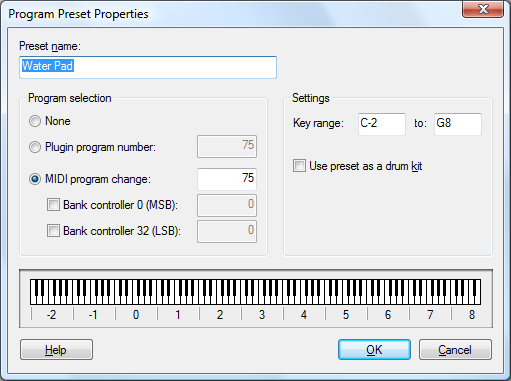

Program presets for external devices use MIDI bank and program change messages. Program presets for plugins will normally use VST program numbers but can also be configured to use MIDI messages. Note that not all plugins support MIDI program changes. VST program numbers cannot be used to select programs on individual MIDI channels, so when using multitimbral plugins you have to use MIDI program changes for that purpose.

Some advanced MIDI devices, such as those supporting the XG format, can automate parameters for individual drum notes. If you on the same track assign a drum parameter and a drum preset configured with a limited key range, then any curve sequences playing on that track will combine the drum preset key range with the parameter to automate that specific drum sound.

#### 3.7.2\. Library Preset Properties

The data contained in a library preset consists either of a VST plugin program file (.fxp) or bank file (.fxb) or binary MIDI SysEx messages (.syx).

Plugins and external hardware devices hold only a limited number of presets. You may need to store more presets than can be stored in the device. Rather than relying on loading VST bank files in your plugins or using various storage media with your hardware devices, you can opt to store the presets in your project file and have your entire collection of presets instantly available when you need them.

Just as with program presets, library presets need to be placed within the device definition folder for the device, or else they won't be available in the track inspector preset panel. To create library presets by importing preset files: Use the project window to navigate into the proper device definition folder. Optionally create a "Library" subfolder and navigate into it. Use the **Import File...** command on the **File** menu. Set the file dialog filter to All Files (\*.\*) and open the preset files.

With the two buttons in the **Library Preset Properties** dialog you can import and export the preset files, in case you need to exchange presets with other applications.

When Podium stores a plugin or SysEx preset it uses a zip packing algorithm to minimize the memory and disk space requirements. For some plugins this can drastically reduce the size to less than 1% of the unpacked preset. The byte size shown in the **Library Preset Properties** dialog is the size of the compressed data.

### 3.8\. Parameters

Parameter objects can be configured for various types of MIDI messages as well as VST plugin parameters and Podium mixer engine parameters.

You use parameter objects by assigning them to tracks with curve sequence automation, or by dragging them onto tracks to create parameter events.

More information on how to work with parameters in arrangements can be found in the [parameter panel](#h.ed57aa1rrutb) and [parameter automation](#h.l9u0rfngkzfi) chapters.

#### 3.8.1\. Parameter Properties

The MIDI protocol defines a wide range of message types used for transmitting various sorts of information. With the **Parameter type** drop-down list you can select among these MIDI message types, as well as: Plugin Parameter, Audio Level, Audio Panning and Audio Send.

For polyphonic pressure messages you specify an associated **Note number**. This message type was designed to provide separate 'aftertouch' for each key held. Keyboards supporting polyphonic pressure are rare and often expensive. Some synthesizers uses polyphonic pressure messages in an unconventional way as an addition to control change messages.

For control change messages you specify a **Control change number**. This number is used to identify the parameter in the plugin or external device. Control change messages can transmit 7-bit values (0-127).

The dual control change message combines a pair of control change messages for a single parameter and by doing so can transmit 14-bit values (0-16383). The MIDI protocol specifies that controller numbers 0-31 are intended as the MSB values and controller numbers 32-63 the LSB counterparts. If you select the dual control change type the **Control change number** should be set to the MSB number (0-31). Podium will add 32 to this number to get the LSB number. Note that very few devices support the dual control change method.

Many devices support a larger number of parameters than is accessible with simple control change messages. To access these parameters a device may implement support for RPN/NRPN or System Exclusive messages.

RPN/NRPN is short for 'registered parameter number/non-registered parameter number'. Parameters using RPN are defined by the MIDI protocol and include generic parameters such as master-tune. NRPN definitions are entirely in the hands of the manufacturer of a device, and can be unique for each product. RPN/NRPN messages consist of a series of control change messages reserved by the MIDI protocol. Two control change numbers are used to set a current parameter number and a further two control change numbers are used to set the value of the current parameter. So when combined, you can access 16384 parameters and set their values with 14-bit resolution (0-16383). When using RPN/NRPN parameters, Podium handles all necessary transmission of control changes internally.

The **Use note number for LSB part of number** option is used for example to encode the note of a drum preset into the NRPN message. The **Data value consists only of MSB** option will skip the LSB value and only send 7-bit values.

The value definition settings allow you to restrict the range of valid values, set a default value for use by the curve editor and automation tracks, and to define a zero offset point. If you are configuring a center based parameter such as a panning position, you can specify a value range of 0-127 and a default value and zero offset of 64\. Thus when displaying a curve sequence, the curve will be drawn with its base at the center.

By default plugin parameters use 32-bit floating point values ranging from zero to one. This is the resolution Podium will use if both the min and max settings for the range are set to 0\. Most plugin parameters will use a limited number of value steps, such as an on/off switch, a type selector, or a dial with a 0-127 value range. The floating point values stored in the plugin and sent to Podium will be quantized accordingly. The plugin will of course accept values from Podium in the full floating point range and just round to the nearest valid value. When the number of plugin parameter value steps is known, you can enter the same number of steps in the parameter value range settings. This will make Podium remap the floating point parameter values when displaying the value in the curve editor and the mixer sliders.

The **Record as curve sequence on separate track** option should be enabled for any parameters that are suited for curve automation. If this option is disabled then parameter changes will be recorded as individual parameter events.

#### 3.8.2\. System Exclusive Messages

Understanding and configuring SysEx messages can be a complex task and requires that you are confident with hexadecimal numbers and the MIDI protocol in general.

Podium supports dynamic SysEx messages by using a simple macro language. This allows Podium to encode parameter value and information from device mapping and preset objects into the transmitted SysEx message.

The following macro identifiers are available:

*   [value]
*   [deviceid] or [devid] or [id]
*   [variable1] or [var1] or [v1]
*   [variable2] or [var2] or [v2]
*   [channel] or [chnl]
*   [note]

You may truncate the macro names, for example [value], [val], [v] as long as the macro name is surrounded by [ ]. The macro names are not case sensitive.

You can append bit operators after the macro name. This is used to mask out bits and split up a large number in several bytes within the message. If you write a number immediately after the macro name this will be used as a bit start offset (in essence a right shift operator). A bit width can be specified by writing a colon followed by the bit width.

You can use the '|' character between elements in the message to 'OR' the numbers into a single byte.

The [device id] and [channel] are the **SysEx device ID** and MIDI output **Channel** from the **Device Mapping Properties** dialog.

The [variable1] and [variable2] can be used for alternative enumerations of the voices on a device. As an example the Yamaha SW1000XG sound card has 32 different 'parts' that are accessed through two different MIDI ports for normal channel messages. However SysEx messages use part numbers 0-31 rather than MIDI channel numbers. The SW1000XG device mappings are configured with both MIDI channel numbers and their corresponding part number in 'SysEx variable 1'. Furthermore the SW1000XG supports routing its audio channels through its built in effects, which requires the use of 'SysEx variable 2' to enumerate the alternative audio channels.

The [note] value is the low note of the key range defined in the preset object that is active on the track that sends this message. This can be used to control specific drum note voices within a drum kit.

Here is an example of a master tune message for the SW1000XG. The value is split up into 4 bytes that each holds 4 bits of the value: F0,43,10,4C,00,00,00, [val12:4], [val8:4], [val4:4], [val0:4], F7

Here is an example of 'Reverb Return Level' from the Yamaha AN1x synth. The 'OR' operator is used to combine the hex value 10 (indicating parameter message) with a 4 bit device ID: F0,43,10|[id:4],5C,10,00,41,[val],F7

* * *

## 4\. Editors

Sequences are objects that have a timeline. There are four different types: [arrangement](#h.gb6j5hy74mvq), [sound](#h.dt6ocnu9e8au), [note sequence](#h.ttvmxags9otu)and [curve sequence](#h.o6oomworp3q7). All sequences can contain various types of events that place data on the timeline. Arrangements add the use of tracks to hold some types of events. Sounds additionally contain one or more channels of audio samples.

For each type of sequence there is a dedicated editor. These editors share some common features which are described in this chapter.

When you enter into a sequence object in the project window, an editor page is installed instead of the normal folder page. Typically you enter into an arrangement, and access sounds, note and curve sequences on the tracks in the arrangement editor. You access editors for these sequences either with the arrangement embedded sequence editor, or by opening separate editor windows. All sounds, note and curve sequence objects created in the arrangement editor are placed under the arrangement object in the project.

Many of the editor controls can be activated using key shortcuts and some of the tools have alternate actions when used in combination with key shortcuts. When the **Popup Help** option on the **Help** menu is enabled, placing the mouse over a control will pop up a description with mouse and key shortcuts hints.

A common feature of the editors, is that any drag action can be canceled by right-clicking before releasing the left button. This applies both to dragging objects, editing and zooming with the editor tools, dragging value dials, dragging mixer sliders and resizing panels in the editor. Canceling by right-clicking will undo the effect of the drag operation and revert to the state before the drag action was begun. If the canceled drag action was an edit to a sequence then the edit can be restored using the redo edit command.

### 4.1\. Timeline

The timeline ruler region at the top of the editor shows the currently displayed timeline range. The ruler shows a handle for the edit cursor and draggable bars for segment selection, punch and loop ranges. When the mouse is placed over the timeline you can use the mouse wheel to zoom in/out. Holding Shift while using the mouse wheel will scroll the timeline.

The timeline context menu has commands for setting the timeline controls based on the clicked position, the edit cursor position or the current selection. The time position is shown in the menus that use either the clicked position or the edit cursor position. The editor snap mode and quantize value will affect these positions.

If the editor is showing a sound, note or curve sequence that is opened from a sequence event in the arrangement editor, then the timeline resolution will be locked to the arrangement timeline, as will the edit cursor, punch and loop settings. Only the segment selection is independent of the arrangement. The part of the sequence timeline that extends beyond the range of the sequence event is painted with a darker background color.

Use the four **CSPL** buttons or the ruler context menu to select either cursor, segment, punch or loop edit mode. The edit mode determines which of the four is painted topmost and also which is affected when you click and drag in the ruler. For example the loop bar may be overlapped by the punch bar, in which case you need to select the loop edit mode to be able to drag the loop range.

Set the edit cursor position by dragging the handle or by clicking and dragging in the ruler using the cursor edit mode. The editors can optionally show separate edit and play cursors. The **Link Edit Cursor To Play Cursor** option is available on the timeline ruler context menu and on the editor **View** menu. When this option is disabled the editor will show separate edit and play cursors during playback. The edit cursor can be moved without affecting playback. Stopping playback will return the play cursor to the edit cursor position. Pressing the play button during playback will restart playback from edit cursor position. When the option is enabled, double-clicking in the timeline ruler starts and stops playback. When using key shortcuts to move the cursor during playback the separate edit cursor appears and there is a small pause before playback jumps to the new position. The pause gives you time to use multiple keypresses to reposition playback.

The segment, punch and loop ranges are displayed as bars with handles at the edges. Drag the top part of the bar to move the whole range, and drag the handles to resize the range.

The segment bar is only displayed if a segment is selected. The segment is highlighted by a translucent curtain that is painted on top of all regions that have a timeline.

The appearance of the punch bar depends on whether punch in and out are enabled. If only one of the punch in or out buttons are enabled, then the punch bar is extended to the edge of the timeline to indicate that recording will not punch in or punch out. The punch bar is painted with a dimmed color if neither punch in or punch out are enabled and recording mode is not activated. When recording mode is activated, areas that will be affected by recording, such as record enabled tracks, are painted with the record color.

The loop bar is painted with a dimmed color if looping is not activated. When looping is activated, the loop range is highlighted by a brighter background color in all regions that have a timeline.

### 4.2\. Selection

On the timeline you can use two different types of selection methods. You can select events or you can select a timeline segment. In arrangements you also have a focus track that receives key focus when there are no event or segment selections.

Selection can be done with the mouse or with key shortcuts. Edit actions will apply to the current selection. The state of the current selection and the clipboard contents determine which commands are available on the **Edit** menu and editor context menus.

Mouse selection of events can be done using the select and pencil tools. Clicking on an empty spot with the select tool will reset all selections. Clicking on an unselected event will select it and deselect other events. Clicking on an already selected event will only deselect other events when you release the button. This allows you to click on a multiple event selection and drag them to a new position. Ctrl+clicking an event will toggle selection of that event and preserve selections of other events.

Clicking on an empty spot with the select tool will start a marquee drag selection. When the mouse is released all events that overlap the marquee are selected. Holding the Shift key while clicking will start a marquee selection no matter if you click on an empty spot or an existing event. Using Shift will also preserve the existing event selection and it can be used with the pencil tool as well.

Segment selections can be made by dragging with the segment tool, or by dragging in the timeline ruler if the ruler segment edit mode is selected.

Press Ctrl+A to select all events in the sequence. Press J or Alt+J to set the segment selection to the markers that surround the edit cursor. Press Shift+J to move either the start or end edge of the segment selection to the edit cursor position. Press the arrow keys to move either the track focus or a currently selected event focus to the closest track or event.

### 4.3\. Clipboard

In addition to the object clipboard used in the project and browser windows, there is a sequence clipboard that is accessed with the **Edit** and context menus in the editors. The sequence clipboard can store events, segments, tracks and sound channel samples.

When you paste an an event selection that you have cut or copied to the clipboard, the events are inserted starting at the current segment selection, or if there is no segment selection, at the edit cursor position. When copying track events in the arrangement editor, the events are stored with a track offset relative to the focus track. Thus you can paste events onto other tracks by moving the track focus before doing the paste.

Cutting and pasting an event selection will not change the positions of the other events in the sequence. Use segment selection to cut or copy entire segments and all events within. Events will be split if they extend across the segment edges. Pasting a clipboard segment will insert the segment at either the current segment selection, or else at the edit cursor position. Existing events that extend across the insert position will be split and the last part moved to the end of the inserted segment.

The track context menu has a submenu with clipboard commands.

### 4.4\. Edit History

Edit actions are logged in a history list for each sequence object. The undo and redo toolbar buttons and the Ctrl+Z and Ctrl+Y key shortcuts will step back and forth in the history. The maximum number of logged actions can be defined in the **Preferences** dialog.

You can also access the edit history using the undo and redo menus. The menus show each undo and redo edit with the time elapsed since the edit was made. Open the menus by Shift+clicking or right-clicking the buttons or by using the keyboard shortcuts Alt+Z and Alt+Y respectively.

Some edit actions in the arrangement editor involves changes both to the arrangement and other sequences. The changes made to the other sequences are logged in the history of these sequences. Undoing the edit action in the arrangement editor will also undo the related edit action in the sequences, provided that you have not since made edits to the sequences in their own editors.

Note that changes that only relate to the visual layout are not logged in the edit history. This includes minimizing and hiding track lanes and track groups, resizing tracks or sound channels, zooming and scrolling.

### 4.5\. Toolbars

This chapter describes the elements of the default edit, track, editor profile and transport toolbars. The track and editor profile toolbars are only present in the arrangement editor. The transport toolbar is only present in the arrangement editor and the standalone sound editor, since sounds, note sequences and curve sequences placed on tracks are controlled by the arrangement editor transport.

You can customize the elements in the toolbars, if you for example want to remove elements you have no need for, or if you want to join the edit and transport toolbars into one toolbar. See the [editor profiles](#h.w97na76gog9d) chapter for more information about how to configure an editor profile.

You can specify the height of a toolbar in the toolbar setup dialog. You can also adjust the height directly on the toolbar: Move the mouse cursor onto the toolbar and use the mouse wheel while holding the Ctrl key down. The elements in the toolbar will resize accordingly. Note that the **Default button size** setting in preferences controls the height of all buttons in the UI, including those in toolbars. To adjust the default button size: Move the mouse cursor onto the project window menu bar and use the mouse wheel while holding the Ctrl key down.

#### 4.5.1\. Edit Toolbar

*   **File menu**: See the [File menu](#h.lje072d0va6d) section.
*   **Track menu**: See the [Track menu](#h.1fwio3lvq5lr) section. Only available in the arrangement editor.
*   **Edit menu**: See the [Edit menu](#h.44nlc4xedbmx) section.
*   **View menu**: See the [View menu](#h.nq3103tkz4a2) section.
*   **Undo**, **Redo**: When you move the mouse cursor over either of the buttons, a popup will show a description of the next undo or redo action. The buttons are dimmed if there are no undo or redo steps available. Press Ctrl+Z to undo and Ctrl+Y to redo. Right-click either button, or press Alt+Y and Alt+Z, to show a menu listing the edit history. Each edit step in the menu has an hour:minute:second timestamp that shows how long ago the edit action was applied. Click a step in the menu to undo/redo all the steps up to and including that step. See the [edit history](#h.9angtgx8xrjc) section for more information.
*   **Tool**: The selected tool button will determine the primary edit function of the left mouse button. The tools included in the default arrangement editor profile are: **Select**, **Segment**, **Pencil**, **Eraser**, **Scalpel**, **Slide**, and **Zoom X/Y**. Some of the actions you can do with a certain tool can also be done with other tools, using key modifiers. Selecting a tool for a specific purpose can speed up editing in some situations. Press D or F to cycle the currently selected tool. Enable the **Include editor tool shortcuts in timeline context menus** option on the **Application** tab in **Preferences** to allow selecting tools from the right-click menu in the editor timeline.
*   **Snap**: When enabled, all mouse actions on the timeline will be snapped. Snapping can be configured using the adjacent **Grid & Snap menu**. Press A to toggle snap on and off. Hold Shift while moving or editing events to temporarily disable snap.
*   **Grid & Snap menu**: In the menu you can select grid values from a whole bar down to 1/128 notes, as well as options for snap behaviour. The current grid value is displayed on the menu button. Press Shift+D or Shift+F to cycle through the grid values. See the [Grid & Snap menu](#h.2uqlo93h56m2) section.
*   **Mouse cursor**: Displays the position of the mouse cursor, if it is positioned within the timeline. Time is displayed with a subdivision of the editor grid value. If snap mode is disabled, a percentage value is displayed to indicate the relative position between the two nearest grid lines.
*   **Segment range**: Shows the start and end position of a segment selection.

#### 4.5.2\. Track Toolbar

*   **Add new track**: Left-click to open the **Track Properties** dialog for a new track. Right-click to show an options menu. The menu contains the **Add New Track** command (same command as left-click) followed by a list of all your track templates. The new track will be added to the bottom of the track list.
*   **Global solo**, **Global mute**, **Global record arm**: The buttons are lit if there are any soloed, muted and record armed tracks. Hovering the mouse cursor over a button will show a popup listing the names of all affected tracks. Clicking the button will reset the mode on all tracks. The buttons are useful for quick overview, in case you work with a lot of tracks that don't fit on the screen at the same time.
*   **Track tag bar**: Clicking the **Tags** button opens the **Track Tags** dialog. If there are any tags defined in the arrangement, these will be presented as buttons to the right of the **Tags** button. See the [track tags](#h.bxehbr2enpil) section for more information about track tags and how to configure them.

Clicking a tag button will select/reset the tag. Selecting a tag that is part of a mutually exclusive group (buttons that are joined with no space between them) will reset other tags in the group. Ctrl+click a tag to toggle it without resetting other tags.

Each tag button has a small check button inside it. Check buttons indicate which tags are assigned to the focus track. Click a check button to assign/remove the tag on the focus track. Note that if you remove a tag from the focus track, the track may become hidden if the tag is selected.

Right-clicking a tag button will show an options menu:

*   **Solo**, **Mute**, **Record Arm**: Toggles the solo, mute or record arm state off/on for all tracks that has this tag. The state is enabled for all tracks, if the state is off for one or more of the tagged tracks. Otherwise the state is disabled for all tracks.
*   **Customize tag**: Opens the **Track Tags** dialog with the tag selected in the list, and key focus set to the tag name edit field.

#### 4.5.3\. Editor Profile Toolbar

The editor profile toolbar is used to quickly switch between editor profiles. In the default setup this toolbar is only included in the arrangement editor. The available arrangement editor profiles are: Tracks, Editor, Mixer, and Big Transport.

The only element contained in the toolbar is the **Editor profile bar** element. The profile bar shows a row of buttons that represent the available editor profiles. Editor profiles are designed specifically for either arrangements, sounds, note sequences or curve sequences. Only profiles that are compatible with the editor are shown in the profile bar. In addition to the editor specific profiles you also have generic profiles, such as the **Event List** profile, which can be selected in all editors. Generic profiles are rarely used, so they are not included in the profile bar.

Click a profile button or press the 1-9 number keys to select a profile. You can also select a profile from the list in the **View** menu.

You can customize the editor profiles by right-clicking one of the profile buttons to bring up an options menu:

*   **Customize Editor Profile**: Opens the **Editor Profile Properties** dialog. The same command is also available for the current profile in the **View** menu.
*   **Duplicate Editor Profile**: Creates a copy of the profile, next to the original. The copy can for example be modified by stripping away regions you rarely use, in order to maximize the available vertical space for timeline editing.
*   **Delete Editor Profile**: Removes the profile from the setup completely. If it is the current profile, then the first available profile in the list will become the current profile.
*   **Move Left**, **Move Right**: Shifts the selected profile one position to the left or right in the profile list.

The toolbars in the default setup are configured so that they will fit on a small screen resolution without being truncated. If you are working with a large screen resolution, you may, for example, want to move the editor profile bar into the edit toolbar, so that you can free up some vertical space by deleting the dedicated editor profile toolbar. To do that, follow the steps listed below. Note that you will need to repeat those steps for each of the profiles in the editor profile bar.

*   Right-click a profile button and select **Customize Editor Profile** to open the profile dialog.
*   Select **Toolbar (Edit)** in the **Region list** and click **Properties** to open the toolbar dialog.
*   Scroll to the bottom of the **Layout** list and select the bottom line divider in the list.
*   Select **Align to right** in the **Elements** list and click **Insert**.
*   Select **Editor profile bar** in the **Elements** list and click **Insert**.
*   Click **OK** to close the toolbar dialog.
*   Select **Toolbar (Editor profile bar)** in the **Region list** and click **Delete**.
*   Click **OK** to close the profile dialog. If you select the profile you should see that the profile bar has moved up on the edit toolbar.

If you have created your own additional profiles for sound, note sequence and curve sequence editors, you could also use the above procedure to add the editor profile bar to those editors.

If you accidentally mess things up while experimenting with the editor layout configuration, you can retrieve the default editors by using the **Restore Default Editor Profiles** command in the **Setup** menu.

#### 4.5.4\. Transport Toolbar

The Power, Play, Loop, Record, Metronome, Punch In and Punch Out buttons can be right-clicked to open an options menu. Most of the menu options are shortcuts to relevant options in the **Preferences** dialog.

*   **Power**: Turning the power on for an arrangement will load plugins and start monitoring of any MIDI and audio inputs that are assigned to tracks. The power button pulsates when power is off. Note that power is not turned off if you leave the arrangement editor. Only one arrangement can be powered on at a time. Press Ctrl+Shift+Alt+Space to toggle power.
*   **Stop**, **Play**: Playback will start from the edit cursor position. If the **Link Edit Cursor to Play Cursor** option in the **View** menu is disabled, clicking play during playback will restart playback from the edit cursor position. Press Space to toggle playback. Press Numpad Enter to start playback. Press Numpad Zero to stop playback. Press Numpad Zero twice to move the edit cursor back to the start.
*   **Loop**: Enables looping around the time range shown in the adjacent loop range field. Enabling loop mode will reveal the loop region above the timeline ruler, where you can set the loop range by dragging the loop bar. Press L to toggle loop mode. Press Shift+L to set loop start or end at the edit cursor position. Press Alt+L to set loop around the current event or segment selection.
*   **Loop range**: Shows the loop start/end positions. The positions are displayed with a subdivision of the time signature at the start/end position. The text is dimmed if loop is not enabled.
*   **Record**: The record button arms the arrangement for recording. Recording will start on all record armed tracks once playback is started. Press K or Numpad Decimal to toggle recording mode.
*   **Metronome**: Outputs a click on bars and beats. The metronome can be configured on the **[Metronome](#h.c2qttg8o8l3p)** preferences tab. Press U to toggle metronome mode.
*   **Punch in**, **Punch out**: Enables recording within the time range shown in the adjacent punch range field. Enabling punch in or punch out mode will reveal the punch region above the timeline ruler, where you can set the punch range by dragging the punch bar. Press I and O to toggle punch in/out modes.
*   **Punch range**: Shows the punch in/out positions. The positions are displayed with a subdivision of the time signature at the start/end position. The text is dimmed if punch in or out is not enabled.
*   **Edit/Play cursor**: Shows the position of the edit/play cursor. The play cursor position is shown during playback, and the edit cursor position is shown when stopped. If the arrangement time resolution is time signature based, the time is displayed both as hours:minutes:seconds,hundreds and as bars and beats, followed by a meter that illustrates the position within the current bar. If the arrangement time resolution is linear, the time is shown as hours:minutes:seconds,hundreds only.
*   **Time signature and tempo**: Shows the time signature and tempo at the edit/play cursor position. Double-clicking the field will open the properties dialog for the tempo event that is placed before or at the cursor position. If there is no tempo event, a new event will be created at the start of the arrangement. Note that, since tempo events can be configured with either time signature and/or tempo settings, the displayed time signature or tempo may be set by a previous tempo event.
*   **Performance indicator**: Shows the relative time used by the mix engine and the sound file streaming, before overload will occur. When overload occurs it can result in gaps in the audio output. If an overload has been detected, the background will be colored with the overload color (as specified in the current color setup). This can be a helpful indication whether a recording was made without any sound drop-outs. Clicking the indicator will reset the overload coloring. The following are some observations about performance:  
    1: Factors that will affect performance include: available computing power, the buffer size configured for the audio interface, disk read/write access time, and other programs running on the PC.  
    2: The mix percentage includes the processing of plugins, but the actual CPU usage of plugins may be smaller. You can verify this with the Windows Task Manager performance graphs.  
    3: In order to process audio without audible gaps, the mix engine must be able to complete its processing within the time of each buffer that is requested by the audio interface. Using small buffer sizes will result in low latency, but it increases the sensitivity to CPU spikes caused by software running in high priority mode. This could be a plugin that needs to do occasional CPU intensive initialization in response to program or parameter changes, or system critical processes that needs to do file access. That is why you will see a more frequent occurrence of performance spikes when you are using small buffer sizes.
*   **MIDI indicator**: The upper part lights up when MIDI is received on any configured MIDI input interfaces. The bottom part lights up when MIDI is being sent out to any configured MIDI output interfaces.

### 4.6\. Editor Menus

#### 4.6.1\. File Menu

#### 4.6.2\. Track Menu

#### 4.6.3\. Edit Menu

#### 4.6.4\. View Menu

#### 4.6.5\. Grid & Snap Menu

#### 4.6.6. Marker Menu

Right-clicking anywhere on the marker lane will bring up the marker menu. The following menu items are available:

*   **Select All Markers**: Selects all marker events and deselects other types of events.

If you have right-clicked on an empty area of the timeline:

*   **New Marker... ({})**: Inserts a new marker event at the clicked position. The position is snapped if the editor snap mode is enabled. The menu item is disabled if there already is a marker event at the specified position.
*   **New Marker at Cursor ({})**: Inserts a new marker event at the edit cursor position. The menu item is disabled if there already is a marker event at the specified position. The menu item does not open the **Marker properties** dialog, and thus the Alt+M shortcut can be used to create markers on the fly during playback.

If you have right-clicked on an existing marker event:

*   **Set Segment Selection**: Selects the segment between the clicked marker and the next marker.
*   **Set Punch Range**: Sets the punch range between the clicked marker and the next marker.
*   **Set Loop Range**: Sets the loop range between the clicked marker and the next marker.
*   **Extend Punch Range**: Extends the punch range with the range between the clicked marker and the next marker.
*   **Extend Loop Range**: Extends the loop range with the range between the clicked marker and the next marker.
*   **Delete Event** or **Delete Events**: Deletes any selected events.
*   **Marker Properties**: Changes settings for the clicked marker event.

#### 4.6.7. Tempo Menu

Right-clicking anywhere on the tempo lane will bring up the tempo menu. The following menu items are available:

*   **Select All Tempo Events**: Selects all tempo events and deselects other types of events.

If you have right-clicked on an empty area of the timeline:

*   **New Tempo Event...**: Inserts new tempo event at clicked position.
*   **New Tempo Event at Cursor...**: Inserts new tempo event at snapped edit cursor position.
*   **Adjust Tempo to Align Grid at Cursor**: Adjusts the previous tempo event to make the grid lines align at the edit cursor time location. This can be used to create a tempo map based on an audio recording. The editor quantize value determines the grid snap resolution.
*   **Adjust Tempo and Stretch to Align Grid at Cursor**: Adjusts the previous tempo event and stretches sequences to make the grid lines align at the edit cursor time location.

If you have right-clicked on an existing tempo event:

*   **Delete Event** or **Delete Events**: Deletes any selected events.
*   **Tempo Event Properties**: Changes settings for the clicked tempo event.

### 4.7\. Sliding & Zooming

This chapter describes the different methods you can use to slide and zoom the timeline area in the editors.

#### 4.7.1\. Navigator

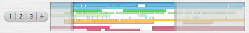

The navigator serves two purposes:

*   It displays a miniature overview of the full timeline range.
*   It acts as an advanced scrollbar.

The navigator can be included in all editor types. The arrangement navigator displays a line for each non-hidden track, with colored blocks representing sequence events on the tracks. The sound navigator shows a half-height miniature of the waveform. The note sequence and curve sequence navigators show miniatures similar to those that are shown on the sequence events in the tracks region.

The navigator height can be resized by dragging the bar below the navigator. If you have a lot of tracks in your arrangement, it can be necessary to increase the height of the arrangement navigator to see all the tracks.

A zoom pane is displayed on top of the miniature. The pane is painted as a frame around the current zoom range in the editor. There are several ways you can adjust the zoom range using the mouse:

*   Click+drag the zoom pane to slide the zoom range. In the arrangement navigator you can also drag up/down to set the vertical position in the tracks region.
*   In the arrangement navigator, click above or below the zoom pane to drag the timeline with the vertical track position locked.
*   Click+drag the zoom pane side handles to resize the zoom range.
*   Click outside the zoom pane to set the zoom range centered on the clicked position.
*   Double-click to set zoom to full range. Double-click again to restore previous zoom range.
*   Double-click the zoom pane left/right side handles to set the zoom range to start/end.
*   Alt+click+drag anywhere in the navigator to select a zoom range.
*   Shift+click+drag anywhere in the navigator to select a zoom range without snapping.
*   Use mouse wheel on the zoom pane to zoom in/out locked on the mouse position.
*   Use mouse wheel outside the zoom pane to set the zoom range centered on the mouse position.

#### 4.7.2\. Zoom Snapshots

Zoom snapshots can be used to quickly jump between different areas in your arrangement. Each zoom snapshot stores the timeline position and zoom setting, as well as the track list vertical position and zoom setting. The snapshots are managed using the buttons on the panel to the left of the navigator.

Initially you will only see the **Add zoom snapshot** button next to the navigator. Clicking this button will add the current zoom range to a new snapshot, unless a snapshot already exists with that exact zoom range. Each snapshot will be shown as a numbered button. Up to nine snapshots can be stored for each arrangement.

A snapshot button will be shown as selected when the current zoom range matches the range stored in the snapshot. If you hover the mouse cursor over a snapshot button, the snapshot zoom range will be highlighted on the navigator miniature.

Click a snapshot button to recall the zoom snapshot. Click the button again to restore the previous zoom range. Ctrl+click a button to overwrite the snapshot with the current zoom range. Alt+click a button to remove the snapshot.

Right-click a snapshot button to show the options menu:

*   **Insert New Snapshot**: Creates a new snapshot of the current zoom range and inserts it before the clicked snapshot.
*   **Overwrite Snapshot**: Overwrites the snapshot with the current zoom range.
*   **Delete Snapshot**: Deletes the snapshot.
*   **Move Left**, **Move Right**: Moves the snapshot one position to the left or right in the snapshot list.

#### 4.7.3\. Scrollbars

The tracks, channels and notes regions all have a vertical scrollbar and a vertical zoom slider. Use these to get an overview of your current vertical zoom range, as well as for adjusting the position and zoom setting. You can also scroll up and down with the mouse wheel, provided that you are not holding down any key modifiers.

You can insert a horizontal timeline scrollbar region in the editor profile, as an alternative to the navigator region. A scrollbar region contains: a timeline scrollbar, a timeline zoom slider, and buttons for zooming to full range and zooming to the current selection. The scrollbar shows the current zoom range in relation to the full range. Clicking the right arrow button on the scrollbar allows you to step beyond the full range, so that you can add new content with the edit tools. The zoom slider will zoom in/out fixed on the edit cursor position. When releasing the zoom slider, the handle will return to its center position, allowing you to drag the handle again to zoom further in/out.

In the default setup, the editors have been configured with a navigator instead of a scrollbar region. If you prefer the more simplistic style of a scrollbar, you can add a scrollbar region and optionally delete the navigator region. To do so, follow these steps:

*   Open the editor where you want to replace the navigator.
*   Select **Customize Editor Profile** from the **View** menu to open the profile dialog.
*   Select **Navigator** in the **Region list** and click **Delete**.
*   The next region in the list should be **Space (Texture image, drag)**. If so, click **Delete**. The purpose of this region is to separate the navigator from the regions below, as well as providing a drag region for resizing the navigator.
*   Scroll to the bottom of the **Region list** and select the bottom line divider in the list.
*   Click the **Insert new...** button and select **Scrollbar**.
*   Click **OK** to close the scrollbar dialog, and click **OK** to close the profile dialog.

#### 4.7.4\. Slide/Zoom Tools

There are four different tools that can be used to slide/zoom the timeline area: **Slide**, **Zoom X/Y**, **Zoom X** and **Zoom Y**. The default edit toolbar includes the **Slide** and **Zoom X/Y** tools. When one of these tools are selected, you can slide/zoom either by using the mouse wheel or by clicking and dragging. The position where you place the mouse cursor will be the fix point for the zoom.

Instead of selecting a slide/zoom tool in the edit toolbar, you can temporarily activate a slide/zoom tool by holding down combinations of the Ctrl, Shift and Alt key modifiers. When releasing the keys the previously selected tool will become active again.

*   Shift+Alt: Slide tool.
*   Ctrl+Shift+Alt: Zoom X/Y tool.
*   Ctrl+Alt: Zoom X tool.
*   Ctrl+Shift: Zoom Y tool.

As you may notice, the orientation of the key combinations on the keyboard matches the direction of the zoom. When the slide tool is activated, the mouse cursor turns into a hand cursor. When a zoom tool is activated, the mouse cursor shows a magnifying glass with small + and - symbols aligned in the direction of the zoom. You can use those small + and - symbols as a hint for which direction to drag the mouse, in order to zoom in or out.

If you are dragging with the mouse to slide/zoom, you can always cancel the drag operation by right-clicking while still holding the left mouse button down. This will reset the zoom range to the state it was before you started the drag operation. This can be useful if you for example want to temporarily zoom out for an overview.

#### 4.7.5\. Slide/Zoom Key Shortcuts

Pressing the arrow keys without other key modifiers will navigate the event selection. The timeline area will automatically slide if focus is moved to an event outside the currently displayed range.

To slide/zoom with the arrow keys, you use the same Ctrl+Shift+Alt key combinations that you use to temporarily invoke the mouse slide/zoom tools. This has the advantage that the mouse cursor turns into the slide/zoom cursors, as described in the previous section. The + and - symbols in the zoom mouse cursors can be used as a hint for which arrow key to press, in order to zoom in or out. Holding down an arrow key will repeatedly slide/zoom until you release the key.

In addition to the arrow keys, there are several other slide/zoom key shortcuts. Below is a summary of all the key shortcuts:

*   Shift+Alt+ArrowKeys: Slide.
*   Shift+Home/End: Slide to the top/bottom.
*   Alt+Home/End: Slide to the start/end.
*   Home: Center the timeline on the current selection.
*   End: Center vertically on the current selection.
*   Ctrl+Shift+Alt+ArrowKeys: Zoom in/out.
*   Ctrl+Shift+End: Set vertical zoom to default.
*   Ctrl+Home: Set timeline zoom to full range.
*   Ctrl+End: Set timeline zoom to the current selection.

### 4.8\. Arrangement

An arrangement consists of tracks on which you assign input, output, effect and instrument devices. You organize the tracks in a hierarchy to set up how audio is routed through the tracks. On the track timeline lanes you can place sound, note and curve sequences as sequence events. Sounds will output audio into the audio routing at the track. Note and curve sequences will control the device mapping assigned to the track.

You can create the sequence events manually using the editor tools or by recording the MIDI and audio input mappings you have assigned to the tracks. You access the editors for the sound, note and curve sequences by selecting the sequence events on the tracks. You can use the sequence editor that is embedded in the arrangement editor, or you can open new editor windows.

Events in note and curve sequences do not have device specific properties. Curve sequences output relative values that are converted to true parameter values using the parameter object assigned to the track. This allows you to reuse note and curve sequences on multiple tracks with different device mappings and parameters.

#### 4.8.1\. Arrangement Properties

The **New Arrangement Properties** dialog can be opened if you enable the **Open properties dialog for new arrangement** option on the **Create New Project** page. It can also be opened with the **New Arrangement...** command in the **Contents** menu on the project start page.

Once an arrangement has been created, you can open the **Arrangement Properties** dialog with the **File** menu in the arrangement editor, or from the arrangement right-click menu on the project start page. This dialog contains a subset of the settings from the **New Arrangement Properties** dialog.

*   **Time resolution**: You can choose between using **Musical (Time signature/tempo)** time resolution or using **Linear (Sample rate)** time resolution. If you intend to arrange non-musical material or prefer to work without the restraints of time signatures, choose the linear resolution. This setting cannot be changed once the arrangement is created.
*   **Sample rate**: If you are going to use audio in your arrangement, select the sample rate that you want your audio interface to use. This setting will by default be set to the **Default sample rate** that you can specify in the **[Audio/MIDI](#h.bh1v8j6t8rb5)** dialog.
*   **Mono panning**: If you are using mono audio sources then this setting defines the gain scaling applied to the mono signal when panned into the stereo stream. The indicated dB value is the amount that a mono signal will be dampened when panned dead center. The dampening will decrease towards 0 dB when panned full left or right. For music production a setting of -3 dB is appropriate. Without this center dampening the human ear will perceive a signal panned from side to side to be louder at the center.
*   **RMS meter scale** & **RMS meter window**: The meters on each individual audio track can be switched to show RMS meters in addition to the standard peak meters. These two settings control the RMS meter behaviour. The meter scale has options for the K-System scales **K-12**, **K-14** and **K-20**, in addition to **Peak scale (0 dB)** and **Peak scale (+3 dB)**. The meter window defines the response time of the RMS meters.
*   **Audio tracks**: Enter a number here if you want to automatically create a number of audio enabled tracks when the arrangement is created. If this is left at zero then only a master track is created. This setting is not available after the arrangement has been created.
*   **Bus sends per audio track**: If you specified to create a number of audio tracks then this setting defines how many bus sends you want to set up on each audio track. For each send, an additional bus return track will also be created.

#### 4.8.2\. Arrangement Editor

The default arrangement editor layout is from top to bottom: Edit toolbar, timeline ruler, marker region, tempo and time signature region, tracks region, mixer, transport toolbar.

The main part of the arrangement editor is the tracks region. At the left edge is the track inspector which shows the properties of the focus track. At the bottom edge is a resizable embedded editor which shows the editor for the last selected sequence event.

The track inspector, embedded editor and mixer can be collapsed allowing you to optimize the available screen space when arranging events on the tracks. Information about tracks and the track inspector can be found in the [tracks](#h.f7vfc7unqcre) chapter. Information about how to work with sequence events, automation, mixing and recording can be found in the [arranging](#h.qt5ulkqbu40u) chapter.

The height of tracks that are neither minimized nor collapsed are defined by a combination of the vertical zoom slider position and a height scale of each individual track. Drag the zoom slider to scale the height of all tracks. The relative height scale of a track can be set by dragging the bottom of the track header or by using the zoom y or zoom x/y tool on the track header.

#### 4.8.3\. Markers

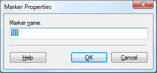

Marker events can be used to identify and divide timeline sections of your arrangement. In a typical song for example, you could use marker events to indicate where the different verses and choruses begin. Marker events are shown on the lane just below the timeline ruler. Each marker is displayed as a tag where the left edge is aligned at the event time position. The name of the marker that is placed at or before the start of the displayed timeline range is shown at the left edge of the lane.

Right-clicking a marker event shows a context menu with options for the clicked event. There are commands for selecting all marker events and setting the segment, punch and loop ranges between the clicked marker and the next marker on the timeline. Right-clicking on an empty area on the timeline shows a context menu with options for inserting a new marker either at the clicked position or at the play cursor position (key shortcut Alt+M). The editor snap mode and quantize value will affect the insert positions. See the [Marker Menu](#h.marker-menu) section for more information.

New marker events can be inserted by double-clicking with the select tool or clicking with the pencil tool on an empty area in the timeline. Use the scalpel tool if a previous marker tag overlaps the position where you want to insert a new event.

If you have selected a marker event, press Left/Right to navigate the marker events. Press Ctrl+Left/Right to move selected events in steps of the editor quantize value. Press the Enter key to open the **Marker Properties** dialog.

Press Q/W or Numpad 7/9 to move the edit cursor to the previous or next marker event, or to the previous or next edge of the segment selection, punch or loop ranges, whichever comes first. Press Alt+J/K/L to set the segment, punch and loop ranges between the two marker events surrounding the edit cursor position.

Use the mouse wheel over the marker event lane to scroll the timeline so that it starts at the previous or next event on the lane.

#### 4.8.4\. Time Signature, Tempo & Scale

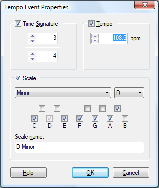

Arrangements created with musical time resolution use tempo events to define time signature and tempo changes on the timeline. Tempo events are shown on the lane below the marker lane. The time signature and bpm value that is active at the start of the displayed timeline range is shown at the left edge of the region.

Right-clicking a tempo event shows a context menu with options for the clicked event. Right-clicking on an empty area on the timeline shows a context menu that allows you to select all tempo events, insert new tempo events and adjust tempo events so they align with an audio recording. The editor snap mode and quantize value will affect the insert positions. See the [Tempo Menu](#h.tempo-menu) section for more information.

As an alternative to editing tempo events in the timeline, you can double-click the tempo indicator in the transport toolbar to access the properties of the last tempo event before the current play cursor position.

If a tempo event with a time signature change is not placed on a bar line then the time signature will be in effect from the next bar. The bar and beat divisions of the time signature is visualized both by the numerals shown in the timeline ruler and by the vertical grid lines drawn in the editor.

If you have any sound events on the tracks and you insert a tempo change, you may notice that the waveform shown inside the events will compress or expand accordingly. Sounds are played at the arrangement sample rate, so changing the tempo causes the waveform to shift in relation to the bar/beat positions. If you have dragged a sound file onto a track, the event will be resized so that the entire sound still plays. If you have resized the sound event or created it with the pencil tool, the event will not be resized as the size of the event will be locked to the bar/beat positions.

If you want to extract the tempo from an imported loop file, simply insert a tempo event at the start of the loop, select the loop sound event, use the timeline ruler **Set Cursor At Selection End** command, and finally use the **Adjust Tempo to Align Grid at Cursor** command. The tempo event should now be set to the loop tempo and the position you marked with the edit cursor should be aligned on a bar/beat grid line.

To tempo map a recording of a longer live performance with tempo variations:

Align the sound event so that the first bar/beat in the recording is on a bar/beat grid line. If this position is not at the start of the recording, then also insert a tempo event at the first bar/beat position. Now move the edit cursor to the next noticeable bar/beat position in the sound and use the **Adjust Tempo to Align Grid at Cursor** command.

You now have a tempo indication of the recording. If this tempo is general for the song, and you had a pause before the recording started, you could replace the default tempo event at the start of the arrangement with this tempo, and then realign the sound event to the new bar/beat grid positions.

Repeat this procedure from start to end of the recording. Find the next position where the tempo is changing, insert a tempo event at this position, move the edit cursor to the next bar/beat position in the recording, and use the **Adjust Tempo to Align Grid at Cursor** command.

#### 4.8.5\. Track Tags

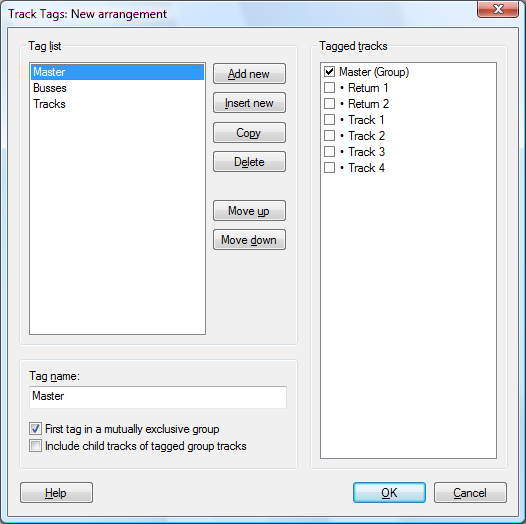

The **Track Tags** dialog is opened by clicking the **Tags** button in the track toolbar. The tags configured in this dialog are shown as tag buttons in the track toolbar.

Tags can be used to organize tracks into categories such as: instrument type, microphone placement, performer, and whatever groupings you may find useful. Selecting tag buttons in the track toolbar will show only the tagged tracks in the tracks and mixer regions.

Each track can have several tags applied. As an example, you may have a general tag group that groups your tracks into drums, guitars and vocals. Another tag group can organize tracks according to whether they were recorded with close mics or ambient mics. Depending on what you're doing in your mix, you can select the drums tag when you want to do overall work on your drum tracks, and you can select the ambient mics tag when you want to adjust the sound of all your ambient microphone recorded tracks.

*   **Tag list**: Shows the list of tags created for the arrangement. Up to 32 tags can be created for each arrangement. The buttons to the right of the list can be used to organize the list. There are key shortcuts for all the buttons, so for example Alt+A will add a new tag to the end of the list.
*   **Tag name**: The tag name is displayed on the button in the track toolbar.
*   **First tag in a mutually exclusive group**: When this is enabled on a tag, it marks the end of a previous tag group, and the start of a new tag group. Tags that are grouped will be shown as joined buttons in the track toolbar. Clicking a tag button in the group will automatically deselect other selected tags in the group. Shift+clicking a tag button allows you to select the tag without deselecting other tags.
*   **Include child tracks of tagged group tracks**: When enabled, all child tracks of a tagged group track will behave as if they were tagged as well. An example of when this option should not be selected, is the **Master** tag that is created by default in new arrangements. This tag will toggle display of the master track but not all other tracks under the master group.
*   **Tagged tracks**: Shows a list of all source and parameter tracks in the arrangement. Click the checkmark boxes to select which tracks should be tagged with the currently selected tag in the **Tag list**. If the **Include child tracks of tagged group tracks** option is enabled, then child tracks of tagged group tracks are shown with translucent checkmarks. Note that parameter tracks are always automatically included if their source track is tagged. You can however tag a parameter track without tagging its source track. The checkmarks correspond to the check buttons inside the tag buttons on the track toolbar.

### 4.9\. Sound

Podium supports the Wave sound file format with 8 to 32 bit fixed point resolution and 32/64-bit floating point resolution. The multichannel extension to the Wave file format is also supported, which enables you to configure a sound to use up to a 10.1 speaker configuration or up to 32 mono channels. Normal Wave files can only be up to 4GB in size. When you save a Wave file that is larger than 4GB, Podium will use the extended RF64 Wave file format. Note that many applications that can read Wave files may not be able to read RF64 Wave files.

In addition to the Wave file format Podium also supports the AIFF/AIFF-C sound file format. If you are working with multichannel files it is recommended to use Wave files, since AIFF files don't store the speaker configuration specified in the sound properties dialog. Also, AIFF files can't be larger than 4GB. Podium saves AIFF-C files using the Intel byte-order storage implemented by Apple. This means that AIFF files saved in Podium may not load in other applications that aren't updated for the latest AIFF format extensions.

On the **[Engine](#h.1813mv5uygi9)** preferences tab you can select the default format used when you create new sounds in Podium. When you save a sound file with the file dialog, it will by default use this format, but you can override it by entering the proper file name extension. Wave files use the ".wav" extension, and AIFF files use either ".aif" or ".aiff".

When working with large sound files all sample data cannot be loaded into memory at once. Podium only loads the sample data when it is needed, which means when playing the sounds or when zooming in on the waveform in the editors. When the waveform is shown zoomed out beyond a certain point, Podium uses a cached image of the waveform which takes up much less memory than the real sample data. All cached images are stored in a database file named "WaveformImageCache.db" which Podium saves in the Projects folder.

After importing a sound file that does not yet have a cached image, Podium will start to create the image in a background thread. Thus when you import sound files you don't have to wait for the image to be created. As a consequence, if you enter the sound editor for a recently opened sound file, you may see the text "Profiling waveform..." in the upper left corner of the waveform display while the waveform gradually is being rendered. This does not prevent you from playing the sound or zooming in on the waveform in which case the real waveform samples at some point will be displayed.

When Podium is started it will erase any images in the WaveformImageCache.db database that have not been accessed for a year. Still, if you browse a lot of audio files the database can grow quite large. When Podium is not running, you can safely delete the WaveformImageCache.db file. The next time Podium is started it will then recreate the database file and the images will gradually be regenerated as you access the sound files.

When recording audio or editing the waveform in the sound editor the changes are stored in temporary cache files. The sound file will not be touched until you choose to save the sound. The location of the temporary cache file folder can be configured on the **[Engine](#h.1813mv5uygi9)** preferences tab.

If a sound object references a file that could not be found, the sound object icon shown in the project and browser windows is colored red.

#### 4.9.1\. Sound Properties

If the sound object is created by importing a sound file then the **Filename** field shows the referenced folder and filename. If the sound object is created as a new object in the project, it initially is not linked to a sound file. When you save the project file, all unsaved sounds are assigned filenames based on the sound object names and are placed in the same folder as the project file. You can also use the sound editor **File** menu to save the sound in any folder and with any filename you desire.

The Podium project file only stores the sound object as a sound file reference. All the settings specified in the sound properties dialog, along with the wave data and any marker events, are stored in the wave file. Thus if you open a project that fails to locate the referenced sound files, the **Sound Properties** dialog will show default values and a red background in the **Filename** field. The **Relink File...** button opens a file dialog which allows you to relink the sound object to a sound file.

If the sound file is located under the same folder as the project file, then the **Relative to project path** option can be selected. This will store the sound filename with a relative path reference in the project file, which enables you to move the project folder together with the sound files to another folder location without breaking the links to the sound files.

The **Sample rate** setting shows the sample rate specified in the wave file. Changing the sample rate will not resample the wave data.

The **Speaker** combo-box can be used to set the channels and speaker options to mono, stereo or common surround configurations. You can create a custom setup by toggling individual speakers or adjusting the number of **Channels**. Selecting speaker locations are optional. You can choose to assign all channels as mono by clearing all speaker check boxes and entering the number of mono channels.

Changing the **Bit resolution**, wave length or channels/speaker configuration settings will convert the wave data when accepting the changes with the dialog **OK** button. This will reset the sound edit history. The sound file is not affected until you choose to save the sound.

#### 4.9.2\. Sound Editor

The sound editor shows the individual sample data channels in the sound. The channels are identified by labels in the channel headers. If the sound uses a surround speaker configuration, speaker placement miniatures are drawn beneath the channel labels.

If you accessed the sound object from the project window instead of from an arrangement, the sound is opened in a master sound editor. Compared to the slave sound editor used with arrangements, the master editor gives you a marker region, a transport toolbar, and punch and loop settings for the sound. Read more about [markers](#h.y3nf6rilothh) in the arrangement chapter. Marker events are saved in the wave file as a cue list, so that the markers are available if you edit the wave file in other sound editor applications. The sound punch and loop settings are saved in the Podium project file.

Clicking the particle zoom button next to the tool buttons will set the timeline zoom so that one pixel covers one sample. This is useful when doing precision editing of the waveform with the pencil tool. The pencil tool is mostly used for removing unwanted clicks in recordings. To draw silence you can alternatively use the eraser tool.

When you have made a segment selection, you can access various editing commands either from the **Edit** menu or from the timeline context menu. Use the select or segment tools to drag a segment selection. Drag the segment handles in the timeline ruler to adjust the segment selection.

Clicking the channel headers will toggle channel selection. The curtain that is drawn for a segment selection will only be drawn on selected channels. When performing an edit on a segment selection only the selected channels will be affected. This allows you for example to copy sample data from one channel, toggle channel selection and paste into another channel.

The vertical scrollbar and zoom slider control the amplitude range of the waveform displayed inside all the channel lanes. To change the relative height of the individual channel lanes you can use the zoom y or zoom x/y tool. Click and drag upwards on one of the channel headers to increase its height relative to the other channels. The height of the other channels will shrink so that all channels are always visible in the editor.

#### 4.9.3\. Export to Sound File

The **Export to Sound File** dialog will appear when you select one of the export commands in the sound editor file menu, the arrangement editor file menu or the track bounce menu. Exporting allows you to quickly save the sound to a file format that you need for other applications and tools such as mp3 encoders. Exporting a sound will not affect the source sound used in the project.

The options in the dialog are:

*   **&Bit resolution:** You can select among 8 to 32 bit fixed point and 32 or 64 bit floating point formats. The bit resolution of the source sound is shown in parenthesis.
*   **&Normalize**: Enabling this option will normalize the sound before it is exported. Use this if you are exporting a single instrument recorded at a low level. You should not use the normalize option on arrangement mixes as this can degrade the quality and disturb any dithering that may have been applied in the master effect chain.

**Export...**: Once you have set the desired export options you can click this button to open a file save dialog. In the file save dialog you can specify either wave or aiff file format by selecting the corresponding file extension.

### 4.10\. Note Sequence

Note sequences contain note events. The properties of each note event are: start time, duration, note number, attack and release velocities. Note properties are defined according to the MIDI specification, so note number and velocities are values in the range of 0 to 127.

Note sequences are placed as sequence events on tracks in an arrangement. The instrument that is active on the track will be used for playback of the note sequence and for auditioning edited notes in the note editor.

A note sequence can be phantom copied to multiple tracks and thus you can control different instruments with the same note sequence.

Note sequences are edited with the note editor.

#### 4.10.1\. Note Editor

The note editor will be shown in the embedded editor when a note sequence event is selected. Double-clicking a note sequence event will open the editor in a separate window.

The note editor is used for editing note events as well as for editing the note map. The note map can be configured to work in either piano roll or drum map mode.

The appearance and editing behaviour can be customized in the **[Notes Region](#h.x0xe88b886ef)** dialog, which can be opened with the menu: **View > Customize Region > Notes**.

Each track contains a customizable note map where individual notes can be disabled, soloed, muted, colored and renamed. Solo and mute are only available in drum map mode. By disabling notes you can hide unused note ranges from the editor. Disabled notes are muted during playback. This makes it possible to phantom copy a single note sequence to multiple tracks, and set up each track to play different note ranges with different instruments.

The note map properties are stored for the track where the note sequence is placed. Thus editing the note map will affect all note sequences that are placed on that track. The note map editing is integrated in the note editor for convenience, as the note map is only useful in relation to the note editor. Edits to the note map are stored in the note sequence undo history, and not the arrangement undo history.

At the left side of the note editor is a button panel for setting various editor options. At the top of the panel is the **Note map options menu** button which have the following menu items:

*   **Customize Note Map...**: Opens the **Note Map** dialog. The dialog can also be opened by right-clicking the piano keyboard or the drum map headers.
*   **Drum Map Mode**: Toggles the note map between piano roll mode and drum map mode.
*   **Enable All Notes**: Enables all 128 notes in the note map.
*   **Enable GM Drum Kit Notes**: Enables notes within the standard GM drum kit range (D#0 to D#5) and disables all notes outside the range.
*   **Enable Notes Used on Track**: Enables notes that already have note events and disables all other notes. As the note map affects all notes playing on the track, all sequence events placed on the track will be included in the search for used notes.
*   **Copy Note Map**: Copies the current note map to the clipboard. The properties copied include note enable/solo/mute state, color and name for each note, as well as the drum map mode option.
*   **Paste Note Map**: Pastes the clipboard note map to the track where the current note sequence is placed.

The remaining buttons in the side panel are:

*   **Audition event mode**: When you select an event either with the mouse or with cursor key navigation, the selected event will be auditioned on the instrument assigned to the track. Resizing an event also auditions the note. If you click an event with the mouse the audition will stop when the mouse button is released, even if the note event duration is longer.
*   **Wide event mode**: Sets a minimum width of the clickable frame around each note event, making it easier to select and edit short duration events.
*   **Ghost event mode**: Displays a mask on the timeline background of note events on all visible tracks. Only notes on tracks with the same drum map mode setting will be shown, to avoid having drum notes appearing in melodic instrument tracks, and vice versa. Only notes from tracks that are currently not hidden from the track view will be shown. Alt+clicking a ghost event will switch the editor to that sequence.
*   **Note enable mode**: Toggles display of disabled notes. When the option is selected all drum map headers show an enable/disable button. When the option is deselected, all disabled drum notes are hidden. This can be used to set up a compact drum map with only the drum sounds you intend to use. In piano roll mode it can be used to remove notes above and below the note range supported by the instrument assigned to the track. Notes within the valid range can also be disabled but in that case only full disabled octaves will be hidden to avoid cutting up the piano keyboard graphics. Disabling note ranges in piano roll mode can be useful for acoustic instrument emulations that only play within a limited note range.
*   **Grid button panel**: Clicking the buttons in this panel can be used as a shortcut for setting the grid value, as an alternative to using the **Grid & Snap menu** in the edit toolbar. Ctrl+click a grid value button to quantize the start position of selected events. Alt+click a grid value button to set the duration of selected events.

#### 4.10.2\. Piano Roll & Drum Map

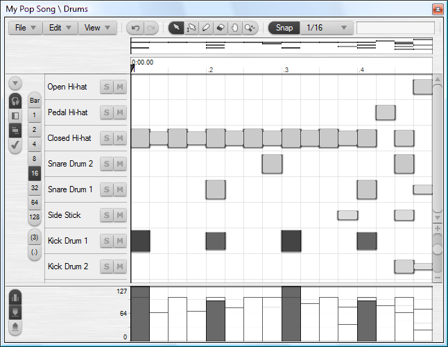

The primary difference between piano roll mode and drum map mode is the layout of the note lines. In piano roll mode the area to the left of the timeline shows a picture of a piano keyboard that is resized to align with the zoomed note line height. In drum map mode the piano keyboard is replaced with drum line headers that show the name of the note along with buttons for soloing and muting individual notes.

By default the drum map headers will show the drum names defined by the standard GM format, which is the primary format supported by most drum capable instrument plugins. If note names have been customized in the note map, then these names are shown instead of the GM names. This also applies to the piano keyboard, provided that the vertical zoom is large enough to show the names overlaid on the black and white keys.

If a VST instrument plugin supports custom note names, the plugin supplied note names will be displayed on the drum map headers and on the piano keyboard, unless the note map already has a customized note name.

The actions that occur when you click the piano keyboard or drum map headers can be customized in the **Notes Region** dialog. The following describes the default actions:

Clicking on the piano keyboard or the drum map headers will audition the note. The note will sound until the mouse is released. The mouse can be dragged up and down to play other notes. Clicking towards the left edge will audition at low velocity and clicking towards the right edge will audition at high velocity.

Click with the select tool on a note to select all events on that note and deselect all other events. Shift+click to select all events on the note and keep the selection state of other events. Ctrl+click to toggle the selection of the events on the note. Alt+click to audition the note without affecting event selection.

Click with the pencil tool on a note to add an event at the edit cursor and advance the edit cursor to the next grid line. Shift+click to advance the edit cursor without adding an event. Ctrl+click to add an event without advancing the edit cursor. Alt+click to audition the note without adding an event. If loop is enabled then the edit cursor will move back to the loop start if it is advanced to the loop end.

If you add events while playback is in progress, then the **Link Edit Cursor to Play Cursor** mode affects how events are added. This mode can be toggled with the timeline ruler right-click menu or with the Ctrl+E key shortcut. If the mode is disabled then edit cursor behaves as described above. If the mode is enabled then clicking a note works as realtime recording of events at the play cursor position. The event duration will be set according to how long you keep the mouse button pressed.

#### 4.10.3\. Editing Note Events

Note events are displayed and edited almost identically in piano roll mode and drum map mode.

Note events are displayed on the timeline as blocks that are colored according to the note attack velocity. The color gradation can be defined in the **Colors** setup dialog. The **Notes Region** dialog also has an option for whether the track color should be applied to the note events. In drum map mode the height of the events are furthermore scaled according to the attack velocity. This makes it easier to see the velocity progression of a single drum line.

The vertical zoom resolution can be adjusted with the zoom slider in the right side panel, as well as with the standard zoom shortcuts. The note editor remembers the zoom setting separately for piano roll mode and drum map mode.

With the select tool you can double-click an empty spot to create a new note event. The new event will have a default velocity and a duration set to the editor grid value. When you single-click an empty spot with the pencil tool, the new event will take on the velocity and duration properties of any currently selected event. The note start time will be snapped if **Snap** is enabled. You can adjust the note duration by dragging the mouse before releasing the button.

With the select and pencil tools you can double-click an event to delete it. With the eraser tool you can delete an event with a single click, or by holding the shift key to drag a marquee deletion.

When you click and drag events, the default action is to move the events. Hold the Ctrl key to create copies instead. Hold the Alt key after starting the drag action to lock either the x or y position of the events depending on the drag direction. Hold the Shift key after starting the drag action to override snap.

Note events can be added by dragging MIDI files directly onto the note editor timeline. This will merge the notes from the MIDI file into the current sequence, in contrast to dropping the MIDI file on a track, which will create a new sequence object. Dropping MIDI files onto the note editor timeline enables you to build a sequence using simple elements, such as chords, arpeggios, single drum patterns, and so on. You can create your library of MIDI file elements by using the **Export to MIDI File** command in the note editor **File** menu. When you move a MIDI file over the timeline, you'll notice that the drop highlight is cut at the note under the mouse cursor. This indicates that all the notes in the MIDI file will be offset to this root note. For example, if you have a MIDI file containing a C major chord, dropping the file on a D note will create a D major chord. Holding the Alt key will override the root note offset. Holding Shift will override snap mode.

The Insert key can be used as a quick shortcut to append duplicates of selected events. The duplicates will be placed starting at the end of the last selected event. The original events will be deselected and the duplicated events will be selected, so that pressing the Insert key repeatedly will continue to append duplicates. A duplicate event will not be created if an existing event is already positioned at the place where the duplicate should be placed. If snap mode is enabled, pressing Insert will snap the duplicates relative to the next editor grid line. Press Shift+Insert to override snap. Press Ctrl+Insert to snap to the next bar, no matter what the editor snap settings are.

Press Ctrl+Left/Right to move the selected events in steps of the editor grid value. Press Ctrl+Plus/Minus to adjust note durations. Press Ctrl+Up/Down to transpose semitones. Press Shift+Up/Down to transpose octaves when using the piano roll mode. If notes in the note map are disabled/hidden in the editor then the transpose will skip past the hidden notes. Press Plus/Minus keys to adjust the attack velocities of selected events in steps of 1/16.

If multiple events are selected, any edit action will be applied to all selected events.

#### 4.10.4\. Note Event Hotspots

You can edit note events with both the select tool and pencil tool. The select tool is convenient for quickly selecting and moving events by dragging, while the pencil tool provides more ways to edit note event properties with single click and dragging.

When the pencil tool is selected, each event has up to four drag hotspots depending on the size of the event: move, resize start, resize end, and velocity.

The layout of the hotspot areas are utilizing the full available note line height. The visual frame of the events may be smaller depending on the zoom setting. The velocity dependent height of events in drum map mode will also not affect the layout of the hotspot areas. The event will be highlighted when the mouse cursor is over the clickable area of the event, and the mouse cursor will change to a resize cursor when it is over the resize or velocity hotspots.

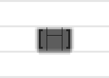

The width of the resize hotspots are 4 pixels, and the height of the velocity hotspot is 4 pixels. When the event width is less than 16 pixels the resize hotspots are cut off at the middle, and when the event height is less than 12 pixels, the velocity hotspot is not available. This is to ensure that the move hotspot does not become too small. If you are trying to edit short duration events then you can use the **Wide event mode** to have a wider clickable hotspot layout.

In addition to the pencil tool hotspots, the event can also be resized or velocity adjusted by holding the Alt key when clicking and dragging. This will work with the select tool as well. The configuration of the Alt key behaviour can be customized in the **Notes Region** dialog. By default, the Alt key will start a resize start/end action, depending on which half of the event you click. Double-clicking with the Alt key pressed will start a proportional resize action, where all selected events will resize proportional to their original size.

#### 4.10.5\. Velocity Region

At the bottom of the editor is a horizontal bar that you can drag to resize the note velocity region. Using the right-click menu or the three buttons in the left side panel you can select between editing attack or release velocities and whether only selected events should be affected when drawing on the timeline.

When the **Edit Only Selected Events** option is enabled any deselected events are drawn as dimmed bars. This option is useful for editing a single selected note event that overlaps with other events in a chord, or when editing the events on a single drum line selected by clicking a drum line header. The velocity of each note is shown as a bar where the height is the velocity and the width is the note duration. Click and drag to set the velocity of the events under the mouse cursor. Use the eraser tool or hold the Ctrl key while dragging to set the default velocity.

#### 4.10.6\. Note Map

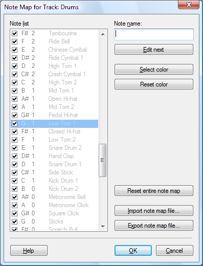

The **Note Map** dialog is opened with the **Customize Note Map...** command in the note editor note map options menu. The dialog can also be opened by right-clicking the piano keyboard or the drum map headers, in which case the dialog is opened with focus set to the clicked note number.

*   **Note list**: Lists all 128 notes with information on note/octave, assigned color and note name. Each note has a checkbox for enabling/disabling the note. If the drum map mode is enabled on the track, then the standard GM drum note names are written dimmed, unless a custom name has been entered for the note. The list supports multi selection of notes, using the standard Windows key and mouse shortcuts. The Ctrl key can be used to toggle selection. The Shift key can be used to select the range of notes between two clicked notes.
*   **Note name**: Shows the name of the first selected note in the note list. Editing the name will be applied to all selected notes.
*   **Edit next**: Moves the selection in the note list to the next note. The button can be activated with the Alt+E key shortcut. This allows you to quickly edit the names for a range of notes.
*   **Select color**: Opens the standard Windows color dialog for selecting a color for all selected notes.
*   **Reset color**: Resets any color assignments for all selected notes.
*   **Reset entire note map**: All notes are enabled, and all color and name customization is removed. Solo and mute states for drum map mode are also reset. The reset is only executed if you press **OK** when closing the dialog.
*   **Import note map file...**: Opens a file dialog which lets you select a note map file you have previously exported. By default the file dialog will open in the "Note Maps" subfolder to the Podium setup folder. Use the **Setup > Explore Setup Folder** menu command to open a file explorer for managing the note map files you have saved. The note map files are plain .ini files that can be edited with a standard text editor.
*   **Export note map file...**: Opens a file dialog for saving the current note map to file.

### 4.11\. Curve Sequence

Curve sequences are used to automate parameters in devices or in the Podium mixer. They consist of a series of point events that connect to form a continuous curve.

Each point event can be configured as either a bar, line or spline type. A bar point maintains its value until the next point event, resulting in a stepped value curve. A line point connects to the next event in a straight line. A spline point also connects to the next event but the line can be twisted with the spline handles.

Each point event defines a relative value within an unspecified value range. When a curve sequence is placed on a track a link is established to the parameter object assigned on the track. The relative curve values are converted to true parameter values using the value range properties of the parameter object. This enables you to use a curve sequence for any kind of parameter.

During playback of line or spline point events that controls a mixer parameter, the curve values will be calculated for each sample. When controlling MIDI or plugin device parameters, a series of parameter messages are output to approximate the curve. The density of these messages depends on factors such as the parameter value range and the slope of the curve.

#### 4.11.1\. Curve Editor

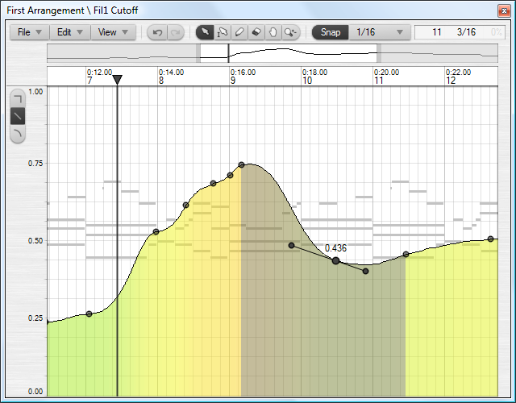

The curve body is painted with the parameter color range as configured in the **Colors** setup dialog. The base line of the curve body is normally at the bottom of the editor. If the parameter uses both negative and positive values then the base line is placed at the zero value. This is the case for example with pitch bend and pan parameters. The opacity of the curve body can be configured in the editor profile.

Bar and line point events are shown with rectangular handles. Spline point events are shown with circular handles. Selected events are highlighted with the select color, both in the point event handles and the part of the curve body that is affected by the event.

The left panel shows a parameter value scale. If a single event is selected then a translucent box with its value is displayed next to the event handle.

The background of the curve editor shows an outline of the sequences placed on the parent track, which can be either notes or sound waveforms. This is helpful when aligning point events to the source material.

The select tool follows the standard behavior with a few exceptions. Click an empty area and drag to select all events on the timeline that you drag across. Hold the Shift key to start a marquee selection instead. Double-click an empty area to insert a new event. Hold down the button on the second click to drag the new event. Double-click an existing event to delete it.

With the pencil tool, click on an empty area and drag to draw a series of new point events. Existing events that you drag across will be deleted. The type of the new point events are determined by the draw mode set with the three buttons at the left edge or with the context menu. The spline draw mode will initially draw line point events but once the mouse is released the drawn curve will be digitized into a spline curve. The interval between new events will depend on how fast you drag. You can activate editor quantize snap and set the quantize value to restrict the interval.

With the eraser tool, click on an event to delete it. Click on an empty area and drag to delete all events on the timeline that you drag across. Hold the Shift key to start a marquee deletion instead.

Selected point events can be transformed to bar, line or spline types with the **Edit** menu or the context menu.

When you drag a single event, it will be dragged in real-time and restricted to the timeline between its two neighbor events. If you drag a multiple event selection, there is no timeline restriction and you can hold down the Ctrl key when dropping to create copies. Press and hold the Shift key after you have started dragging a single or multiple events, to lock either the x or y position depending on the drag direction.

Press and hold the Alt key after you have started dragging or drawing new events to set the events to the default value as defined in the parameter object. Use this to reset for example pitch bend or pan parameter curves to their center position.

Press Ctrl+Left/Right to move the selected events in steps of the editor quantize value. Press Plus/Minus to adjust the value of selected events in steps of 1/32\. If you have selected a single spline event, press Ctrl+Plus/Minus to adjust the tangent length, and press Alt+Plus/Minus to adjust the slope.

#### 4.11.2\. Splines

Spline point events specify a spline going through the point. Changes to a spline event may affect the curve drawn from the previous event if that event is a spline too.

If you have a series of bar or line point events you can digitize their curve to replace them with spline point events. Either select a segment or select multiple connecting events and use the **Digitize Spline Curve** command found on the **Edit** and context menus.

If you select a single spline event the editor will show a line representing the tangent length and slope. You edit the spline by dragging either of the two tangent handles or by using key shortcuts.

The length of the two parts of the tangent can be adjusted individually. Extending the length of a tangent will widen the curve at the point event and compress the curve at the neighbor event. Likewise a shorter tangent length will create a sharper bend in the curve. Use the **Reset Backward Tangent** and **Reset Forward Tangent** commands on the **Edit** and context menus to set the length of the tangent parts to zero.

Depending on the tangent lengths and the zoom setting, the tangent handles may overlap the event handle. To drag the event handle instead of the overlapping tangent handles, hold the Alt key while clicking the event.

If the tangent handles extend beyond the editor area you will not be able to grab them with the mouse. In this case you must use the keyboard shortcuts to edit the spline, or use the reset tangent menu commands.

### 4.12\. Edit Actions

#### 4.12.1\. Adjust Timing

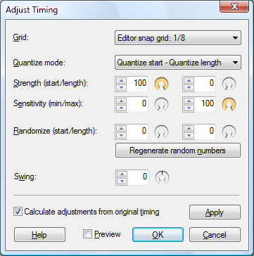

Event timing adjustments applied with the **Quantize** and **Adjust Timing...** edit commands are stored for each event and is saved in the project file. This means you can at any point go back to the original timing if you later on regret your adjustments. When the timing has been adjusted, two new commands will appear in the **Edit** menu:

*   **Revert Timing Adjustments**: Will discard any timing changes and restore the original timing as it were created/recorded.
*   **Commit Timing Adjustments**: Will overwrite the original timing with the current timing, so that future adjustments and use of the revert command will revert to this point.

The timing adjustments are stored as offsets to the event start and length. This means that manually moving events in the editor timeline will move the original timing as well. This allows you to for example move and copy events between bars, but still be able to revert to the original relative timing.

The **Adjust Timing** dialog is opened with the **Adjust Timing...** command in the edit menu. It is available in the arrangement, note and curve editors, for arrangements that use musical time resolution.

The dialog offers three different ways to affect the timing: First the events can be gradually quantized to the grid, followed by randomization and finally swing.

*   **Grid**: Selects the grid size that is used as basis for all adjustments. Value input fields in the dialog are percentages relative to this grid size. The default option is **Editor snap grid: x**. This uses the grid value currently selected in the editor snap menu in the editor where you invoked the **Adjust Timing...** command.
*   **Quantize mode**: The selected mode will define how the strength, randomize and swing settings are applied to the start position, end position or length of events. There are five modes:  
    **Quantize start**: The start position is quantized, and the event lengths are not changed.  
    **Quantize start - Quantize length**: The start position and length are quantized independently.  
    **Quantize start - Set length**: Compared to the quantize length mode, this mode will set the event length to the grid value instead of quantizing it to the nearest multiple of the grid value.  
    **Quantize start - Quantize end**: The start and end positions are quantized independently. This means that event lengths may change if start and end are adjusted differently.  
    **Quantize end**: The end position is quantized, and the event lengths are not changed. This means that event start positions may change. This mode can be useful if you for example have some intro/reverse sounds that you want to align to other sounds starting on a grid line.
*   **Strength**: Sets the percentage strength of the quantization. 0% means no quantization and 100% means full quantization to the grid lines.
*   **Sensitivity**: Defines the minimum/maximum range that are quantized. Events with a position/length falling outside this range will not be quantized. Raising the minimum value allows you to keep the timing of events close to the grid line, while quantizing events that are far off the grid line. Lowering the maximum value has the opposite effect.
*   **Randomize**: Adding some randomization can be used to "humanize" notes that have a timing that sound too rigid. This is useful if you are using the mouse to add notes in the editor, rather than recording the notes.
*   **Regenerate random numbers**: Each time you open the dialog a new set of random numbers are generated. These numbers do not change as you adjust the randomize settings. Use this button to generate a new set of random numbers if you aren't satisfied with the current randomization.
*   **Swing**: Swing involves adjusting the relative timing between pairs of grid intervals. The normal use of "swing" is to slightly slow down the downbeat, and speed up the upbeat. This results in a less rigid timing that is widely used in some musical genres. Swing is often applied to 1/16 note intervals, but you can experiment with other grid settings. The swing value can be set from -90% to +90%, but normal use of swing uses the values from 0% to about +50%. If the **Quantize start** quantize mode is selected then swing is only applied to the start position and not the lengths of the events. This is useful if you are applying swing to a beat-sliced drumloop, in which case you don't want the individual drum hit slices to be resized.
*   **Calculate adjustments from original timing**: Selecting this option will disregard any previous timing adjustments, and instead redo the adjustments based on the original timing as the events were created/recorded.
*   **Apply**: Clicking the button will apply the current settings, so that further adjustments can be made iteratively without having to press **OK** and reopen the dialog. The **Calculate adjustments from original timing** option will be deselected when you click this button. Applying adjustments iteratively can be useful if you for example want to quantize the start position to 1/4 notes and quantize lengths to 1/8 notes. Note that if you have enabled **Preview**, then applying adjustments may show further changes to the events, depending on the settings.
*   **Preview**: Selecting this option will update the editor in real time when any of the settings in the dialog are changed.

#### 4.12.2\. Adjust Sound Events

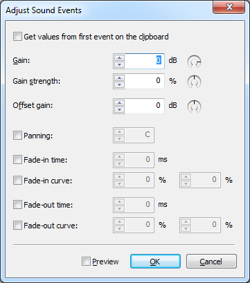

#### 4.12.3\. Adjust Transposition

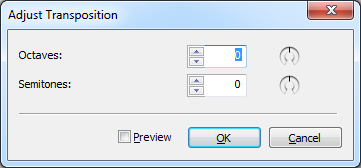

#### 4.12.4\. Adjust Velocities

#### 4.12.5\. Adjust Points

#### 4.12.6\. Beat Slice

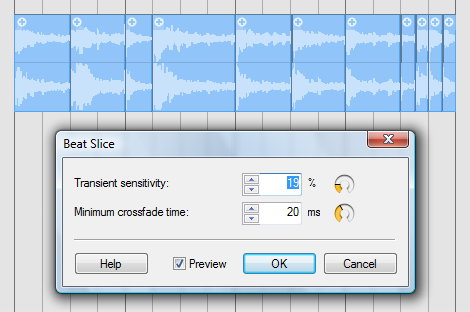

The most common use of beat slicing is for manipulating drum loops. Beat slicing a drum loop does not by itself change the sound, but once you have sliced the individual beats you can quantize or manually move the beats around to change the timing of the loop. Having the beats split up also allows you to move for example kick, snare and hihats to separate tracks with individual effects processing.

Beat slicing can be performed on sound events in the arrangement editor. See the [Sound Event Properties](#h.e2mz3q5m2r4d) section for more information about the fade properties which is used by the beat slicing.

The **Beat Slice** dialog is opened with the **Beat Slice...** command in the sound event context menu or in the **Edit** menu when a sound event is selected.

*   **Transient sensitivity**: Use this to control how many slices you want. Decreasing the sensitivity will result in fewer slices.
*   **Minimum crossfade time**: Sets the minimum fade-in and fade-out time that is set up on each slice. Applying fades will prevent clicks in the sound if you later on move the slices around. The resulting slice crossfade can be longer than the specified minimum if the transient has a slow attack.
*   **Preview**: Selecting this option will update the editor in real time when any of the settings in the dialog are changed.

* * *

## 5\. Tracks

The properties of a track can be modified in the **Track Properties** dialog, on the track headers, and the [track inspector](#h.oo4cat2m3073) in the arrangement editor.

There are no distinctly separate tracks for processing of audio and MIDI data. Instead, this is determined by the device objects assigned to a track.

### 5.1\. Track Hierarchy

Audio, MIDI, and parameter automation signals flow upwards from tracks into parent group tracks, and, depending on the signal type, thus become affected by device mappings on the group track, as well as the group track's gain and pan settings. Group tracks can be nested, meaning groups can be placed inside another group, and due to this, group tracks can also be child tracks of another parent group track. This allows for flexible solutions to routing and sub-mixing, with the signal flow arrows displayed at the left edge of track headers and at the top of mixer strips additionally providing visual confirmation of how tracks are routed.

_Tip:_ When an instrument is assigned to a group track, all note sequences placed on its child tracks will trigger the instrument - this can be especially useful for drum samplers.

When working on an arrangement, you might want to split it up into sections such as drums, vocals, and synths for pop songs, or violins, violas, cellos, basses for classical music. You may also create sub-sections in each section. This allows mixing on different levels: sections, sub-sections or individual tracks within a section. When mixing sections, it can be useful to collapse the section group tracks, so that the individual tracks within the section are not taking up space on the screen.

_Tip:_ You can set up track tags to filter or organize the tracklist further, and hide tracks you are not currently working on. See the [track tags](#h.bxehbr2enpil) section for more information.

### 5.2\. Track Controls

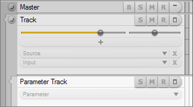

Controls common to all tracks include the **S** solo, **M** mute, and **R** record arm buttons, which indicate the current track state, as well as the **Minimize lane** button used to minimize/restore a track's vertical size. The **B** bounce button is available on bounce enabled tracks. The **Collapse** button is present on group tracks, composite group tracks, and tracks with parameter automation, and is used to collapse/expand all child tracks. Ctrl+clicking the button, or pressing Ctrl+G when the track has focus will hide/show all child tracks.

Depending on the options in the **Tracks Region Properties** dialog, and track height or vertical zoom setting, the following controls (ordered bottom to top, according to the [track hierarchy](#h.1wd9uwxo7xq8)) will become available on track headers:

*   **Input** selector: Opens the input menu.
*   **Source** selector: Opens the source menu.
*   **New effect** button: Opens the effect menu.
*   **Effect** selectors: Open the effect plugin editor window. Send effects additionally display a send level control below the selector.
*   **Bounce** selector: Appears only on bounce enabled tracks.
*   **Gain** and **Pan** controls: Adjust the track gain and panorama settings. On tracks with mono sources, panning is further dependent on the **Mono panning** setting in the **Arrangement Properties** dialog.

Gain, pan, and send level controls can be double-clicked to open the respective track properties dialog in order to enter a numeric value. Hold Shift while adjusting a control to fine-tune its setting. Ctrl+click a control to reset it to its original value.

_Note:_ The positions of the gain/pan controls and meters can be set either before (pre) effects, after (post) effects, after bus sends, or can be manually set at any point inside the signal chain on each track by using the options on the **Fader** and **Meter** submenus of the track context menu, or the **Fader & Meter Grid** on the mixer strips. See the [track menu](#h.1fwio3lvq5lr) and [mixing](#h.o0h1hbsjctg7) sections for more information.

_Note:_ The gain/pan/send control type can be changed from default sliders with popup value display to other types in the **Tracks Region Properties** dialog.

The following controls are only present on specific tracks:

*   **Parameter** selector: Opens the parameter menu. When a parameter is assigned, choosing a different parameter from the parameter menu will create a new parameter track. Shift+click the selector to open the parameter menu and replace the current parameter. This control is only present on parameter tracks.
*   **Output** selector: Opens the output menu to select the audio output device mapping. This control is only present on the top-level (master) track.

Selector buttons share a mostly unified set of control actions:

*   Clicking a selector with no device mapping assigned opens the respective device selection menu. Selectors are displayed transparent when they have no mapping assigned.
*   Clicking a selector with a mapping, be it an instrument or effect, assigned opens the plugin editor window.
*   Right-clicking a selector opens the respective device options menu.
*   Both left- and right-clicking an **Input** selector opens the input menu. Likewise, both left- and right-clicking a **Parameter** selector opens the parameter menu.
*   Clicking a **Bounce** selector opens the bounce menu, also available as a submenu of the track context menu.
*   Clicking the **X** bypass button at the right edge of a selector, or Shift+clicking a selector bypasses the assigned device mapping. For input mappings, this only disables monitoring - audio and MIDI signals received by inputs can still be recorded even when the input is bypassed. Bypassing instruments and effects renders the respective devices inactive. There is no bypass button on **Parameter** selectors - you can mute the parameter track to disable reading automation data. On **Bounce** selectors, the bypass button is replaced by a **B** button to control bounce playback.
*   Alt+clicking a selector unassigns the device mapping.
*   To change the order of effects, simply rearrange the effect selectors by drag-and-drop.

Tracks configured for audio processing display a level meter on the right side of the track header. Depending on track height and vertical zoom settings, indicator lines are shown on the meter, at -6, -12, and -24 dB. You can choose to use horizontal meters, or no meters at all, using the **Tracks Region Properties** dialog.

Appropriate track controls are also available in the rack in the track inspector, as well as on mixer strips.

### 5.3\. Track Properties

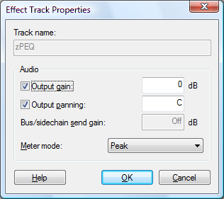

There are three types of properties dialogs that are specific to the track type:

*   **Track Properties**
*   **Effect Track Properties**
*   **Parameter Track Properties**

The dialogs can be opened using any of the following ways:

*   Selecting **Track Properties** from the **Track** menu or the source options menu.
*   Double-clicking the track header.
*   Pressing Alt+Enter when the track has focus.
*   Clicking the **...** button in the track panel in the [track inspector](#h.oo4cat2m3073).

The **Effect Track Properties** dialog can furthermore be opened by choosing **Effect Track Properties** from the **Effect** selector context menu.

**Settings**:

*   **Track &name:** If the **Use name of ...** option is enabled this field is read-only and displays the name of the currently assigned mapping or parameter.
*   **Use name of device &assigned to track**: The name of any device mapping assigned to the track is automatically used wherever the track name is displayed in the [arrangement editor](#h.hs5e8kq143r6), mixer, or rack.
*   **Use name of parameter &assigned to track**: The name of any parameter assigned to the parameter track is automatically used wherever the track name is displayed.
*   **Use as g&roup track**: Enables the track to be used as group track. See the [track hierarchy](#h.1wd9uwxo7xq8) section for information on group tracks.
*   **Use as composite track**: Enables the track to be used for the specific purpose of multi-take recording and compositing, or 'comping'. See the [multi-take recording and compositing](#h.pepa41hpbyoq) section for more information. Note that, depending on the settings in the **[Preferences](#h.4g9tau50c64r)** dialog, record enabled tracks may be automatically used as composite tracks.
*   **Track co&lor**: Setting a color will paint the track header, as well as sequences on the track with the selected color instead of the default track color. Track colors can also be selected using the [color picker](#h.nw620gb1l8is) in the track inspector. When a group track is colored, the color will be applied to any child tracks as well, unless they are assigned a color of their own. See the [colors](#id.3m8pl9do09kz) chapter for more information on track color options.

**MIDI**:

*   **&Transpose notes:** Will transpose notes as they are sent to the instrument. This can be used to audition alternative transpositions or to create doubled tracks using the same note sequence, but with different transpositions.
*   **Randomize note timing:** Specify a randomization period for note events.
*   **Randomize note velocity:** Specify a randomization strength of note event velocity values.

The two randomize options are applied to note events during playback, but not to notes played live on MIDI inputs. These options can be used to simulate 'human' inaccuracy, which is useful, for example, for creating an ensemble effect with multiple instruments playing the same sequence. The specified timing interval is the total time, so a note can be played from half the interval early to half the interval late. The timing randomization is furthermore influenced by note length, attack velocity and the previously randomized note start. Notes shorter than quarter notes will reduce the interval according to the note length. Attack velocities above 64 will reduce the interval with up to 50% at full velocity, simulating a more accurate timing when striking strong notes on an instrument. The note release time will be set to compensate slightly for the randomized start time. If, for example, the note start is set to be early, then the note length will be extended with half the randomized start offset. Using randomized timing requires that repeated notes have silence between them. Otherwise the start and stop of two notes may intersect, causing notes to be dropped.

_Tip:_ The track panel in the inspector provides controls for quick access to the MIDI options enabled on the track.

**Audio**:

*   **Output &gain:**
*   **Output &panning:** These options determine whether controls for gain and panning should be displayed for the track. The value fields to the right of the options allow you to enter precise values that may otherwise be difficult to set with sliders.
*   **Bus/sidechain send gain:** The value field is only available for effect tracks assigned with a send mapping, such as a bus send or a sidechain send to an effect plugin. See the [busses](#h.ecu67864j4uj) section for more information.
*   **&Meter mode:** The available options are: **Disabled**, **Peak**, **RMS**, **Peak + RMS**. Each track can be configured to show **Peak** and/or **RMS** meters on the track header and the mixer strip. Clicking the meter on any mixer strip will toggle RMS metering on/off. The meter options can also be set with the options on the **Meter** submenu of the track context menu. You can select to use a different RMS meter scale, such as the K-System, in the **Arrangement Properties** dialog.

### 5.4\. Track Templates

Track templates can reduce repetitive work by allowing you to store tracks complete with all track properties, device object assignments, and plugin presets. Sound events, sequences, and automation data present on a track may also be included in a template. A new track created from a track template can be edited like any other track in the arrangement, as it is a unique track and not connected to the template.

To create a template from a track, open the **Track** menu by clicking the **Track** button on the toolbar, or right-clicking the track header, and choose **Save Track As Template...** (**Save Group Track As Template...** for group tracks) from the **Templates** submenu. This will open the **New Track Template** dialog, in which you can edit the name for the new template, and choose whether sounds and sequences present on the track should be included in the template, by enabling **Copy track timeline events to the template**.

Effect chains can be saved as a template by choosing **Save Effect Chain As Template...** from the **Templates** submenu on the track context menu. A single effect track can be saved as a template by right-clicking it and selecting **Save Effect Track As Template...** from the **Templates** submenu.

A track can be created from a template by any of the following ways:

*   Selecting a template from either the **Insert New Track**, **Replace Effect Chain**, or **Insert Effect Chain** submenus of **Templates** on the track context menu.
*   Opening the context menu for the **Add new track**button on the [track toolbar](#h.9kkz1o9swvee), and selecting a template.
*   Selecting a template from the tracklist context menu.

Saving a track template will create a Podium project file containing only the device objects used by the track(s), and a single arrangement with the actual template tracks.

_Note:_ You can open a track template file like a normal project if you want to edit the template.

The default location of track templates is inside the "Zynewave Podium\Library\Track Templates" folder in your documents folder. The location of track templates can be changed on the **[Projects](#h.57glu1kj2699)** preferences tab. Use the **Explore Templates Folder** command on the **Templates** submenu to open a Windows Explorer window directed to the templates folder.

If you organize your track template files in subfolders, Podium will show the files on submenus named after the folders. Changes made to the track templates folder structure will be reflected in the menus upon restarting Podium, or by using the **Update Templates List** command on the **Templates** submenu of the track context menu.

### 5.5\. Track Inspector

The track inspector is used to show detailed information about the focus track, as well as to assign device objects such as inputs, plugins, or plugin presets to tracks.

The inspector can be opened and closed by clicking the **Inspector** tab at top left side of the Podium window, and its width can be adjusted by dragging the divider between the inspector and the arrangement editor. It can also be opened in a separate window by selecting **New Inspector Window** from the **Window** menu.

The layout of the inspector is divided into panels - the **Color Picker**, **Rack**, and **Object Lists** - all of which can be shown or hidden using the toolbar buttons, or the inspector options menu at the top of the inspector.

The five object lists, namely, the **Track**, **Device**, **Preset**, **Parameter**, and **Input** panels can be opened and closed by clicking their respective panel headers, or by using key shortcuts F1-F5\. If the inspector is hidden upon accessing a panel via a key shortcut, this will open the inspector and set focus to the corresponding panel. While the inspector is open, pressing F1-F5 with focus already set on the corresponding panel will close the inspector.

All object lists show information relevant to the currently selected track in the tracklist. To use the list panels for effect tracks, the track selection can be changed using the **Device/track select** check buttons in the rack.

Common control actions for the list panels are single-clicking to select an object, and double-clicking, choosing **Assign to Track** from the context menu, or pressing Return to assign the object to the focus track. The assigned object will be highlighted in the list by a pin icon, and the name of the object will be displayed on the panel header. If a track does not have an object assigned, it may inherit an object assigned to a parent track, in which case the name of the parent object will be shown dimmed on the panel header. Right-clicking a panel header opens a context menu containing the most important commands for the respective panel.

If the focus track is unsuitable for the device mapping you want to assign, the mapping will instead be assigned to the first appropriate track in the track chain. For example, double-clicking an effect plugin mapping while the focus track has an instrument assigned will add the plugin on an effect track.

The object list show/hide animations can be disabled in the **[Preferences](#h.4g9tau50c64r)** dialog.

#### 5.5.1\. Color Picker

The color picker consists of hue, saturation, and luminance (HSL) adjustment fields, and is primarily used to colorize tracks. Clicking inside the color picker will assign the chosen color to the focus track, thereby overriding the default track color specified in the **[Colors](#h.ab5qqsep725r)** dialog. Colors assigned to group tracks will be applied to child tracks as well, unless the child tracks have a color setting of their own. Color selections can be copied and reused on other tracks using the **Copy** and **Paste** commands on the color picker context menu. The color setting can be removed from a track by disabling **Enable Track Color** on the context menu.

_Note:_ Group tracks will, by default, be drawn with a luminance offset of -20 to visually separate them from child tracks inside the group. This also applies to parameter tracks, which are drawn with a luminance offset of +20\. These offsets can be configured in the **Colors** dialog, and are saved in color setup files.

Furthermore, the color picker can be used to change the colors of Podium's interface elements. Select which element's color to adjust from the color picker context menu. Choose the interface element 'Track' to again use the color picker for track coloring. See the **[Colors](#h.ab5qqsep725r)** chapter for more information on each element.

#### 5.5.2\. Rack

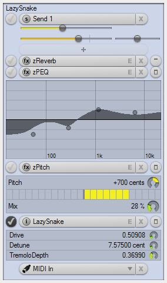

The rack can be used to show and manage track effect chains, as well as to control plugin parameters without the need to open plugin editor windows.

Devices and tracks in the rack follow the track hierarchy concept, meaning signals flow from bottom to top, as indicated by the signal flow arrows on track divider lines. The rack always presents the complete signal flow starting from the focus track, up to the master track. For example, selecting a child track will also show its parent group track, along with effects on the group track.

The rack uses the same selector buttons also present on track headers and mixer strips. See the [track controls](#h.ck0yjadhw9an) section in the tracks chapter for more information on using selectors. Gain and pan sliders are shown before (pre), after (post) effects, after bus sends, or at the point which they are set at in the track effect chain. Send effects additionally show a slider to adjust the send level.

_Note:_ The control type can be changed from default sliders with popup value display to other types on the **Control type** submenu of the inspector options menu.

Device objects, such as VST plugins, plugin presets, parameters, or input mappings, can be dragged from the object lists to appropriate selectors, or empty regions in the rack. New effects can also be added with the **+** new effect buttons, and effect tracks can be rearranged by drag-and-drop.

Select which track to edit with the object lists using the **Device/track select** check buttons to the left of selectors. These buttons are not shown when the list panels are hidden from the inspector.

A vertical scrollbar will appear in the rack if the vertical size exceeds the defined rack height, which can be adjusted by dragging the divider between the rack and the object lists. You can also hide the color picker and object lists to gain additional space for the rack.

The inspector options menu contains the following options related to the rack:

*   **Show Master Chain**: Controls whether the master track chain should be shown.
*   **Show New Effect Buttons**: Select to show or hide **+** new effect buttons.
*   **Show Gain, Pan, Send Controls**: Allow to show or hide each of these controls separately.
*   **Small Size**: Enable this option to use smaller controls, like on track headers and mixer strips.
*   **Control Type**: Select between dials and slider types to use for gain, pan, and send controls.

**Embedded Plugin Editors:**

Embedded plugin editors can be enabled by clicking the **Editors** button at the top of the inspector, or selecting **Show Rack Embedded Editors** from the inspector options menu.

When embedded plugin editors are enabled, a show/hide button appears to the right of each selector that holds a VST plugin. You can use these buttons to show/hide individual embedded plugin editors. Click inside the empty embedded plugin editor region, or select **Add All Rack Editor Parameters** from the device selector button right-click menu to add all available plugin parameters to the editor. A confirmation dialog will appear if there are more than 64 parameters. To manually add or remove parameters from the embedded plugin editor, enable or disable parameters from the **Add/Remove Rack Editor Parameter** submenu of the selector button context menu. These menu options are only available if embedded plugin editors are enabled.

Alternatively, you can use the parameter list in the **Parameter** panel to configure parameters to be embedded. Click the **Embedded editor parameters** button in the **Parameter** panel to show checkboxes next to each parameter in the list. The first checkbox for each parameter is used to show/hide the parameter in embedded plugin editors in the rack, and the second checkbox is for embedded plugin editors in the mixer. See the [mixing](#h.o0h1hbsjctg7) chapter for more information on embedded editors in the mixer.

The parameters inside embedded plugin editors are displayed in list form, with a value readout and a dial to the right of each parameter. Changes made to parameters can be recorded in the same way as recording adjustments made to controls inside plugin editor windows. See the [parameter automation](#h.l9u0rfngkzfi) chapter for more information.

Zynewave plugins - zPEQ, zPitch, zReverb - are all presented using their familiar UI, integrated in the rack. The embedded zPlugin editors are automatically resized to fit the inspector width, and depending on its size, less important controls (diffusion delay times, tuning pad) may become hidden from the zReverb editor UI. See the [zPlugins](#h.y7cgsi32l1fo) chapter for more information.

_Note:_ Embedded plugin editor configurations are stored in the project file, and apply to all arrangements in the project.

#### 5.5.3\. Track Panel

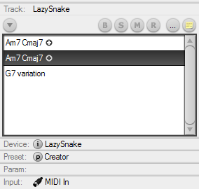

The **Track** panel is accessible by key shortcut F1\. The panel header displays the name of the focus track. The panel always displays the source track, even if an effect track is selected with the select buttons in the rack.

The panel contains the following buttons:

*   **Track menu**: Opens the track menu, also available by clicking the **Track** menu button in the editor toolbar.
*   **B**, **S**, **M**, **R**: Used to enable or disable bounce (if available), solo, mute modes, or record arm the track.
*   **Track Properties (...)**: Opens the **Track Properties** dialog, also available by double-clicking the track in the tracklist or mixer, or pressing Alt+Enter when the track has key focus.
*   **Stickie note**: Opens the stickie note window. The contents of a note can be displayed by moving the mouse cursor on the stickie note button.

Depending on the options enabled in the **Track Properties** dialog, the **Track** panel will additionally show sliders for controlling MIDI track functions: transpose, randomize timing, and randomize velocity. See the [tracks](#h.f7vfc7unqcre) chapter for more information.

Located below these controls is a list of all sound events, note, or curve sequences present on the track - you can drag these directly from the list to tracks. The list also provides an alternative method for selecting and accessing properties of events on the track by use of key shortcuts. If the track contains [parameter events](#h.rfoi2y6r1g62), dials for adjusting their value will appear alongside them in the list.

#### 5.5.4\. Device Panel

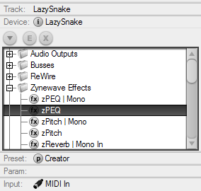

The **Device** panel is used for assigning devices such as VST and ReWire plugins, [hardware device definitions](#h.6vl0wl4j7c4f), bus mappings, as well as audio outputs to tracks, and is accessible by key shortcut F2\. The panel header displays the name of the device mapping assigned to the focus track.

The panel contains the following buttons:

*   **Device menu**: Opens the device menu, also available by right-clicking the **Device** panel header.
*   **Editor**: Opens the plugin editor window for the assigned plugin. Also available by pressing E when the track has key focus.
*   **Bypass**: Bypasses the device mapping. Also available by pressing X when the track has focus and has no input mapping assigned.

The device list contains all device mappings available in the current project, save for inputs. Device mappings can be dragged from the list and dropped on track headers, mixer strips, or in the rack. Dropping a device mapping on an empty region of the tracklist will create a new track with the mapping assigned. You can also assign devices by selecting **Assign to Track** from the list context menu, or by pressing Return when the list has key focus.

_Tip:_ You can drag a folder from the device list to an empty region of the tracklist to create a group track along with child tracks for each device mapping inside the folder. This can be useful to quickly set up multitimbral or multiple IO instruments.

See the [devices](#h.ah1wa2i5n4kq) chapter for more information.

#### 5.5.5\. Preset Panel

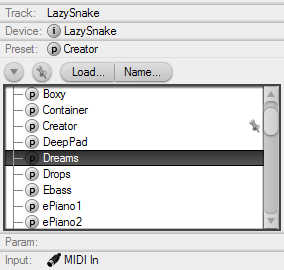

The **Preset** panel is accessible by key shortcut F3\. The panel header displays the name of the preset assigned to the device on the focus track.

The panel contains the following buttons:

*   **Preset menu**: Opens the preset menu, also available by right-clicking the **Preset** panel header.
*   **Load...**: Opens a dialog to load an FXB or FXP file.
*   **Name...**: Opens a dialog to edit the name of the currently used preset.
*   **Auto-assign preset**: When this option is enabled, presets will be assigned when selecting them with a single click, or when using the up/down arrow keys. This is useful when you want to quickly audition different presets in an instrument.

The preset list shows the available presets for the device on the focus track. You can assign a preset by double-clicking it in the list (single-clicking if **Auto-assign preset** is enabled), dragging a preset from the list to a track with a compatible device mapping, selecting **Assign to Track** from the list context menu, or pressing Return when the list has key focus. Note that some VST plugins use their own proprietary preset handling systems, and plugin presets thus may be unavailable in the **Preset** panel.

_Note:_ The **Preset** panel can only display actual preset names when the arrangement is powered on, and the plugin on the focus track has not been disabled.

See the [presets](#h.tnibgkjol3wp) chapter for more information on presets.

#### 5.5.6\. Parameter Panel

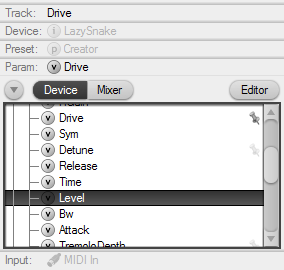

The **Parameter** panel is accessible by key shortcut F4\. The panel header displays the name of the parameter assigned to the focus track.

The panel contains the following buttons:

*   **Parameter menu**: Opens the parameter menu, with functions used to enable MIDI and SysEx parameters. Also available by right-clicking the **Parameter** panel header.
*   **Device/Mixer**: Toggle the parameter list to show either VST and MIDI parameters, or Podium mixer parameters, such as level and pan. The **Device** button is only available if the assigned device has VST or MIDI parameters.
*   **Embedded editor parameters**: Enables checkboxes used for selecting parameters to be shown/hidden in the embedded plugin editors in the rack and mixer strips. See the [rack](#h.klsav4v2qf6e) section and [mixing](#h.o0h1hbsjctg7) chapter for more information. Only available if the assigned device has VST or MIDI parameters.

You can set up parameter automation by double-clicking a parameter in the list, dragging a parameter from the list to a compatible track, selecting **Assign to Separate Track** from the context menu, or pressing Return when the list has key focus - this will create a new parameter track with the parameter assigned. To replace the parameter assigned to the focus track, either select **Assign To This Track** from the list context menu, or Shift+click the **Parameter** selector and choose a parameter. In addition to the pin icon shown next to the parameter that is assigned to the focus track, dimmed pin icons are shown next to all parameters that have been assigned to parameter tracks belonging to the focus track.

See the [parameter automation](#h.l9u0rfngkzfi) chapter for more information.

#### 5.5.7\. Input Panel

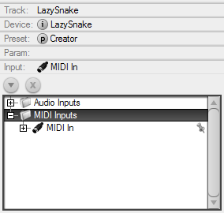

The **Input** panel is accessible by key shortcut F5\. The panel header displays the name of the input mapping assigned to the focus track.

The panel contains the following buttons:

*   **Input menu**: Opens the input menu, also available by right-clicking the **Input** panel header.
*   **Bypass**: Bypasses the input mapping. Also available by pressing X when the track has focus.

An input mapping can be assigned to a track by double-clicking it in the list, dragging a mapping from the list to a track, using the **Assign/Move to Track** command on the list context menu, or by pressing Return when the list has key focus. When you assign an input mapping in any of these ways, this will remove the mapping from all other tracks it is assigned to. You can assign the same input mapping to multiple tracks by selecting **Assign/Copy to Track** from the context menu, or dropping the mapping on a track while holding the Ctrl key.

An input can alternatively be automatically assigned to the focus track by selecting **Auto-Assign to Focus Track**. The input mapping will thereby be automatically moved to the currently selected track, unless the track already has an input mapping. The name of an auto-assigned input will be shown dimmed on the **Input** selector and on the panel header.

_Note:_ The first MIDI input device detected by Podium is, by default, configured to be auto-assigned in newly created projects.

_Tip:_ As with device mappings, you can drag a folder from the input list to an empty region of the tracklist to create a group track along with child tracks for each input mapping inside the folder.

_Tip:_ You can configure both an auto-assigned MIDI and audio input mapping at the same time. Depending on whether there is an instrument assigned to the focus track, the appropriate input will be used.

### 5.6\. Using Presets

Assigning a preset to a track will recall the preset on the device. The recall is only done if the track is unmuted and if monitoring is activated. If a program preset is assigned, the device will recall the preset from the specified program location in the internal preset bank of the device. If a library preset is assigned, the preset data will be transferred to the device. In the case of external devices this is done by sending MIDI SysEx messages. Note that some plugins handle preset recall as part of the audio processing. This can lead to a momentary CPU overload and audio drop-out.

To avoid conflicts between presets, only a single library preset is allowed on tracks with mappings for a global device instance. Plugin program presets are also only allowed on a single track for a plugin instance. Program presets using MIDI program changes can be assigned to tracks with individual MIDI channel mappings. Any invalid preset assignments will be indicated by a red message popup button in the track inspector and on the strips in the mixer.

A single program or library preset can be assigned to multiple tracks with different instances of a plugin or external device. Changes to the preset will then be applied to all device instances assigned with the preset.

#### 5.6.1\. Creating Plugin Library Presets

Assigning program presets to a plugin track is an efficient way to recall predefined factory presets in the plugin without storing the preset data in your Podium project. Some plugins require large amounts of memory for preset data, so the memory saved with program presets can be substantial.

If you want to store a preset you have edited with the plugin editor, you need to use library presets. You can create library presets containing the data for only the current program or for the entire bank of presets. Some plugins may require the use of bank presets. This can be the case with multitimbral instruments that store additional information such as global settings and channel setups in bank presets.

Library presets are created with the **New Program Library Preset** and **New Bank Library Preset** commands found on the preset panel menu and track context menu. The **Create Library Presets For All Programs** command will create a series of library presets for all programs found in the plugin. Creating library presets with these commands will place the presets in a separate "Library" subfolder within the device definition folder of the plugin.

When a new bank has been loaded in the plugin, either by assigning a bank library preset to a track or by using file load commands in the plugin, the program names in the plugin will likely not match the names of the preset objects. Use the **Update Programs List** command to update the list with the new contents of the plugin preset bank.

Assigned library presets are synced with the plugin settings when saving projects and unloading plugins etc. Library presets can be manually synced using the **Store Current Settings To Library Preset** command.

#### 5.6.2\. Creating SysEx Library Presets

MIDI SysEx messages are used when storing preset data for external devices. Podium does not know the preset format for your external device and so cannot automatically request presets from the device. You have to record SysEx preset dumps from the device and then create the library presets from the recorded SysEx events.

Set up an arrangement to record from the device. Start the recording and use the menu system on the device to initiate a SysEx dump of the current preset. It is important that it is the current preset and not bank presets you transfer. Otherwise when Podium transfers the preset back to the device it would overwrite the bank preset rather than the current preset. Recall another preset and repeat the SysEx dump for each preset you want to transfer. When done, stop the recording and check the recorded events. There should be a series of stream events for each preset you transferred.

If the device only transmits one SysEx message for each preset you can select all the stream events, right-click the selection and choose the **Create Library Presets For Each Stream Event** command. This should create a series of generically named presets in the track inspector preset list. You can now choose to rename the presets to what their name was on the external device.

If the device transmits several SysEx messages for each preset you select the group of stream events for one preset, right-click the selection and choose **Create Library Preset From Combined Stream Events** command. Repeat this for each group of stream events for all the presets you recorded. The **Preset Properties** dialog will be displayed to let you specify the correct name for the preset.

After this procedure the new presets are found in the "Library" folder under the device definition folder associated with your device. You can now delete the SysEx messages you recorded.

* * *

## 6\. Arranging

The Podium mixing engine uses the track tree of an arrangement to control the routing of MIDI and audio. A track can generate MIDI or audio either through live device mapping objects or through recorded material contained in sequences on the tracks. The output of the tracks will be streamed through each parent track in the tree until arriving at a track with a device mapping that can use the streamed data.

As an example let's say we have a group of tracks containing note sequences and curve sequences for parameter automation. The output of these tracks will stream upwards to a parent track that has a device mapping for an external synth or a plugin synth. This track will then generate the audio output of this device and stream the audio upwards in the tree possibly passing through tracks containing effects plugins and eventually arriving at the master output track.

Bouncing is a feature that is useful when your system resources are low. It involves recording the audio output for example of a plugin and thus freeing the resources required by the plugin. In Podium you can enable bouncing on any track that streams audio. This enables you to bounce a single plugin track, a group of plugins on a parent track or the master output at the topmost track. Once your bounce tracks have been recorded you can use the **B** bounce button on a track to switch between bypassing the bounced sound or bypassing the subtree that produced the bounced sound.

### 6.1\. Sequence Events

A sequence event refers to a segment of a sequence object. When you move, resize, or split events, you modify the start and end position of the segment that the event links to - the sequence object itself is not affected. There are four types of events used in the arrangement editor: [sound events](#h.e2mz3q5m2r4d), [note sequences](#h.ttvmxags9otu), [curve sequences](#h.o6oomworp3q7), and [parameter events](#h.rfoi2y6r1g62). New events can be created by recording, importing audio or MIDI files, or by using the select or pencil tools. The type of sequence created thereby depends on the track configuration.

The name of a note or curve sequence can be changed in the **Sequence Properties** dialog, accessible from the sequence event context menu, or by pressing Alt+Enter when a sequence is selected. To change the name of a sound event, use the **Sound Event Properties** dialog, see the [Sound Event Properties](#h.e2mz3q5m2r4d) section.

Click+drag a sequence event to move it on the timeline, as well as across tracks. Hold the Shift key to lock either the x or y position of events, depending on the drag direction. Press Ctrl+Left or Ctrl+Right to move selected events in steps of the editor quantize value.

Sequence events can be resized using the bottom-most handles that appear at the event start and end points when the select or pencil tool is placed on an event. You can alternatively resize an event when the resize handles are not in view, by Alt+clicking the event. Whether the start or end of the event is resized thereby depends on the clicked position.

You can have multiple sequence events referencing the same sequence object. These phantom sequence events are indicated by a plus symbol next to the sequence name. All changes made to the notes, curve points, or sound data referenced by a phantom sequence event will be reflected in all phantom copies of the event. Phantom copies can be created from selected events by holding the Ctrl key before or while moving events. Releasing and holding the Ctrl key again while holding the mouse button will toggle between creating phantom and unique copies. The mouse cursor indicates whether a phantom or unique copy will be created. A phantom sequence can be made into a unique copy using the **Convert to Unique Copy** or **Convert to Unique Cropped Copy** commands on the **[Edit](#h.44nlc4xedbmx)** menu and the sequence event context menu.

The Insert key can be used to create phantom copies of all selected events, whereby the duplicated events will align to the grid according to the editor snap value, provided that snap is enabled. Press Ctrl+Insert to snap the start of the duplicated events to the next bar. Press Shift+Insert to align the duplicated events exactly at the end of the selected events.

#### 6.1.1\. Gain, Fade-In/Out & Crossfades

Sound events can have gain, fade-in, and fade-out settings, which are applied in real-time during playback. The waveform displayed on sound events is scaled according to the fade length.

Placing the select or pencil tool on sound events will display four handles, as well as a horizontal gain handle at the top of the event. When the mouse cursor is placed on one of the fade handles or the gain handle, the fade curve is highlighted and the fade-in/out time or event gain value is displayed at the bottom of the event. Drag the gain handle up or down to adjust the event gain in 0.1 dB steps. Drag the upper left handle to adjust the fade-in time, and the upper right handle to adjust the fade-out time. Right-click a fade handle, or inside the fade range to display a menu used for selecting the fade curve shape. Double-clicking either fade handle or the gain handle opens the **Sound Event Properties** dialog, with key focus set to the appropriate value input field. See the [Sound Event Properties](#h.e2mz3q5m2r4d) section.

Moving a sound event so that it overlaps with another sound event will automatically create a linear crossfade on the overlapping sections. The crossfade is logged as a separate action in the edit history. Clicking the undo button, or pressing Ctrl+Z once will undo the crossfade, and clicking the undo button again will undo the event move.

When right-clicking within the crossfade range, the selected curve shape will be applied to both the overlapping events. If you have resized two or more crossfaded events, or edited the crossfade times, you can use the **Crossfade** command to restore the original crossfade times of the overlapped sections. This command is available on the **Edit** menu and on the sound event context menu when two or more selected sound events overlap.

Fade curves on sound events in the arrangement editor are applied non-destructively. You can bounce tracks, or use the sound editor to apply fades destructively. See the [sound editor](#h.67h2qj7ry5ak) chapter for more information.

_Note:_ Fade curves on sound events will, by default, be shown at all times. To only show fade curves when moving the mouse cursor on an event, disable the **Show sound event fade curves** option in the **Tracks Region Properties** dialog. See the [editor profiles](#h.pd5qj0yekcu5) chapter for more information.

#### 6.1.2\. Time-Stretching

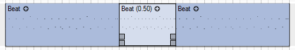

Time-stretching can be used on note and curve sequences in the arrangement editor.

Placing the select or pencil tool on sequence events will display four handles, of which the top handles at the start and end of a sequence are used to adjust time-stretching. When a sequence is time-stretched, its play rate will be written in parentheses next to the sequence name.

Time-stretching is performed non-destructively. Sequences can be returned to their original play rate by selecting **Reset Time-Stretch** from the sequence event context menu. Creating copies of a time-stretched sequence will also copy the play rate setting for the sequence.

#### 6.1.3\. Sound Event Properties

The **Sound Event Properties** dialog can be opened by selecting **Sound Event Properties** from the sound event context menu, or by pressing Shift+Enter. It can also be opened by double-clicking either of the fade handles or the gain handle on a sound event, in which case key focus will be set to the appropriate value field in the dialog.

In this dialog, you can enter a **Sound event name** to use in place of the sound file name, as well as adjust **Gain offset**, **Panning**, **Fade-in**, and **Fade-out** settings, which will be applied to the sound event in real-time during playback.

The fade curve displays can be used to precisely set the fade time and curve shape. To adjust the curve shape, click+drag horizontally inside the upper and lower halves of the curve display, or use the value input fields below the display. The segment of the waveform that is inside the fade range is shown underneath the curve.

### 6.2\. Parameter Automation

Automation in Podium is track based, with automation points enclosed in curve sequences, which are presented the same way as note sequences and sound events in the arrangement editor. Curve sequences can thus be moved, resized, split, and time-stretched, among other editing actions. It is also possible to create phantom copies of curve sequences.

Automatable parameters include MIDI parameters (for example, Control Change, Program Change, or SysEx), VST plugin parameters, and Podium mixer parameters (level, pan, send). Mixer parameter automation is applied as a relative offset to the track gain, pan and send settings. For example, you can adjust the track gain value to fit it into the mix, and any existing level automation on the track will automatically be offset to the new overall gain value. Level and send parameters range from minus infinity (off) to zero dB. Thus you need to set the gain and send track settings to the maximum peak value that you require, which then can be reached with the maximum 0 dB automation value.

Parameter tracks can be created manually by selecting parameters from a menu, or they can be created automatically by recording parameter changes made with the mouse in plugin editors or with connected MIDI controllers. See the [recording automation](#h.bplgul9eo1n5) section for more information.

To manually create a parameter track, select a parameter from the **Parameter** submenu of the track context menu, or from the **Parameter** panel in the inspector. See the [track inspector](#h.oo4cat2m3073) chapter for more information. This will create a parameter track, which appears as a child track of the track to which the automated device is assigned. To change the parameter object assigned to a parameter track, Shift+click the parameter selector. See the [track controls](#h.ck0yjadhw9an) section in the tracks chapter for more information. When you create a new parameter track, a curve sequence spanning the length of the arrangement is automatically created on the parameter track.

_Note:_ To be able to record or edit MIDI parameters in a plugin or hardware device, it is required that the device definition contains parameter objects that define the MIDI messages. Not all MIDI messages are created by default when you for example import a plugin. Use the **Parameter** panel in the inspector to create and edit MIDI parameter objects. See the [parameters](#h.9iroo5tnlh4t) and [track inspector](#h.ed57aa1rrutb) chapters for more information.

#### 6.2.1\. Mixer Faders

Parameter tracks in the mixer appear with a fader representing the value of the curve sequence at the play/edit cursor position. If there is no curve sequence at the play cursor position, the fader knob is drawn dimmed.

The parameter selector shown in the mixer strip header will be vertically aligned to the source/effect selector that it belongs to, provided that the **Show Effect chains** mixer option is enabled. This provides a helpful visual clue, when you for example have automated the same parameter on two different effect tracks. This could be the send parameter automated for both "Send 1" and "Send 2", which will show up as "Send" in the mixer strip title for both parameter tracks. The track lane header does not have the same visual clue tying a parameter track to an effect, so it includes the controlled effect name in parentheses in the header title, such as "Send (Send 1)".

If you have created parameter tracks for multiple effects on a single track, the parameter tracks are sorted with the topmost effects appearing first. This top to bottom order cannot be changed, but you can rearrange parameter tracks that belong to the same source/effect selector. Use the parameter track **Move** submenu, or drag the parameter track lane header up/down in the track list.

The fader on a parameter mixer strip will use the full available height of the strip, with the exception of the level and send parameters. These parameters are automating dB gain values in the Podium mixer, and so the faders are aligned vertically to match the level markings of gain faders and meters on audio tracks.

#### 6.2.2\. Recording Automation

Parameter changes can be recorded with hardware MIDI controllers, by adjusting controls in VST plugin editor windows, or using the controls in embedded plugin editors in the rack or mixer. See the [mixing](#h.j34mrh5o2p9c) and [track inspector](#h.klsav4v2qf6e) chapters for more information on embedded plugin editors.

To record automation using a MIDI controller, the controls on VST plugin editors, or embedded editors, the respective track must be record armed, and recording mode enabled on the transport toolbar. When recording parameter changes to a device assigned to an effect track with a MIDI controller, the appropriate MIDI input must be assigned to the effect track by selecting the track in the [rack](#h.klsav4v2qf6e), and assigning the input device from the **[Input](#h.rc02xbdh79xq)** panel in the inspector.

_Note:_ It is not required to enable recording mode or record arm a track when using parameter value faders on parameter tracks in the mixer to record automation.

When you record using the mouse on controls in VST plugin editor windows, embedded editors, or parameter faders in the mixer, automation will be recorded for as long as you keep a control active by holding the left mouse button.

Recording automation with MIDI controllers, VST plugin editors, or embedded editors will create a series of bar point events, to ensure that playback will reproduce the exact same series of parameter changes. Dragging the faders on parameter tracks in the mixer during playback will create a series of line point events, resulting in gradual value changes.

_Note:_ Changes to mixer parameters (level, pan, send level) can only be recorded using the faders on parameter tracks in the mixer.

_Tip:_ Changes made to a curve sequence by dragging a parameter fader in the mixer can be cancelled by right-clicking while dragging the fader.

To record only changes to specific parameters, you can record arm individual parameter tracks. Use punch mode to record only within a certain timeline range. See the [recording](#h.wne9g8ykgvz9) chapter for more information. Note that punch mode does not affect automation recording when using the faders on parameter tracks in the mixer.

#### 6.2.3\. Editing Automation

Curve sequences are primarily edited with the curve editor, see the [curve sequence](#h.o6oomworp3q7) chapter for more information.

Alternatively, the parameter value faders on parameter tracks in the mixer can be used to input parameter changes even when playback is stopped. Dragging a fader will edit the curve sequence at the edit cursor position - if the edit cursor is positioned at a point on an existing curve that uses line or spline points, a line point will be created. Otherwise a bar point will be created, resulting in an abrupt parameter value change. If there is no curve sequence at the edit cursor position, the previous sequence will be extended or a new one will be created automatically at the start of the drag action.

_Note:_ Adjustments made to parameter value faders are logged in the arrangement undo history.

#### 6.2.4\. Parameter Event Automation

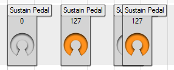

For MIDI parameters that only need to be set to a fixed value at a certain point on the timeline, you can insert parameter events directly on the timeline, as an alternative to curve sequences.

Parameter events can be created for MIDI parameters by dragging parameter objects from the **[Parameter](#h.ed57aa1rrutb)** panel in the track inspector onto the timeline area of a track. The events are drawn as squares with a header showing the parameter name. The left edge of the square is aligned at the event time position. If the parameter object has a value range, as defined in the **Parameter Properties** dialog, the parameter event will show a value along with a dial you can use to change the value. See the [parameter properties](#h.4j3ny3pda0o6) section for more information. The dial is sized according to track height.

The **Parameter Properties** dialog for a parameter object contains a **Record as curve sequence on separate track** check box. This setting determines if recording parameter changes should generate curve sequences or parameter events.

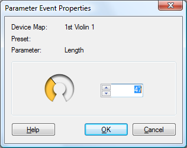

If there are several parameter events stacked on top of each other, it can be difficult to select an individual event with the mouse. If you select one of the events, you can use the left/right arrow keys to step between the events. The selected event will always be drawn on top of unselected events. Alternatively, you can use the event list on the **[Track](#h.hraquu6dnyd7)** panel in the inspector, where you can view all parameter events on the track, and edit their values with the dials in the list. If you want to enter a precise value, open the **Parameter Event Properties** dialog by double-clicking the event or pressing the Enter key when the event has key focus.

When you edit the parameter event value, it is applied to the parameter in real time so you can audition the effect of the value change.

### 6.3\. Mixing

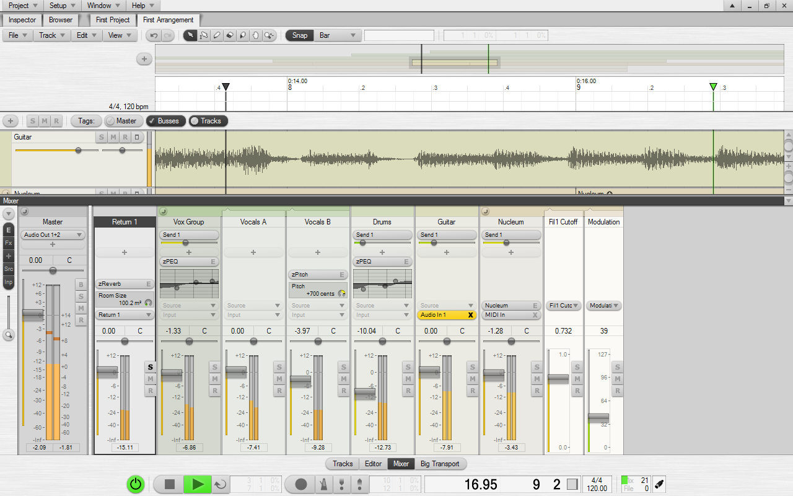

The mixer can be used to to get an overview of, and precisely control track settings, levels, and effect chains. By default, the mixer is accessible by clicking the **Mixer** button on the [editor profile toolbar](#h.mobw1psefvgm), located above the transport bar.

The layout of the mixer strips mirrors the tracks region, with the tracks arranged as columns rather than rows. Collapsed group tracks will be shown collapsed in both the mixer and arrangement editor. Selecting a track in the arrangement editor will scroll the mixer if the track is off-screen.

_Tip:_ Track tag selections apply to both the arrangement editor and mixer. See the [track tags](#h.bxehbr2enpil) section in the arrangement chapter for more information.

You can set the height of the mixer region by dragging its title bar vertically, or using the **Minimum region height** and **Maximum region height** settings in the **[Mixer Region Properties](#h.mijj7hankzjl)** dialog. Click the arrow button on the right side of the mixer region title bar, double-click the title bar, or press F7 to minimize/restore the mixer.

The column to the left side of the mixer contains a button to open the mixer options menu, as well as shortcut buttons to show/hide embedded plugin editors, effect chains, **+** new effect buttons, **Source** selectors, and **Input** selectors. The options to show or hide these and other mixer elements are also available in the mixer options menu. Below these buttons is the **Zoom strip widths** slider, used to horizontally zoom mixer strips from 20% to 300% original size. Double-clicking or Ctrl+clicking the slider will set zoom to the default 100%. Double-clicking again will restore the previous zoom setting. When you adjust the zoom by dragging the slider, the zoom will lock onto the focus track.

When zooming the mixer strip widths below 100%, the embedded plugin editors and various mixer controls will change position and size to accomodate for the narrow mixer strips. The BSMR buttons will be moved above the meters, the translucent faders will gradually overlap the meters, values will be shown with fewer decimals, various texts will be shortened or removed, in order to present a clean view of the mixer strips even at 20% zoom.

The arrangement editor slide and zoom tools can also be used to navigate the mixer strips. Selecting the Slide tool (hold Shift+Alt) will show the hand mouse cursor, allowing you to click anywhere on the mixer strips and drag to slide the view. Selecting either the Zoom X or Zoom XY tool (hold Ctrl+Alt) allows you to click on a mixer strip and drag sideways to zoom in/out on the mixer strip. Instead of click+drag you can also use the the mouse wheel to zoom in/out.

Mixer strips use the same track controls and selector buttons also used on track headers and in the rack. See the [track controls](#h.ck0yjadhw9an) section in the tracks chapter for more information.

_Note:_ The control type used for gain/pan/send controls can be changed in the **Mixer Region Properties** dialog.

Each track configured for audio processing presents a large fader and peak meter. The number of meters displayed on a track depends on the speaker configuration (mono, stereo, or surround setups) of devices in the track effect chain. Clicking a meter toggles RMS metering on/off on the track. You can select to use a different RMS meter scale, such as the K-System, in the **Arrangement Properties** dialog.

Parameter tracks show a fader indicating the parameter value at the edit/play cursor position. This fader can also be used to record parameter automation. See the [parameter automation](#h.l9u0rfngkzfi) chapter for more information.

Additionally, the following controls and elements are available on mixer strips:

*   **Fader & Meter Grid**: See the [fader & meter grid](#h.mxizbzi64utf) section.
*   **Peak hold indicators**: Display the peak dB values measured on tracks during playback. Clicking a peak hold indicator will reset its value, and double-clicking any peak indicator will reset the value on all mixer strips.
*   **Latency information**: Shows the time that the signal on the track is delayed before it arrives at connected monitoring equipment, presented as miliseconds, with the number of samples in paranthesis. This is caused by latency added by plugins and the audio interface. The delay will be present during live monitoring, but is automatically compensated for during playback and recording.

Double-clicking an empty region of a mixer strip opens the **[Track Properties](#h.b66m8i5vbhr5)** dialog for the track. Clicking the gain or pan value display opens the **Track Properties** dialog with key focus set to the matching value field. These value displays may not be available, depending on the **Gain/pan fader** setting in the **Mixer Region Properties**.

The master track, as well as bus tracks can be configured to be docked to the left or right side of the mixer in the **Mixer Region Properties** dialog. By default, the master track is docked to the left side of the mixer. Docked tracks will always be shown, even when they would otherwise be hidden by [track tag](#h.bxehbr2enpil) selections.

#### 6.3.1\. Mixer Options Menu

Besides options to show or hide various mixer elements, the mixer options menu contains the following settings:

*   **Minimize Audio Tracks**: Minimizes all tracks producing audio signals.
*   **Minimize MIDI Tracks**: Minimizes all tracks only producing MIDI signals.
*   **Minimize Parameter Tracks**: Minimizes all parameter tracks. Disabling this option returns parameter tracks to their previous state.
*   **Expand All Groups**: Shows all child tracks in collapsed groups. Disabling this option returns group tracks to their previous collapsed/expanded state.

#### 6.3.2\. Fader & Meter Grid

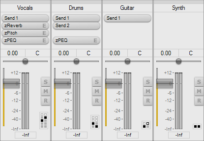

When enabled in the mixer options menu, the fader & meter grid is displayed at the bottom right side of every mixer strip. Each row of blocks in the grid represents an effect in the track effect chain. The left column of blocks represents the fader position, and the right column represents the meter position. A highlighted block indicates the position at which the fader or meter is currently set. Bus sends are drawn as framed blocks instead of filled blocks.

Clicking the grid will toggle the meter between pre- and post-effect metering. Shift+clicking a block in the grid will set the fader or meter to the corresponding effect track. Move the mouse cursor over the grid to show a popup with detailed information.

#### 6.3.3\. Embedded Plugin Editors

Embedded plugin editors can be shown/hidden using the **Embedded plugin editor** button on the options column at the left side of the mixer region, or with the **Show Embedded Plugin Editors** option on the mixer options menu.

To add or remove parameters from an embedded plugin editor, enable or disable parameters from the **Add/Remove Mixer Editor Parameter** submenu of the selector button context menu, or select **Remove All Mixer Editor Parameters** from the menu to remove all parameters.

Alternatively, you can use the parameter list in the track inspector **[Parameter](#h.ed57aa1rrutb)** panel. Click the **Embedded editor parameters** button in the **Parameter** panel to show checkboxes next to each parameter in the list. The second checkbox for each parameter is used to show/hide the parameter in embedded plugin editors in the mixer.

Parameters inside embedded plugin editors are displayed with a value readout and a dial. Click+drag anywhere inside the editor to adjust the value of a parameter. Changes made to parameters can be recorded in the same way as recording adjustments made to controls inside plugin editor windows. See the [parameter automation](#h.l9u0rfngkzfi) chapter for more information.

The Zynewave parametric equalizer plugin - [zPEQ](#h.hyn5swkuhepf) - is presented using its familiar UI, integrated in the mixer. See the [zPlugins](#h.y7cgsi32l1fo) chapter for more information on how to use the zPEQ editor miniature. The embedded editor is automatically resized when using the mixer strip zoom function.

_Note:_ Embedded plugin editor configurations are stored in the project file, and apply to all arrangements in the project.

#### 6.3.4\. Busses

Busses are generally used to create a branch off the [track hierarchy](#h.1wd9uwxo7xq8), with the result that the signal not only flows upwards in its own track chain, but is also routed to another track chain starting on the bus track. This can be used to the advantage of routing multiple tracks to the same effect chain, or to create submixes that may otherwise be difficult to set up within the track hierarchy.

Podium supports a total of 100 bus instances, and each bus supports up to 32 audio channels. Bus sends are not fixed at pre- or post-effect positions, but can instead be moved to any point in the effect chain in the same way as effect mappings. Busses are handled like other device objects, such as VST effect plugins - to route a track to a bus, assign a send mapping to the track by either selecting the mapping from the menu on the **+** new effect button, or by dragging a mapping from the **[Device](#h.ykjf851o0f0u)** panel in the [track inspector](#h.oo4cat2m3073). Unless there is already a track holding the matching return mapping, a dialog will appear, asking whether to create one. Bus return tracks created in this way are, by default, set to automatic solo mode.

By default, bus mappings are located in the **Busses** folder, accessible from the [devices panel](#h.o2zqto9a3fve) on the project start page. The default mappings are named 'Send n' and 'Return n' - these names can be changed in the same way as those of other device mappings. See the [devices](#h.ah1wa2i5n4kq) chapter for more information.

_Tip:_ You can use [track templates](#h.6k5bq12jjm1p) to set up new tracks with a number of send mappings assigned.

In a newly created project, you will have four busses available. Additional bus mappings can be created using the **Devices** panel on the project start page. Choose **New Bus Instance** from the **Devices** menu to create a new bus instance using the default bus naming scheme. Alternatively, you can right-click an existing bus mapping, and choose **New Instance** to create a new bus mapping with its name based on the name of the selected instance. This option is also available on context menu in the **Device** panel in the track inspector.

_Tip:_ If you prefer to start a new arrangement with a more traditional mixer layout, for example, 16 tracks and 4 busses, you can specify the number of tracks and busses in the **New Arrangement Properties** dialog.

Mixer strips for bus return tracks can be configured to be docked to the left or right side of the mixer, using the **Mixer Region Properties** dialog. Docked bus tracks will always be shown, even when they would otherwise be hidden by [track tag](#h.bxehbr2enpil) selections.

#### 6.3.5\. Levels

On all tracks that are configured to stream audio there is a gain control that offsets the level of any audio passing through the track. This gain control is meant for setting the overall balance of the tracks.

When you wish to automate level fades you create parameter tracks and record the level fades into curve sequences.

The Podium mixer engine operates in 32-bit or 64-bit floating point. One advantage of using floating point is that clipping of overloaded audio does not occur until the audio is streamed to audio devices or rendered to a fixed point wave file. If audio overloads in the course of streaming and summing through the track tree you can reduce the level higher in the tree without losing quality.

Each track can be configured for use as an audio mixing junction. If audio is enabled then an audio level meter will be displayed in the track header and the the mixer track strips. The track will also include a gain adjustment. The purpose of the gain controls are to create an overall balance of your tracks and, for example, to boost weak audio inputs or reduce the gain of a track summing the output of multiple child tracks to avoid that it will overload plugins higher in the track tree.

If you want to automate levels you should assign the audio level parameter to a track and record curve sequences. The audio level parameter works as an offset to the current track gain setting. It functions as a damper of the track gain setting, so if you want to be able to automate a boost in the track level you should set the gain to the max desired. Since any automated level curves act as an offset to the track gain setting, you can at a later point readjust the balance of your track gains without having to redo the level automations. The automated level curves follow your track gain adjustments. Imagine you have an automated level curve fading from full scale to -6 dB below full scale. If your track gain is set to +6 dB the automated level curve will create a fade from +6 to 0 dB. If you adjust the track gain to -12 dB the level curve will create a fade from -12 to -18 dB.

Meters in the mixer region measure from -infinite to +6 dB. If the level on a track exceeds 0 dB the meter coloring will turn red and slowly fade back to green when level falls below 0 dB again. In general you should always try to make your audio tracks use the full range of the meter but always avoid any meter overloads. Preferably you should adjust the output level on the devices supplying the audio.

Both external devices and plugins often have a dedicated master volume. Once you have optimized the device output levels you can use the track gains to balance your mix. Even if you have a track that is supposed to be very quiet in the final mix you should always capture the source audio in full scale for optimum quality and only reduce the level as late as possible in the track tree mixing.

### 6.4\. Recording

This chapter describes how to record audio, MIDI, and plugin parameter automation. See the [parameter automation](#h.l9u0rfngkzfi) chapter for information on mixer parameter recording.

Before being able to start recording, you must assign the appropriate input device mapping(s) to one or multiple tracks. Click the **Input** selector on the track header and select an input from the menu. Alternatively, you can open the **[Input](#h.rc02xbdh79xq)** panel in the track inspector, or press F5, select an input, and either double-click it to assign it to the focus track, or drag it onto the tracklist to create a track with the mapping assigned. See the [devices](#h.ah1wa2i5n4kq) chapter for more information on using device mappings.

_Tip:_ You can drag a folder containing multiple device mappings from the **[Input](#h.rc02xbdh79xq)** panel in the inspector to the tracklist to create a new track for each device mapping inside the folder.

For recording audio, you must assign an audio input mapping to a track you wish to record on. To record note events via MIDI, or plugin parameter automation using a MIDI controller, you must assign the desired MIDI input device mapping to a track, and also assign an instrument plugin or hardware device definition, using the **Source** selector on the track header.

You do not need to assign an input if you plan on recording plugin parameter automation by moving the plugin UI controls with the mouse.

_Tip:_ The first MIDI input device configured in Podium will be automatically assigned to the focus track in a newly created project. The name of an auto-assigned input is displayed dimmed on the **Input** selector.

After you have assigned an input to a track, click the **R** record arm button on the track header, or press R to arm the focus track for recording.

Activate recording mode by clicking the **record** button on the transport bar, by pressing K, or Decimal on the numeric keypad. When recording mode is activated, all **R** buttons on record enabled tracks, track lane backgrounds, as well as any sequence events on record enabled tracks are colored with the record color defined in the **Colors** dialog. If punch recording is activated, only those parts of tracks and sequences that fall inside the punch range will be colored. Furthermore, the play cursor will be colored with the record color once it enters the recording range.

Recording will commence on all record enabled tracks whenever playback is started with recording mode activated, or when recording mode is activated during playback, beginning at the play cursor position. Any recorded sound, note, and curve sequences will be displayed and updated in realtime during recording. It is possible to edit already recorded sequences, even during recording, without interrupting recording or playback. To stop recording, deactivate recording mode or stop playback. Recording mode will be deactivated automatically when playback is stopped. This can be configured using the context menu on the **record** button, or on the **[Play/Record](#h.p5syr6xd4yah)** preferences tab.

You can activate metronome mode by clicking the **metronome** button on the transport bar, or by pressing U. The metronome will generate a clicking sound on each bar and beat during playback to aid you in keeping the desired tempo. Open the **[Metronome](#h.c2qttg8o8l3p)** preferences tab, or choose **Metronome Preferences** from the **Metronome** button context menu to configure the metronome.

Loop mode can be activated by clicking the **loop** button on the transport bar, or by pressing L. Set the loop range by moving the loop locators, or using the options on the loop region context menu. When recording with loop loop mode activated, [multi-take recording](#h.pepa41hpbyoq) will be used automatically on tracks with audio inputs assigned. This behavior can be configured on the **[Play/Record](#h.p5syr6xd4yah)** preferences tab. When recording in loop mode with multi-take recording disabled, sound events will be overwritten on each subsequent pass through the loop range. Conversely, any new MIDI data recorded will be added to the existing note sequence when recording in loop mode, enabling you, for example, to layer drum notes during each pass.

_Tip:_ You can quickly set the loop range around the current selection by pressing Alt+L.

In summary, the following steps need to be taken to set up recording:

*   Assign an audio or MIDI input device mapping to a track. See the [devices](#h.ah1wa2i5n4kq) chapter for more information.
*   Arm the track for recording by clicking the **R** button on the track header, or pressing R when the track has focus.
*   Activate recording mode by clicking the **record** button on the transport bar, by pressing K, or Decimal on the numeric keypad.
*   Optionally, activate metronome mode and loop mode by clicking the **metronome** and **loop** buttons on the transport bar, or by pressing U and L, respectively. Note that recording audio with loop mode activated will, by default, enable [multi-take recording](#h.pepa41hpbyoq).
*   Start playback by clicking the **play** button on the transport bar, by pressing Space, or Enter on the numeric keypad.

#### 6.4.1\. Punch Mode

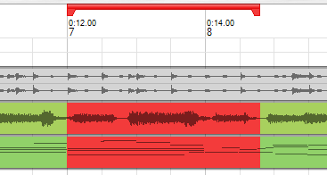

Punch mode is used in combination with recording mode to limit the time range recording should be activated in.

Click the **punch in** and **punch out** buttons on the transport bar, or press I and O, respectively, to toggle punch in/out mode. Set the punch range by moving the punch locators, using the options on the punch region context menu, or the options on the **punch in/out** buttons context menu.

_Tip:_ You can quickly set the punch range around the current selection by pressing Alt+K.

When punch mode is activated, recording will only be activated once the play cursor enters the punch range, and deactivated again once the play cursor leaves the range. Activate only **punch in** to start recording from the punch in position, and keep recording until the end of the arrangement. Likewise, activate only **punch out** to start recording at the beginning of the arrangement, and stop recording at the punch out position.

#### 6.4.2\. Multi-Take Recording and Compositing

Multi-take recording can be useful in many situations, whether you are recording a performance or trying out different variations of a musical phrase, without having to worry about manual track management or recording over existing material.

_Note:_ Currently, multi-take recording is only available for audio recording.

Depending on the **Convert record enabled tracks to composite multi-take groups** setting on the **[Play/Record](#h.p5syr6xd4yah)** preferences tab, multi-take recording will be used automatically upon starting recording, or only when loop mode is activated. To disable multi-take recording, set this option to **Never**. You can manually configure a track for multi-take recording by enabling **Use as composite track** in the **Track Properties** panel, or choosing **Composite Track** from the **Options** submenu of the track context menu.

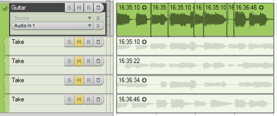

A composite multi-take group consists of a **composite** track and a number of **take** tracks. When using multi-take recording, contrary to loop recording, each new recording will not overwrite the previous one. Instead, a new take track will be created for each subsequent recording. The maximum number of take tracks to use in each multi-take group can be set on the **[Play/Record](#h.p5syr6xd4yah)** preferences tab. Note that only sound events on the composite track will actually be played back. Sound events on take tracks are drawn dimmed to emphasize this.

Events created on take tracks will, by default, be named after the time recording was started at (in the format of hours:minutes:seconds).

The following steps need to be taken in order to set up multi-take recording:

*   Assign an audio input device mapping to a track.
*   Arm the track for recording.
*   Activate recording mode on the transport bar.
*   Activate loop mode and set a loop range. See the [play/record](#h.p5syr6xd4yah) section for multi-take recording options.
*   Start playback.

Once you have recorded enough takes, you can start to combine the best parts of each take to assemble a satisfying performance - a process widely referred to as compositing, or 'comping'.

For this purpose, you can toggle solo mode on take tracks by Shift+clicking the **solo** button, or pressing Shift+S to toggle solo mode on the focus track to listen to each take separately and decide which sections to use.

_Tip:_ Take tracks can be renamed, rearranged, and deleted like any other tracks.

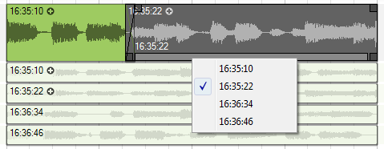

To create a comp from your recorded takes, split the composite event on the composite track, using the scalpel tool at every position you want to switch to another take.

Each split segment on the composite track has an additional control element not present on other types of sequence events - the **take selection bar**. Click this bar to cycle through all available takes, or right-click the bar to open a context menu, which allows you to directly select a take to use for the segment. To create smooth transitions, it is recommended to resize the composite events to slightly overlap each other, select all events on the composite track, and choose **Crossfade** from the sequence event context menu.

If you have selected multiple composite events, and select a take on one of the selected composite events, any similar named takes in the other selected composite events will also be selected. If the **Use timestamp as name for new take events** option on the **[Play/Record](#h.p5syr6xd4yah)** preferences tab is enabled, it is easy to simultaneously change takes on multiple composite tracks. If you for example have recorded multiple takes of a band rehearsal using multiple audio inputs, you can select all the composite events, and switch the takes for all tracks simultaneously. Since the takes are named with a timestamp of the recording start, the selected takes will always be from the same recording, even if you reorganize the take tracks.

_Note:_ Only those takes that start before or at the same position as a composite event can be selected as active take for the composite event.

_Note:_ When composite events are moved on the timeline, this will offset the recorded material inside the composite event in time, compared to the original take - this can be used to a desired effect. Switching the active take used for the composite event hereafter will, however, revert to the original position of the take.

Like with normal group and child tracks, take tracks can be hidden to show only the composite track by Ctrl+clicking the **Collapse** button on the composite track header, or with key shortcut Ctrl+G, to conserve screen space.

Should you need to convert the comp into a single sound event ready for export or reuse on another track, select all composite events, and choose **Merge** from the sequence event context menu. Alternatively, you can bounce render the composite track.

#### 6.4.3\. Recording MIDI Parameters

When receiving any MIDI messages such as control change, NRPN and SysEx messages, Podium will try to match them with any of the parameter objects belonging to the device mapping assigned to the recording track. If a match is found and the **Record as curve sequence on separate track** option in the **Parameter Properties** dialog of the parameter is selected, then that parameter will be assigned to a new parameter track (if not already assigned to a track), and the value of the parameter will be recorded to a curve sequence. If the matched parameter is not configured for curve recording, then a static parameter event will be placed on a dedicated child track. If the received message is not matched to any parameter objects, and the message is not a SysEx message, then the message is considered unusable for this particular device and is discarded. SysEx messages will be stored in stream events on a dedicated child track. By using this form of parsed recording of MIDI messages Podium makes your recorded material more understandable by presenting it with parameters named according to their purpose rather than MIDI message format.

* * *

## 7\. Setup

The setup options can be reached through the **Setup** menu in the project window.

Apart from the data that is stored in project files and any associated wave files, all persistent configurations made in Podium are stored in a single plain text setup file. Podium does not store any information in the Windows registry. Of the information stored in the setup file it is only the settings for the Audio/MIDI interfaces, the mixer engine resolution and the root VST plugin folder that may influence how project files are loaded and played back. This makes it a simple task to copy your project folders to backup media and to port your projects to Podium installations on other PC systems.

The **Setup** menu contains five configuration dialogs, covering everything from interface selection to customizing the appearance and behavior of Podium:

*   **[Audio/MIDI](#h.4r7kvywic1ed)**
*   **[Preferences](#h.4g9tau50c64r)**
*   **[Colors](#h.ab5qqsep725r)**
*   **[Editor Profiles](#h.w97na76gog9d)**
*   **[Windows](#h.yyun8msvbakz)**

### 7.1\. Setup Files

When Podium is starting up it will try to load a setup file named "Podium.ini". If the file is not found, Podium creates the file with the default setup. When Podium is exiting it will write the current settings back to "Podium.ini".

If Podium is not exited properly, "Podium.ini" may become corrupted. This can happen if the computer is powered off while the setup file is being written. The next time Podium is started a corrupt setup file will typically cause the editor windows to be blank because the profiles are missing. If this happens, either use **Load Default Setup** on the **Setup** menu to overwrite "Podium.ini" with the default setup, or use **Load Setup...** if you have saved a backup of your setup file.

If you have put a lot of work into customizing the setup, you should save it to a backup setup file. Use the **Save Complete Setup...** command for this purpose. The **Save Color Setup...** command is used for saving color schemes, which consist only of the settings from the **Colors** dialog.

The load and save commands on the **Setup** menu can also be used to store setups for different occasions. There may be situations where you want to use different configurations of your MIDI and audio interfaces, or you could have setup files for different types of projects and work styles.

The Podium setup files are stored under the Windows managed application data folder. If you have a multi-user Windows installation, each user will have their own personal application data folder. For newer Windows versions using English, the setup folder is in the following location (substitute [user] with your user name):

"C:\Documents and Settings\[user]\Application Data\Zynewave\Podium"

If you use Windows Explorer to locate this folder you may not be able to see the application data folder in the file list if you have the **Do not show hidden files and folders** option selected in the Explorer **Folder Options** dialog. You can still access the folder by entering the folder name directly in the Address bar.

Any setup files you save to the application data folder, including "Podium.ini", will remain if you uninstall Podium. You do not lose your setup if you uninstall or install a newer version of Podium.

### 7.2\. Audio/MIDI

#### 7.2.1\. Audio

For audio interfaces you can select to use either ASIO or Windows Wave/MME driver types. The best performance is obtained by using ASIO drivers. The support for Wave drivers is there primarily to allow Podium to run on a PC system that does not have any ASIO drivers installed. The panel below the driver type setting will contain options specific to the selected driver type.

When using the ASIO driver type, you can select one of the available ASIO drivers that are installed on your PC system. After selecting a new ASIO driver, you need to load the driver by clicking the **Apply** button in order to update the other setup options with information derived from the driver. At the bottom of the panel is a **Driver Setup...** button that will open the control panel of the currently active ASIO driver.

The choices available for the **Clock Source** setting will depend on the ASIO driver. The clock source will control the sample rate synchronization. If the audio interface has digital inputs then it usually is possible to use these inputs as clock source. Some interfaces do not support selecting the clock source through the ASIO driver, but instead allows the user to select it in the ASIO control panel.

When using the Wave/MME driver type, the interface is divided into separate input and output devices, similar to MIDI interface drivers. You can select one input device and one output device. Note that if you select input and output devices for two different hardware interfaces, the two devices may not be sample synchronized, which can lead to timing errors as the sample clock of the two interfaces may slowly drift apart.

The **Default sample rate** setting will show all the supported sample rates for the selected audio interface. Podium can handle sample rates up to 192 kHz. The default sample rate will be used when first initializing the audio driver. If an arrangement is monitor activated, the audio streaming will be initialized to the sample rate set in the **Arrangement Properties** dialog. When creating a new arrangement, the default sample rate will be preselected for the arrangement.

The **Active channels** listbox will show all the supported channels for the selected audio interface. If you are going to use only a subset of the available channels, you should disable all unneeded channels, as this will reduce the CPU load required to transfer samples between Podium and the audio driver.

#### 7.2.2\. MIDI

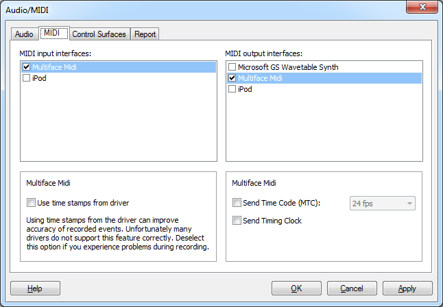

MIDI interface drivers on Windows PC systems are implemented as separate input and output devices. Check the boxes next to all the inputs and outputs that you want to use with Podium.

For each enabled MIDI input, you can select whether you want Podium to **Use time stamps from driver** when recording MIDI messages. If this option is cleared then the time stamps are set by Podium when the messages are retrieved from the driver. Better accuracy can be achieved when using driver time stamps. Unfortunately many MIDI interface drivers do not support time stamping correctly. One problem can be a fixed time displacement of recorded events. Another problem can be drifting timing, resulting in an increasing displacement of the recorded events. If you are concerned about getting the optimal timing accuracy when recording MIDI inputs, you could try enabling this option and check the results with your MIDI interface.

For each enabled MIDI output, there are three options:

*   **Send Time Code (MTC)**.
*   **Send Timing Clock**: Allows you can enable output of MIDI Timing Clock messages. This special MIDI message is a pulse that is sent 24 times per quarter note. External effects devices can use this pulse to sync for example delay times or LFO speeds with the tempo in Podium. Timing Clock messages are not meant for synchronizing playback with external sequencers.
*   **Detect Mackie compatible control surface**:

Depending on the Windows version you are using, you will likely see a MIDI output named Microsoft GS Wavetable SW Synth. This virtual MIDI output can be used to play a simple software synthesizer that is integrated in Windows. The output of this synth is sent to the audio device selected for sound playback in the Windows **Sounds and audio devices** control panel. Note that conflicts may occur if this audio device is also in use by the currently active ASIO driver in Podium.

#### 7.2.3\. Control Surfaces

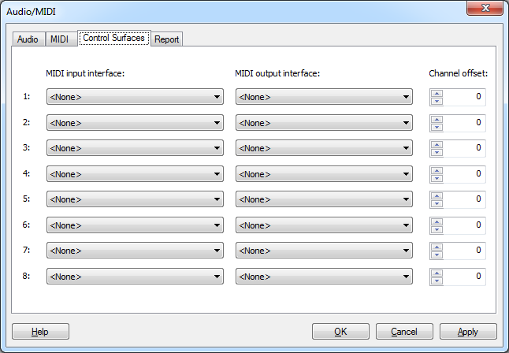

#### 7.2.4\. Report

The report page shows information about the currently active audio driver that can be helpful for diagnostic purposes. The report will include descriptions of any error conditions that have been detected during the log period. The log period will begin when the driver is initialized, and end when you first open the **Audio/MIDI** dialog. Clicking the **Update** button will set a new log end time and update the report. Use the **Reset** button to reset the report and start a new log period. The **Save...** button can be used to export the report to a text file. If you contact Zynewave support about a problem with an audio interface, you may be requested to supply a report file by email.

### 7.3\. Preferences

#### 7.3.1\. Projects

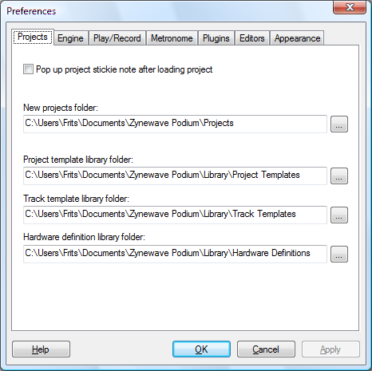

*   **Pop up project stickie note after loading project**: Automatically displays the stickie note on the project page. Move the mouse cursor over the stickie note button to dismiss the note.
*   **New projects folder**: Specifies the folder where new projects will be stored.
*   **Project template library folder**, **Track template library folder**, **Hardware definition library folder**: Specify the locations of your template and hardware definition files, respectively.

When you run Podium after you have installed it for the first time, you will be presented with a dialog where you can choose to let Podium build a set of default folders, or to open the **Preferences** dialog to configure the folders yourself. If you later on move or rename the folders, you must update the paths to the folders on this page. If the paths are not valid, the **Preferences** dialog will pop up when you start Podium, and the invalid paths will be highlighted with red background color.

#### 7.3.2\. Engine

*   **Mixer engine bit resolution**: Podium is able to process audio with either 32-bit floating point or 64-bit floating point precision. Setting it to 64-bit will require more memory bandwidth and CPU processing power, so unless you have compelling reasons for wanting 64-bit precision, it is recommended to use 32-bit processing for best performance. Please note that this option has nothing to do with whether you are running a 32-bit or 64-bit version of Windows. 64-bit mixing works the same way whether running on a 32-bit or 64-bit OS. More information can be found in the [about 64-bit mixing](#h.s1hl3oww1kf8) section.
*   **New sound default file format**: Selects which file format to use when saving sounds created in Podium. The available formats are “.wav”, “.aif”, or “.aiff”. See the [sound](#h.dt6ocnu9e8au) section for more information.
*   **New sound bit resolution**: When set to **Audio driver setting**, the bit resolution supplied by the audio driver will be used. You can see what the audio driver bit resolution is in the **I/O resolution** info line in the **Audio/MIDI** dialog. Some drivers report 32-bit resolution when in reality the audio interface hardware only uses the upper 24-bits and sets the lowest 8-bits to zero. Consult the manual for your interface to see how many bits the audio converters support. Even if the interface do support a high bit-resolution, you can select the 24-bit or 16-bit fixed resolution settings in this combobox, to reduce the amount of disk space used when saving sound files.
*   **Stream muted sounds for fast response to unmuting**: Clear this option if you want to reduce unnecessary disk usage for muted tracks.
*   **Bypass processing when detecting CPU overload**: When this option is off, Podium will continue to process plugins even when CPU overload is detected. If you have a PC with a multi-core CPU, leaving this option off provides the best uninterrupted audio performance. If you have an old single-core CPU machine, and you experience problems with the UI becoming unresponsive when overload occurs, turning this option on will allow you to still operate the UI during overload.
*   **Release drivers when Podium does not have focus**: The ASIO driver system has the disadvantage that only one application at a time can access a specific audio channel. If you try to start up another application that uses the same ASIO driver that you configured in Podium, you will likely get an ASIO error message in the other application. Enabling this option allows you to switch to another application that uses the ASIO driver, without having to quit Podium first.
*   **Sound file cache folder**: Specifies the location where Podium saves its temporary audio cache files. If you leave this field blank, Podium will use the Windows temporary folder. If you have limited free space on the storage drive where your Windows is installed, or if you have another drive with faster read/write access time, you may want to set up a cache folder on your second drive. Every time you record audio or perform edits in the sound editor, the waveform data is cached to this folder if there isn’t enough available free memory. Since Podium only saves to sound files when the user selects save commands, the space required for the temporary audio files can be quite large. One gigabyte free space is the recommended minimum. The cache files are deleted when you exit Podium.

#### 7.3.3\. Play/Record

*   **Stop playback when end of arrangement/sound is reached**: When enabled, playback will stop when the play cursor has reached the end of the last event in the arrangement, or the last waveform data in the sound. Playback will not stop if recording mode is enabled, to allow recording new material beyond the end of the arrangement/sound.
*   **Deactivate record mode when playback is stopped**: When enabled, the record mode button is automatically deselected when playback is stopped. This can avoid situations where you forget to manually deselect record mode, and then unintentionally start recording again the next time you start playback.
*   The following set of options pertains to **Multi-take recording**. See the [multi-take recording and compositing](#h.pepa41hpbyoq) section for more information.  
    **Convert record enabled tracks to composite multi-take groups**: Sets under which circumstances multi-take recording should be used. Choose **Never** to disable multi-take recording unless a track has been manually set as composite track.  
    **Maximum take tracks per composite group**: Sets the maximum number of takes to record in each composite group.  
    **Delete oldest take when maximum take tracks is reached**: When enabled, takes will be deleted starting from the oldest take, and replaced by new recordings once the track limit is reached.  
    **Use timestamp as name for new take events**: When enabled, the time of recording (in the format of hours:minutes:seconds) will be used as name for new recorded events. If disabled, recorded events will be named 'Track name: Take n'.
*   **Record enabled MIDI messages**: Select which types of MIDI messages you want to record from external MIDI inputs. Only in rare cases would you need to clear any of the options. If you for example have a synthesizer that transmits SysEx messages when you operate the synth's front panel buttons, you can clear the **SysEx** option to avoid recording your actions.

#### 7.3.4\. Metronome

*   **Output to MIDI interface**: Enables you to select among the interfaces you have enabled in the **Audio/MIDI** dialog. Set the MIDI channel, the MIDI notes, and note velocities for the bar and beat clicks.
*   **Output to Audio interface**: Set which audio channel to use for outputting the click sound. Selecting the **Stereo** option will output the click as a stereo sound on two audio channels starting with the selected audio channel number. Gain adjustments can be specified for the bar and beat clicks.
*   **Roll back to previous bar/beat on playback start**: Specify how many **Bars** and **Beats** the play cursor should be moved back before playback starts with metronome mode activated.

#### 7.3.5\. Plugins

*   **Enable plugin multiprocessing**: Select whether to distribute plugin processing to all available processors, or use only a single processor for plugin processing. Podium supports multiprocessing, either in the form of hyper-threading enabled processors, multi-core or multiple physical processors. When enabled, processing can be completed in a shorter period of time, which results in extra available CPU headroom. Disable this option if you encounter plugins that become unstable when using multiprocessing.
*   **Enable ReWire devices**: When disabled, ReWire devices will not be loaded, or detected when creating a new project.
*   **Enable recording of VST plugin MIDI output**: Allows recording the MIDI output of a VST instrument assigned on a track. The recorded sequence events can then be reused on tracks with other instruments. This option is off by default, because some plugins will copy the MIDI data it receives on its input through to its output, resulting in duplicate recorded events when recording overdubbed on an existing sequence.
*   **VST plugin scan folders**: Up to four VST plugin scan folders can be specified. These folders will be searched when Podium scans for plugins. When you run Podium for the first time, it will automatically detect any "Vstplugins" subfolders it can find at: "C:\", the Windows "program files" folder, and the folder containing the Podium.exe program file.
*   **Automatically search for missing plugins when loading a project**: If you have changed your plugin installations since you created a project, the plugin file references stored in the project may be invalid. You will see these broken plugins highlighted with red background in the devices list on the project start page. When this option is enabled, after loading a project Podium will automatically try to search for any missing plugin files in the VST plugin scan folders, and relink the plugins if they are found. If this option is not enabled, you can manually do the search with the **Search for Missing Plugins** command in the **Devices** menu.
*   **VST plugin editor knob mode**: Select your preferred method for using the mouse to adjust knobs in VST plugin editors. Set to **Plugin default** to use each plugin's default mode. Note that some plugins do not support changing the knob mode.

#### 7.3.6\. Editors

*   **Activate power when opening arrangement editor**: If enabled, the power button will automatically be activated when you open an arrangement editor page or window. When power is turned on, VST plugins will be loaded, and audio/MIDI devices will be activated. You may want to turn this option off, if you are doing edits in arrangements that does not require the plugins to be loaded. Only one arrangement can be powered on at a time, so if you open a new arrangement editor, the previous powered arrangement will be turned off.
*   **Enable panel show/hide animations in editors**: Sets whether to use sliding animations when selecting list panels in the inspector, and minimizing/restoring the embedded editor or mixer. Clear this option if your PC system has a slow graphics card.
*   **Include editor tool shortcuts in timeline context menus**: The tools in the edit toolbar will be included as shortcuts in the timeline context menu.
*   **Drag scroll acceleration width around editor**: Podium will automatically scroll the timeline area when you move the mouse outside the timeline area while doing a drag operation. This setting specifies the pixel distance outside the timeline area that is used to determine the scroll speed. The farther away you move the mouse cursor, the faster the scrolling.
*   **Drag scroll maximum pixels per second**: Specifies the maximum scroll speed used when the mouse is moved beyond the pixel distance as set in **Drag scroll acceleration width around editor**.
*   **Maximum sequence/sound undo levels**: Maximum number of steps stored in the edit history for each arrangement, sound and sequence object. When you reach the maximum, each new edit will remove the oldest edit from the edit history list. The edit history menu can be opened by right-clicking the undo or redo toolbar buttons. This setting determines the maximum number of edits that are shown in the menu.

#### 7.3.7\. Appearance

*   **Default button size**: Specifies the overall minimum size of menu, selector and option buttons. Buttons in toolbars can be scaled even larger by adjusting the toolbar height. If you are working with a touchscreen monitor, you may prefer to set a larger button size to be able to comfortably hit the buttons with your finger. The button size can be adjusted directly in the Podium UI by placing the mouse cursor over the project window menu bar, holding the Ctrl key down, and using the mouse wheel to adjust the button size.
*   **Scrollbar size**: Specifies the size of the Podium UI scrollbars.
*   **Button corner roundness**: Specifies the amount of roundness applied to buttons. 0% results in rectangular buttons. 100% results in circular buttons.
*   **Slider knob corner roundness**: Specifies the amount of roundness applied to slider knobs.
*   **Use glass effect on slider knobs**: When enabled, slider knobs will be rendered with a glossy effect. When disabled, knobs will appear as matte.
*   **Panel texture image file**: Allows selecting an image to replace the default brushed metal texture. The image must have a minimum resolution of 32x32 pixels.
*   **Dye texture image to match panel background color**: Enable this option to colorize the custom texture image with the panel background color specified in the **Colors** dialog.

#### 7.3.8\. About 64-Bit Mixing

If your music production mainly involves using softsynths and encoding the final master to MP3 files, then don't bother with 64-bit mixing as you won't be able to hear any improvements in audio quality.

However, if you are producing music recorded in pristine studio conditions and aimed for reproduction on high end audio equipment, 64-bit mixing will offer better precision and larger dynamic range.

The 64-bit mixing will be utilized when the mixer engine is processing and routing audio internally. The audio will be converted down to 32-bit when routed through plugins that only support 32-bit processing. Support for 64-bit processing was introduced with the VST 2.4 plugin protocol.

When describing floating point numbers, the 32 and 64 bits refer to the amount of memory that is required to store the floats. The bits are split into two parts that store the precision and the exponent for the 'floating point'. 32-bit floats offers 25 bit precision and 64-bit floats offers 54 bit precision.

The advantage of 64-bit mixing is evident when an audio signal is gain scaled or when two or more audio signals are summed in the mixer engine.

Gain scaling occurs when the track gain or pan settings are affecting the audio signal. The scaling involves multiplying the floating point audio signal with a floating point scale value. These multiplications will result in values that use more precision bits than the original audio signal, causing the least significant bits of the result to be discarded.

To illustrate the effect of summing, let's assume that you have two 25 bit precision audio sources that you want to mix together. These sources could be sound files or the 32-bit floating point output of VST plugins. If you mix these sources together without changing the gain of the tracks, the output will fit within 32-bit floats, provided that the summed output does not clip. If you change the gain of one of the tracks, then the 25 bit precision of that track is displaced up or down in relation to the other track. A gain change of 6 dB will result in approximately one bit displacement. When summing the two tracks the combined precision interval has thus been extended beyond the 25 bits that can be stored in 32-bit floats, so the least significant bits are truncated and you loose some of the precision in the audio sources.

This is where 64-bit mixing will offer an advantage over 32-bit mixing, as it can use 54 bit precision to store the results of gain scaling and summing, and thereby reduce the artifacts of the floating point truncations.

So what's the point of the higher precision if the master output is being bounced to a 24-bit or 16-bit sound file? For every audio track that you add to a mix, you add noise as a result of the truncation of the lower bits of the signal. The accumulation of these rounding errors can result in a slightly degraded output that can be present even when rendering to 16-bit sound files.

Despite these apparent mathematical benefits, 64-bit mixing will only yield a minimal quality improvement. 32-bit mixing is still fully sufficient for professional grade productions.

### 7.4\. Colors

Podium conforms to the themes and appearance settings in the Windows Display control panel when drawing window frames and dialog boxes. With the **Colors** dialog you can customize the colors used for drawing the contents of Podium windows.

Clicking the **...** buttons next to a color opens a standard Windows color dialog where you can define the color. You may be more familiar with colors specified as combinations of red, green, and blue (RGB) values, but colors can also be specified as hue, saturation, and luminance (HSL) values. You can set colors using both these color models in the Windows color dialog. There are value fields for Hue, Sat, and Lum, and the vertical slider next to the color pad controls the luminance as well.

When trying out different color combinations, it is a good idea to use the **Apply** button. This will store the color settings in the current setup, but will keep the **Colors** dialog open. You can then quickly make incremental changes until you have found a color setup to your liking.

Alternatively to using the **Colors** dialog, you can change the colors of interface elements using the context menu on the color picker in the track inspector. See the [color picker](#h.nw620gb1l8is) section for more information.

#### 7.4.1\. Surface and text colors

The **Panel background** color is used for drawing window backgrounds that are shown in Podium windows. The **Listbox background** is the background color for listboxes such as the contents and devices panels on the project start page.

The **Button** color is used for all buttons, including scrollbars. The **Slider knob** color is used for the knobs indicating the position of sliders. The **Text** color is used for all text that is written on panels, buttons, listboxes, and sequence events.

The colors for **Active selection fill** and **Active selection text** are used to draw selected objects that have keyboard focus. Having keyboard focus means that the selected objects will respond to keyboard commands such as the arrow keys to move the focus and the Delete key to delete the selected objects. The **Inactive selection fill** and **Inactive selection text** colors are used to draw selected objects that do not have keyboard focus.

The **Timeline fill** color defines the background color of the timeline inside editors. The **Timeline text** color is used for text inside the timeline ruler region, for waveform display in the sound editor, as well as for events displayed in the navigator region in the note and sound editors. The **Timeline grid** color is used to draw the grid lines indicating bars and subdivisions.

**Default track color** is used for drawing the track headers, as well as for drawing the background of sequence events on tracks that have no color assigned. Use the [color picker](#h.nw620gb1l8is) in the inspector, or the **Track Properties** dialog to set a color for the focus track. If the **Colorize note events with track colors** option is enabled in the **[Notes Region](#h.x0xe88b886ef)** dialog, the track color will also be applied to note events inside sequences on the track. See the [note editor](#h.xevwwe2fm84z) chapter for more information.

#### 7.4.2\. Indicator and highlight colors

The colors for **Play and power**, as well as for **Record** are used on related transport toolbar buttons, the play cursor, and the loop and punch bars in the timeline ruler regions. The **Plugin editor** color is used on selector buttons when the plugin's native editor is open. The **Bounce** color is used for bounce buttons on track headers, as well as for the bounce waveform overlay on bounce enabled tracks. The **Solo**, **Mute**, and **Record** colors are used for the respective controls on track headers. The **Record** color is furthermore used on track lane backgrounds and sequence events when in recording mode.

You can set two colors to define the parameter gradation color range. The resulting range of colors is used to draw the body of the curve in curve sequences, as well as note events, the glow inside slider ridges, and the glow inside the value ring on parameter dials. The first color is used for the lowest parameter value, and the second color for the highest parameter value.

The level meter gradation color range is used to draw the level meters in the tracks and mixer regions. The first color is for -infinite dB, and the second color is for 0 dB. If the level goes beyond 0 dB, then the meters are painted with the **Level meter overload** color.

#### 7.4.3\. Track colors

The percentage values set for **Overall color opacity**, **Rack/header/strip opacity**, and **Lane background opacity** control the blending of track colors with the panel background. An opacity value of 0 will ignore track colors and draw all objects with the specified **Default track color**. Lowering the **Overall color opacity** value can be a convenient way to tone out track colors, if the contrast with the panel background color is too strong. **Lane background opacity** controls the blend of the track color that is overlaid on the timeline with the timeline fill color.

Track colors can be further customized using the **Group track luminance** and **Parameter track luminance** offset settings. Track luminance offsets will be applied to the track color of the specified track types. This allows you to define that, for better distinguishability, parameter automation tracks and curve sequence events should be painted with a darker or brighter shade of the track color.

#### 7.4.4\. Color Setups

Color setups are saved as standard Podium setup files, with the important difference that they only store the settings specified in the **Colors** dialog.

Podium includes a number of color setups. Select a color setup using the **Load Color Setup** submenu on the **Setup** menu. You can save your color customizations as a color setup file with the **Save Color Setup...** command.

Color setup files are stored in the "Zynewave\Podium\Color Setups" folder inside the Windows Application Data folder. Choose the **Explore Setup Folder** command on the **Setup** menu to open a Windows Explorer window directed to the setup folder location.

### 7.5\. Favorite Folders

The **Favorite Folders** dialog is used to set up links to a selection of folders that you use frequently. These favorite folders can be accessed in the Podium [browser window](#h.vhjlegffv0pi) by clicking the favorite toolbar buttons or by using the **Favorites** submenu in the file browser menu.

The dialog can be opened from the [Setup menu](#h.8wrwkuc3rez6) or with the **Organize Favorites...** command in the file browser menu.

*   **Insert new...**: Opens a **Browse For Folder** dialog where you select the folder you want to add to the folder list. The folder will be inserted at the highlighted position in the list. Another way to add favorite folders is to use the **Add To Favorites** command in the file browser menu. This will add the current folder in the file browser to the end of the favorites list.
*   **Delete**: Deletes the currently highlighted favorite. Note that only the favorite link is deleted. The actual folder is not deleted.
*   **Move up** & **Move down**: Moves the highlighted favorite up or down in the list. The order that the favorites are arranged in the list is the same order used in the favorite submenus.
*   **Show full folder path when showing favorites in menus**: Disabling this option will show only the name of the last subfolder in each favorite. Enable this option if you have vaguely named subfolders and need to have the full path to uniquely identify your favorites.

### 7.6\. Editor Profiles

The layout of the arrangement, note, curve and sound editors are defined by editor profiles. A profile is constructed of a list of different types of regions that are stacked as layers in the editor.

The Podium default setup contains a complete set of profiles. You can modify these or create you own alternative new profiles. A typical task for many users would be to modify the toolbars in the default profiles to fit a certain screen size. The default setup is constructed to fit on XGA resolution screens. If you are using a higher screen resolution you may want to join the edit and transport toolbars into one, to gain extra screen space for the other regions in the profile.

Several profiles can be defined for each editor type in which case you can switch between the profiles using the **View** menu in the editor. This can be used for example to switch between a standard editor profile and an event list profile, or to switch between arrangement profiles with or without a mixer region.

The profiles in the editor **View** menu are shown in the same order as they are inserted in the **Profile list**. Use the **Move Up** and **Move Down** buttons to reorder the profiles. When a new editor is opened, the first compatible profile in the list will be selected by default.

The **Insert New** button will insert a new blank profile into the profile list. The **Copy** button will insert a duplicate of the currently selected profile. The **Delete** button deletes the currently selected profile. Please note that if you inadvertently delete a profile or create new profiles without adding regions to the profile, opening an editor may show a blank page. In that case you should either reconfigure your profiles, or if everything is completely messed up, restore the default setup with the **Load Default Setup** command on the **Setup** menu of the project window.

You can access the properties of a profile by selecting it in the **Profile list** and clicking the **Properties...** button. You can also access the properties for the currently selected profile in an editor by selecting **Editor Profile Properties** on the **View** menu.

The **Profile name** is used to identify the profile in the **Editor Profiles** dialog and on the **View** menu in editors. The **Editor type** setting determines what types of sequences this profile is intended for. The **View** menu in editors will only show profiles with a compatible editor type. The available editor types include **Arrangement**, **Note**, **Curve**, **Sound - Master**, **Sound - Slave**, **Embed** variations, and the generic **All types**. The **Sound - Master** profile type is used when opening sound objects directly from the project window, and thus should contain a transport toolbar. A **Sound - Slave** profile will typically not contain a transport toolbar, as this profile type is used when opening the sound through an audio event in an arrangement editor, and thus will be linked to the transport in the arrangement editor. The embed variations of the note, curve, and sound types are used for the embedded editor region. The **All types** editor type will be available in all editors, and is typically used for an event list profile.

The **Region list** shows a descriptive label of all the regions that are currently added to the profile. Clicking the **Insert New...** button will show a menu where you can select a region type, and subsequently a properties dialog for the selected region type is opened. Alternatively you can click **Copy** to insert a duplicate of the currently selected region. The **Move Up** and **Move Down** buttons can be used to rearrange the regions. Clicking the **Properties...** button will bring up the properties dialog for the currently selected region.

Some profile and region settings are not accessible through the properties dialogs but are stored in the profile when modified in the editor. These settings include positions of horizontal and vertical drag bars, panel collapse states and various mode selectors in the regions. When a profile is selected in an editor, these 'last used' settings will be used as defaults.

A common feature found in many of the region properties dialogs are settings for minimum and maximum region height. Setting the minimum and maximum to the same value will define a fixed height region. Setting the minimum lower than the maximum means the region can resize according to the total height of the editor. A profile can contain multiple resizable regions. The **Embedded Editor** and **Mixer** regions have a title bar which can be dragged to resize the region. Other resizable regions can be separated by a **Space** region configured to be used as a drag handle for resizing regions.

#### 7.6.1\. Space Region

The space region is used for adding visual separation between other regions in a profile. In addition to the height of the region, you can select the visual effect from the **Fill type** combo box. The choices are: Blank, Shadow, Up slope, Down slope, Bump, Recess. Many of the other available region types are resizable and have settings for minimum and maximum height. A space region can be inserted between two resizable regions. Enable the **Use as drag handle for resizing regions** option to be able to drag the space region in the editor to resize the surrounding regions.

#### 7.6.2\. Toolbar Region

The **Layout** list shows the current contents of the toolbar. The **Elements** list shows all the available elements that can be added to the toolbar. When you want to insert elements into the toolbar, you select the position you want to insert at in the **Layout** list, select the desired item in the **Elements** list and click **Insert**. Clicking **Remove** will remove the currently selected layout element. Use the **Move Up** and **Move Down** buttons to rearrange the order of the layout elements.

The **Elements** list is divided into sections. The 'Default groupings' section can be used to insert a whole set of elements matching the toolbars you find in the Podium default setup. The 'Separator' element is a vertical line useful for separating groups of toolbar elements. The 'Right align' break element is not a visual toolbar element, but indicates that all elements inserted after the break will be stacked against the right border of the editor. The **Region height** setting determines the size of the toolbar elements.

#### 7.6.3\. Timeline Ruler Region

The timeline ruler region is used to show time resolution legends, a triangular handle for the cursor position and curtain handles for the selection, punch, and loop ranges. The region has a context menu with options to set the ranges and to select a mouse edit mode. The **Timeline Rule Region Properties** dialog allows you to set the **Region height** and to control how the elements of the region are displayed. There are also settings that affect zooming and sliding with the mouse.

#### 7.6.4\. Navigator Region

#### 7.6.5\. Scrollbar Region

The scrollbar region shows a horizontal scrollbar for navigating the timeline. Additional zoom controls can be enabled in the **Scrollbar Region Properties** dialog.

#### 7.6.6\. Format Region

A format region is used to show and edit either tempo or marker events. The **Format Region Properties** dialog contains settings for region height and event type.

#### 7.6.7\. Tracks Region

The tracks region is the cornerstone of the arrangement editor. The **Tracks Region Properties** dialog contains three sections: layout, track header options, and timeline options.

**Layout:**

The **Track separation space** and **Group separation space** settings control the number of pixels that individual tracks and track groups will be spaced apart respectively. The **Vertical group bar width** is the width of the hierarchy bars shown to the left of the track headers.

Track headers and lanes are tinted with the color defined for the track. The amount of coloring can be defined with the **Track header color opacity** and **Track lane color opacity** settings.

**Track header options:**

The appearance of pan, gain, and send controls on track headers can be specified using the **Control type** setting. Choices are Dial, Slider, and Readout slider. Choose None if you don’t want controls on the headers.

Meters on track lane headers can be configured for either horizontal or vertical layout with the **Audio meters** setting. To remove the meters from headers, choose None.

The appearance of track headers can be further controlled using the settings **Show track color bar at right edge of header**, **Show effect chain**, **Show device bypass buttons**, **Show device automation record buttons**, and **Set minimum track height to fit contents**.

**Timeline options:**

Checking **Show track separation bars** will draw horizontal bars in the separation space. These can be used as visual guides if you are using a large display area. When **Show sequence event headers** is enabled, sequence events will be split into a header area that is aligned with the track headers, and a separate area for showing the miniature of the sequence contents.

Normally the sequence event area is filled with the miniature graphics and any text and symbols are drawn on top of the miniature. Clear the **Show sequence event names** option if you prefer to do your arranging without worrying about naming your sequences and sounds. When the **Show sound event fade curves** option is enabled, all sound events show their fade curve. When disabled, only the event under the mouse cursor shows a fade curve. Clear the **Show embedded sequence editor** option to hide the editor that is normally embedded at the bottom of the tracks region.

#### 7.6.8\. Embedded Editor Region

#### 7.6.9\. Mixer Region

The mixer region is typically embedded in an arrangement editor together with a tracks region. Alternatively you can define a dedicated mixer arrangement profile with one or more mixer regions, and set up a second project window for the mixer.

The **Mixer Region Properties** dialog contains settings for the mixer layout. It also allows you to customize mouse actions in the mixer.

*   **Minimum meter height**: a vertical scrollbar will appear in the mixer region if it is resized smaller than the specified meter height.
*   **Minimum strip width**:
*   **Dock master chain** and **Dock bus returns**: the mixer can be configured to show master chain and bus return tracks in separate docked panels, use these drop-down lists to specify whether the panels should be docked to the left or the right or not docked at all.
*   **Gain control**, **Pan control**, and **Send control**: the appearance of the different controls can be specified.
*   **Use small font**, **Show scrollbar even when strips fit in view**, **Show hierarchy/signal flow arrows**:
*   Actions can be specified for clicking, Shift+clicking, Ctrl+clicking, Alt+clicking, middle-clicking, right-clicking, and double-clicking the device and input rows.

#### 7.6.10\. Notes Region

The notes region is used with note sequences. The **Notes Region Properties** dialog allows you to control the appearance of the region.

The background of the region is drawn with ghosts of all notes in the arrangement. The **Ghost note intensity** setting defines the visibility of these ghost notes. There is also a setting to **Hide muted ghost notes**.

#### 7.6.11\. Velocity Region

When included in a note editor profile, it will show note event on/off velocities.

In addition to the minimum and maximum heights settings, the dialog also has a setting for **Curve fill opacity**. A lower opacity value allows the background guides to show through the painted body of the curve or the note velocity columns.

#### 7.6.12\. Curve Region

When included in a curve editor profile, it will show curve events.

In addition to the minimum and maximum heights settings, the dialog also has a setting for **Curve fill opacity**. A lower opacity value allows the background guides to show through the painted body of the curve or the note velocity columns.

#### 7.6.13\. Channels Region

The channels region is the cornerstone of sound editors. It will display the waveform of each channel in a sound.

The **Channels Region Properties** dialog allows you to specify the minimum and maximum heights of the region.

#### 7.6.14\. Event List Region

An event list region contains a listbox that shows text descriptions of the events. The **Event List Region Properties** dialog contains size settings for the region. There are also settings to control how the event times are displayed as percentage variations from the selected editor quantize value.

### 7.7\. Windows

The position and size of the windows that you open in Podium are stored in the setup file. Some windows store additional information, such as the browser window which has options that can be configured for each browser window. Deleting a window in the Windows dialog will remove the setup information, and the window will thus appear in its default configuration the next time it is opened.

Many of the dialog windows will also open at the position that you last moved them to, but these positions are not stored in the setup file. Each time Podium is started, dialogs will open in their default center position. An exception to this, is the standard file dialog. If you move and resize the file dialog, it will appear as you last used it the next time you start Podium.

Another exception are plugin editor windows. Plugins are linked to the tracks that they are assigned to, so the plugin editor positions are stored in the properties of the tracks, and thus will be saved in the project file.

Podium follows the guidelines for Windows standard key shortcuts. Pressing Ctrl+Tab will cycle key focus between all open windows. Pressing Alt+F4 will close the window that currently has focus. Note that if you press Alt+F4 with focus on the application window, this will invoke the **Exit...** command on the **Project** menu.

#### 7.7.1\. Screens

Windows in Podium are linked to virtual screens. Switching between screens allows you to quickly change the window layout to suit your preferred workflow for example for arranging, mixing, file browsing or plugin editing. When you switch screens, all currently open windows will be closed, but stored in the setup as being open in the screen you are switching away from. Any windows that were previously open in the screen you are switching to, will be opened.

There are four virtual screens that can be accessed on the **Setup** menu or using shortcut keys F9 to F12\. When the **Windows** dialog is open, you can use the **Current screen** combobox to switch between screens. The descriptions in the **Window list** will show \<Open> if a window is currently open, or \<Open in screen x> if it is open in another screen. Clicking the **Show** button will open the selected window into the current screen.

The Podium application window is always open in all the screens. If the window is maximized, it will be shown maximized in all screens. If it is not maximized then the window position and size can be set separately for each screen.

When you select a command to open a window that is open in another screen, Podium will automatically switch to that screen and activate the window there. Let's say you in screen 1 have positioned the application window to fill the entire display, and in screen 2 have positioned it to fill only half the display with a sequence editor open in the other half. If you are working in an arrangement editor in screen 1, and double-click a sequence event to open the sequence editor, then Podium will switch to screen 2 with the alternative layout of the arrangement and sequence editors.

* * *

## 8\. Control Surfaces

Podium supports the Mackie control surface standard. This includes full support for Logic Control, Mackie Control Universal (MCU) and MCU Pro. Podium also supports control surfaces from other manufacturers that can be configured to run in Mackie emulation mode. An example is the Behringer BCF-2000, which supports a subset of the Mackie control features.

### 8.1\. Configuration

To enable a control surface, the MIDI input/output connections must be activated in the Podium **Audio/MIDI** dialog. Enable the **Detect Mackie compatible control surface** option for each MIDI output that is connected to a control surface. Podium will auto-detect any available control surfaces when you power-on the control surface, when you start Podium, or when you reconfigure the MIDI interfaces. If you connect the MIDI cables after the control surface is powered-on and Podium is running, the auto-detection will not engage. You can then force detection by opening the **Audio/MIDI** dialog and clicking **OK**.

Some control surfaces support uploading new firmware versions via MIDI. To do this with Podium, first disable the **Detect Mackie compatible control surface** option to prevent Podium from activating the control surface. Also make sure that neither **Send Timecode (MTC)**, **Send Timing Clock**, or the MIDI metronome is enabled for the MIDI output. (For information on metronome configuration, see the **[Metronome](#h.c2qttg8o8l3p)** preferences section.) Open the **Devices** menu on the project start page, point to **Import Hardware Definition** and choose **Generic Effect Device**. Select the MIDI output interface for the control surface in the **Import Hardware Definition** dialog and click **OK**. Use the **Import File...** command in the **Contents** menu and select the MIDI file with the firmware update. The imported arrangement should contain a track with one or more stream events. Make sure the 'Generic (01)' MIDI mapping is assigned on the main track. Follow the instructions for your control surface to put it in firmware update mode, and then start playback in Podium to begin the firmware upload.

### 8.2\. Mixer Integration

When arrangement monitoring is activated, the mixer strips in the Podium mixer will show channel indicators on the tracks that are linked to a control surface fader. Each indicator shows the channel number of the corresponding fader on the control surface. The controlled channels can be shifted using the fader navigation buttons on the control surface.

When a control surface is present, the mixer view menu has a **Follow control surface** option. If enabled, the mixer will scroll when navigating the fader channels on the control surface.

If the control surface supports touch sensitive faders, the fader knobs in the Podium mixer will light up when the control surface faders are touched (similar to when you grab a fader with the mouse). When a fader is touched on the control surface you cannot grab the fader with the mouse in the Podium mixer. Likewise, when a fader is grabbed by the mouse, moving the faders on the control surface will have no effect.

Having a control surface with touch sensitive motorized faders is an advantage when working with parameter track automation during playback. If fader touch is not detected, Podium will assume that the fader is not grabbed and so will send fader movements of any already recorded automation. This can result in motor resistance when you try to move the fader to edit the automation.

If the control surface does not support touch sensitive faders, you can use the channel record button on parameter tracks to simulate fader touch. Pressing and holding the channel record button will have the same effect as grabbing the fader with the mouse, and you can then move the fader without motor resistance, until you release the record button. This function is also useful with touch sensing faders, as it allows you to start an automation edit without having to catch a moving fader.

### 8.3\. Mackie Control

#### 8.3.1\. Help Mode

You can toggle help mode on/off by pressing the rightmost button three rows down (factory label "UNDO"). When help mode is activated the help button LED will blink and all other buttons are disabled. Pressing any button will show a help text for that button in the MCU LCD display. If the button has multiple key combination functions this is shown with the combo key in brackets (for example [Shift]) followed by a description. The V-Pots and Jog wheel will scroll the text in the LCD display.

The factory button labels on the MCU have been reused as widely as possible in the Podium button layout. But for the buttons that are special to Podium, the help mode is useful as a quick reminder.

#### 8.3.2\. Keyboard Simulation

Some of the Mackie buttons will simulate key presses on a normal PC keyboard. As long as Podium is running, the buttons can be used to control any application that has the keyboard focus. The buttons that simulate key presses are (from bottom to top on the MCU):

*   Cursor keys
*   Zoom (Tabulator)
*   Shift, Control, Alt
*   Option (Windows applications key)
*   Cancel (Escape)
*   Enter
*   Global 7 (Undo/Ctrl+Z)
*   Global 8 (Redo/Ctrl+Y)
*   F1-F8

The Shift, Control and Alt keys can be combined with other keys. This means that a large range of the Windows key shortcuts and Podium zoom and edit shortcuts can be simulated on the MCU. Some examples: You can switch to other applications with Alt+Tab, shift between open windows with Ctrl+Tab, close a window with Alt+F4, open the properties dialog with Alt+Enter, navigate lists with the cursor keys, refresh file browsers with F5 etc. When Podium has key focus, you can jump between the different panels and editors with Tab and F1-F8, navigate the lists in the track inspector and assign objects to tracks, navigate events and open editor windows, move events with Ctrl+Cursor keys etc. If you are using a mouse next to the MCU, you can press combinations of the Shift, Control and Alt keys to activate the different mouse zoom tools.

#### 8.3.3\. Arrangement Selection Mode

When first starting Podium, the MCU will be in arrangement selection mode. In this mode you can use the V-Pots or Jog wheel to scroll in a list of all arrangements in the project. The LCD display will show the currently selected arrangement. The rightmost button just above the record button (factory label "SOLO") is the monitor button. This button will blink when in arrangement selection mode, and light constantly when an arrangement is activated. Press the monitor button or press a V-Pot to activate monitoring for the currently selected arrangement. The Podium project windows will show the arrangement. Deactivating monitoring will return the MCU to arrangement selection mode.

#### 8.3.4\. Mixer Mode

When monitoring is activated the MCU will be in mixer mode. In this mode all faders and buttons will become active, and the LCD display will show track names and meters for each fader channel. The group of four fader bank navigation buttons can be used to shift the displayed channels by a full bank or by a single channel.

The group of six buttons above the transport buttons (factory label "AUTOMATION") controls which tracks are assigned to the faders. The top three buttons selects between master, main and bus return sections. This follows the default layout of the docked master and bus return sections in the Podium mixer. Pressing and holding multiple buttons combines the sections. The display below shows an example of a main track section:

The tracks with names shown on the second line are parameter automation tracks. You can toggle the display of these with the Parameter Tracks button (factory label "LATCH"). The Touch button next to it is used for creating parameter automation tracks. Holding down this button while pressing either a channel select button or a V-Pot will create a new parameter track with the corresponding parameter assigned.

As an alternative to the flat track layout you can enable the group mode button (factory label "GROUP"). This mode will assign tracks to the faders according to the track hierarchy. In this mode the channel 1 fader is assigned the current group, and faders 2-8 are assigned child tracks of the group track. Pressing the fader bank navigation buttons will shift only faders 2-8, leaving the group track always on channel 1\. The display below shows an example of group mode:

To quickly navigate between tracks in group mode you use the Group Select button (factory label "GLOBAL VIEW"). Press it to toggle group select mode on/off, after which you can use the select buttons to navigate the hierarchy. Pressing the select button for the Drums track in the previous example will assign the Drums track as the new group track. If you have multiple group layers you can continue downwards in the hierarchy this way. To step up to the parent group press the channel 1 select button.

Instead of toggling group select mode on/off, you can press and hold the group select button while pressing a channel select button. Pressing and holding the group select button while pressing the fader bank navigation buttons will shift the group track to the previous or next group within the parent group.

* * *

## 9\. zPlugins

The full version of Podium comes with three FX plugins: zPEQ, zPitch and zReverb, only zPEQ and zPitch are included with the demo version. These plugins are all VST 2.4 compatible, this includes support for double-precision processing, which is used when the Podium mixer engine is running in 64 bit mode.

You find the zPlugins in the Zynewave Effects folder of the device panel in the [track inspector](#h.oo4cat2m3073).

To use a zPlugin, simply assign it to an effect track. An effect track can be managed both on the track header and in the inspector group panel. The zPlugins can be controlled using their native editors launched by clicking the name of the plugin on the effect track (or by pressing E with the plugin track selected). They can also be controlled using their embedded editors in the track panel of the inspector. To display an embedded editor, click the area immediately to the left of the **X** button on the effect track. Both the native editors and the track inspector can be resized by dragging their borders. Note that the plugin editors are only available when the arrangement is activated and the plugins have been loaded into memory.

All zPlugins provide popup help if enabled. You find the **Popup Help** option on the **Help** menu.

The zPlugins are installed in "Program Files\Zynewave\Podium\Vstplugins\Zynewave Effects". When using the project wizard to scan and import plugins, Podium will search this folder in addition to the user-specified Vstplugin folder.

The zPlugins can be used in other hosts using their generic plugin editor, which means that the graphic displays for zPEQ and zReverb are only available when the plugins are used in Podium. The zPlugins include a feature that allows Podium to reduce the plugin CPU usage when the plugin is processing silence. This feature is not part of the standard VST specification so it will not be available when the plugins are used in other hosts.

### 9.1\. zPEQ

zPEQ is a parametric equalizer plugin which supports both stereo and mono processing (using the two mappings zPEQ and zPEQ Mono).

There are six bands and depending on band type, three or four parameters can be specified for each band, these parameters are type, frequency, gain (only shelving and parametric band types) and Q. You activate a band by clicking its corresponding number. You can Shift+click a band number to actiavate it and deactivate all other bands.

The type parameter can be changed using a menu which is displayed by clicking or right-clicking the current type for the band. Supported types are low shelf, high shelf, parametric, band reject, band pass, low pass and high pass.

The frequency parameter controls the center or corner frequency of the band. It can be modified using the frequency dial in the parameter matrix or by dragging the band handle in the frequency response display.

The gain parameter is only used by shelving and parametric band types. It is controlled using the gain dial in the parameter matrix.

The Q parameter is controlled by the Q dial in the parameter matrix or by Alt+dragging a band handle in the frequency response display. For the shelving types, Q is the slope in dB/octave at the center frequency. For the parametric and band reject/pass types, Q is the bandwidth in octaves. For the low/high pass types, Q is the resonance at the corner frequency. One octave is defined by two frequencies where the lower frequency is half the upper frequency. Parametric bandwidth defines the frequencies where the gain is halved. Band reject and band pass bandwidth define the frequencies where the gain is reduced by 3 db.

Resonance can be adjusted, but dB/octave is fixed. As a workaround you can add an additional band of the same type and at the same frequency to create steeper slopes. Only the low and high pass types have a fixed slope. The shelving types have a slope parameter from 3 to 12 dB/octave. The Parametric, band pass and band reject types have a bandwidth parameter from 0.01 to 10 octaves.

Ctrl+click in the frequency response display to toggle display of phase offset.

### 9.2\. zPitch

zPitch is a pitch-shift plugin, which has been designed to allow smooth automation of the pitch parameter. It has two parameters: pitch and mix.

The pitch parameter controls the amount of pitch transposition. One semitone equals 100 cents and the valid range is -1200 to +1200 cents. Dragging the indicator in the pitch band will adjust in semitones, while Shift+dragging it will adjust in cents. Ctrl+clicking will reset to 0% transposition. If you resize the plugin editor window, the pitch band will resize to fit it, so you can set a convenient size for automation recording of real-time mouse movements on the pitch band.

The mix parameter controls the ratio of dry/wet signal: 0% is all dry, 100% is all wet. Set it at ~50% and you can sing harmony with yourself, with the pitch parameter controlling the harmony voice.

### 9.3\. zReverb

zReverb is a reverb that allows individual placement of two mono input sources and a stereo microphone within a room enclosure. Room dimensions, wall reflections and damping can be adjusted. The reverb is based on a combination of early reflections and late diffusion modules. A threshold parameter defines the balance between reflections and diffusion (and also acts as a CPU usage control).

There is a display that illustrates the room dimensions with draggable handles for the position of the microphone and up to two sources (L and R in stereo setup). These parameters can also be modified using the various Source (or Src) and Mic dials. The dimensions of the room, diffusion, damping, and levels are also controlled using dials.

There are 16 delay parameters (only accessible in the native editor, not in the editor embedded in the [track inspector](#h.oo4cat2m3073)), which enable fine tuning of the diffusion sound (diffusion delay lines). Furthermore the room size parameter will scale all the delay times. These delay parameters are only visible when the plugin window is wide enough. A lot of different soundscapes can be modeled by juggling the delay times. There is not a single set of tunings that will fit all purposes. The diffusion delay Tuning Pad allows both randomizing and automatic correction of the delay times so ringing tones can be eliminated.

See the popup help in the plugin editors for more information about the different parameters. It is possible to automate all parameters.

Parameter editing is deactivated when the plugin is used in other hosts, but you can export presets created in Podium to ".fxp" and ".fxb" files. You create new program or bank library presets using the preset panel menu. Export presets by right-clicking the preset object and choosing **Properties** on the context menu. In the **Library Preset Properties** dialog, click **Export...** to bring up the **Export VST plugin Preset** dialog where you can specify the name and the location of the file.

* * *

## Appendix A: Podium Key Shortcuts

**Key Shortcut** | **Description**
| --- | --- |
| | **Global:**
Alt+P | Open Project menu.
Alt+S | Open Setup menu.
Alt+W | Open Window menu.
Alt+H | Open Help menu.
Shift+F1 | Open the Podium guide at the section that describes the item under the mouse cursor.
F9, F10, F11, F12 | Switch between the four screens.
Ctrl+Tab, Ctrl+Shift+Tab | Rotate key focus between all open windows.
Tab, Shift+Tab | Rotate key focus between listboxes/panels in the focus window.
Ctrl+O | Show file dialog to open a project.
Ctrl+S | Save project.
Ctrl+Shift+S | Save sound when focus is in sound editor.
Ctrl+Shift+Alt+S | Save all changes to project and sound files.
Menu | Open context menu for current selection.
| | **Listbox:**
Up/Down | Move focus in the list.
PgUp/PgDown | Move focus up/down an entire page.
Home/End | Move focus to first/last object in the list.
Left | Collapse folder if object is expanded or else navigate to parent object.
Right | Expand folder if object is collapsed or else navigate to first child object.
Plus/Minus | Expand/collapse folder object.
Enter | Activate focus object. Action depends on context of list box.
Alt+Enter | Open properties dialog for focus object.
Alt+N | Open stickie note for focus object.
| | **Multiple selection listbox:**
Ctrl+[Move] | Move focus without changing anchor position or object selection state.
Shift+[Move] | Move focus and select range from anchor to focus and deselect others.
Ctrl+Shift+[Move] | Move focus and extend select range from anchor to focus.
Space | Select focus object.
Ctrl+Space | Toggle select focus object and set anchor.
Shift+Space | Select range from anchor to focus and deselect others.
Ctrl+Shift+Space | Select focus object and deselect others.
| | **Project browser:**
Ctrl+Enter | Enter focus object as list root.
Backspace | Go up one level.
Ctrl+A | Select all objects in the list.
Ctrl+X | Cut selected objects to clipboard.
Ctrl+C | Copy selected objects to clipboard.
Ctrl+V | Paste clipboard objects into the list.
Delete | Delete selected objects.
| | **File browser:**
Enter | Enter subfolder as list root if focus is on a folder.
Backspace | Go up one level.
Enter | Start audition if focus is on a sound file.
Escape | Stop audition.
| | **Project start page:**
Alt+C | Open Contents menu.
Alt+D | Open Devices menu.
Enter | Enter editor page for focus object.
Ctrl+Enter | Open editor window for focus object.
Backspace | Move to parent page.
Ctrl+I | Import media file.
| | **Editors:**
Alt+F | Open File menu.
Alt+T | Open Tracks menu (arrangement editor).
Alt+E | Open Edit menu.
Alt+V | Open View menu.
1/2/3..8/9/0 | Switch between the first ten editor profiles in the view menu.
Ctrl+Z | Undo previous edit action.
Ctrl+Y | Redo previously undone edit action.
Alt+Z | Open the undo history menu.
Alt+Y | Open the redo history menu.
D/F | Step between edit tools.
Shift+D/F | Step between grid values.
A | Toggle snap mode.
Alt+G | Open Grid & Snap menu.
Ctrl+A | Select all.
Alt+A | Select all from edit cursor.
Ctrl+R | Reset current selection.
Ctrl+X | Cut selection to clipboard.
Ctrl+C | Copy selection to clipboard.
Ctrl+V | Insert clipboard contents at segment selection start or at edit cursor.
Delete | Delete current selection.
Alt+M | Create new marker at cursor position (arrangement and sound editor).
| | **Mouse modifiers:**
Shift+Alt | Activate the slide tool.
Ctrl+Shift | Activate the zoom-Y tool. Click+drag or use wheel to zoom.
Ctrl+Alt | Activate the zoom-X tool. Click+drag or use wheel to zoom.
Ctrl+Shift+Alt | Activate the zoom-X/Y tool. Click+drag or use wheel to zoom.
Shift | Click to drag a marquee selection. Works even if clicked on events.
Ctrl | Click an empty timeline area to drag a marquee selection adding to existing selection.
Ctrl | Click events to toggle selection.
Ctrl | Click events and drag to create copies. Press Ctrl repeatedly to toggle between phantom and unique copies in arrangement editor.
Shift | Press and hold when dragging to disable snapping.
Alt | Press and hold when dragging events to lock horizontal or vertical position.
| | **Slide & Zoom:**
Shift+Alt+ArrowKeys | Slide.
Shift+Home/End | Slide to the top/bottom.
Alt+Home/End | Slide to the start/end.
Home | Center the timeline on the current selection.
End | Center vertically on the current selection.
Ctrl+Shift+Alt+ArrowKeys | Zoom in/out.
Ctrl+Shift+End | Set vertical zoom to default.
Ctrl+Home | Set timeline zoom to full range.
Ctrl+End | Set timeline zoom to the current selection.
| | **Edit cursor, segment, punch and loop ranges:**
Q/W, Num4/6 | Move edit cursor to previous/next grid line.
Shift+Q/W, Num7/9 | Move edit cursor to previous/next marker, loop, punch or segment range.
Ctrl+Q/W, Num1/3 | Move edit cursor to start/end of current selection.
Ctrl+E | Toggle "link edit cursor to play cursor" option.
J | Toggle segment selection.
Shift+J | Set nearest segment start or end position to edit cursor position.
Alt+J | Set segment range to markers surrounding the edit cursor.
Shift+K | Set nearest punch in or punch out position to edit cursor position.
Alt+K | Set punch in/out range to markers surrounding the edit cursor.
Shift+I | Set punch in position to edit cursor position.
Alt+I | Set punch in position to the marker left of the edit cursor.
Shift+O | Set punch out position to edit cursor position.
Alt+O | Set punch out position to the marker right of the edit cursor.
Shift+L | Set nearest loop start or end position to edit cursor position.
Alt+L | Set loop range to markers surrounding the edit cursor.
| | **Transport:**
Ctrl+Shift+Alt+Space | Toggle arrangement power on/off.
Num0 | Stop playback.
NumEnter | Start playback.
Space | Start/stop playback.
L | Toggle loop mode.
K, NumDecimal | Toggle record mode.
U | Toggle metronome mode.
I | Toggle punch in mode.
O | Toggle punch out mode.
| | **Arrangement editor:**
F1, F2, F3, F4, F5 | Open/switch focus to one of the five track inspector panels, or else close track inspector.
F6 | Open/switch focus to browser, or else close browser.
F7 | Open/switch focus to first mixer/embedded region, or else close region.
F8 | Open/switch focus to second mixer/embedded region, or else close region.
Shift+1/2/3..8/9/0 | Select zoom snapshot.
S/M/R | Toggle Solo, Mute and Record Arm mode on the track.
Shift+S/M/R | Toggle mode on the track and clear mode on all other tracks.
Shift+Alt+S | Toggle automatic solo mode.
B | Toggle bounce playback. Render track when offline bounce mode is selected.
Alt+B | Render track only within the punch range in offline mode.
Ctrl+B | Toggle playback without rendering in offline mode. Toggle bounce record arming in realtime mode
X | Toggle bypass mode of device mapping on the track.
E | Toggle plugin editor window on the track.
G | Toggle collapse state of group track.
Ctrl+G | Toggle hiding of tracks within group track.
H | Toggle between minimized and normal height of track.
Plus/Minus | Expand/collapse group track.
Ctrl+M | Mute/unmute selected events.
Ctrl+N | Bundle/unbundle selected events.
Ctrl+T | Split selected events at edit cursor position.
Ctrl+U | Convert selected phantom sequence/sound events to unique copies.
Ctrl+Shift+V | Replace effect chain of current track with a chain copied from another track.
Alt+Enter | Open sequence, sound or track properties dialog for the currently selected event or track.
Shift+Enter | Open sound event properties dialog for the currently selected sound event.
| | **Arrangement tracks region:**
Cursor keys | Move focus between tracks and events on tracks.
PgUp/PgDown | Move track focus to previous/next track on same group level.
Shift+PgUp/PgDown | Move track focus to first or last track.
Ctrl+PgUp/PgDown | Move track up or down within the parent group.
Ctrl+Left/Right | Offset time of selected events with the editor grid value.
Insert | Add duplicates of selected events, snapped to the next grid line.
Shift+Insert | Add duplicates of selected events, without snapping.
Ctrl+Insert | Add duplicates of selected events, snapped to the next bar.
| | **Arrangement mixer region:**
Left/Right | Move track focus.
Up/Down | Move track focus to parent track or first child track.
Shift+Left/Right | Move track focus to previous/next track on same group level.
| | **Note editor:**
Cursor keys | Navigate the note events.
Ctrl+Left/Right | Offset time of selected events with the editor grid value.
Ctrl+Up/Down | Transpose selected events.
Shift+Up/Down | Transpose selected events in octaves (piano roll mode).
Plus/Minus | Adjust attack velocity in steps of 1/16.
Ctrl+Plus/Minus | Adjust note durations with the editor grid value.
Insert | Add duplicates of selected events, snapped to the next grid line.
Shift+Insert | Add duplicates of selected events, without snapping.
Ctrl+Insert | Add duplicates of selected events, snapped to the next bar.
| | **Curve editor:**
Left/Right | Navigate the curve events.
Ctrl+Left/Right | Offset time of selected events with the editor grid value.
Plus/Minus | Adjust value of selected events in steps of 1/32.
Ctrl+Plus/Minus | Adjust tangent length of single selected spline event.
Alt+Plus/Minus | Adjust tangent slope of single selected spline event.

* * *

## Appendix B: Text Translations

The purpose of this appendix is to provide translation of common Podium UI texts that do not belong to specific chapters in this guide.

Dialog buttons:

*   **&OK**
*   **&Cancel**
*   **&Apply**
*   **&Abort**
*   **&Yes**
*   **&No**
*   **&Close**
*   **&Help**

Dialog value units:

*   **dB**
*   **dB**
*   **ms**
*   **%**

